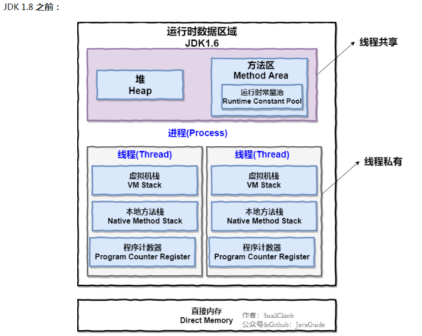
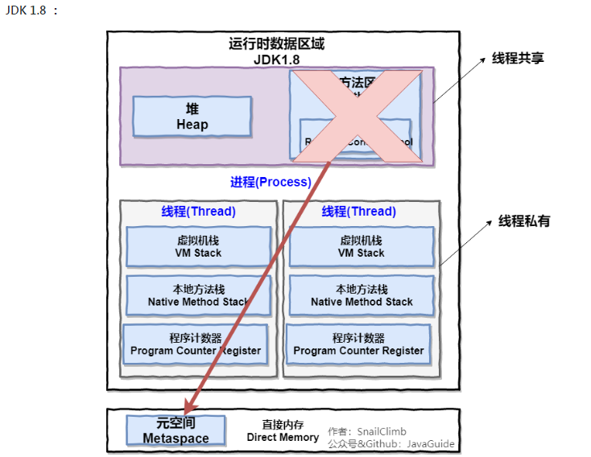
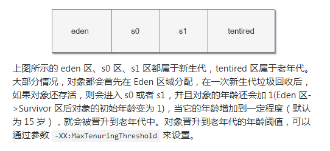

## 概述

对于Java程序员来说，在虚拟机自动内存管理机制下，不再需要像C/C++程序员这样为每一个new
操作去写对应的 delete/free 操作，不容易出现"内存泄露"和"内存溢出"问题。正因为Java程序
把内存控制权利交给Java虚拟机，一旦出现内存泄露和溢出方面的问题，如果不了解虚拟机是怎么样使用
内存的，那么排查错误将会是一个非常艰巨的任务；

## 运行时数据区域
	Java虚拟机在执行Java程序的过程中会把它管理的内存划分成若干个不同的数据区域，JDK1，8和之前略有不同
		

		
- 线程私有的：(1) 程序计数器 (2) 虚拟机栈 (3) 本地方法栈
- 线程共享的：(1) 堆 (2) 方法区 (3) 直接内存(非运行时数据区的一部分)
	
## 程序计数器PCR
		
程序计数器是一块较小的内存空间，可以视为当前线程所执行的"字节码的行号指示器"；
字节码解释器工作时通过改变这个计数器的值来选取下一条需要执行的字节码指令、分支、循环、跳转、异常处理
线程回复等功能都要依赖这个计数器来完成；
		
为了线程切换后能恢复到正确的执行位置，每条线程都需要由一个独立的程序计数器，各线程之间计数器互不影响，
独立存储，我们称这类内存区域为"线程私有"的内存
		
程序计数器的作用：
- (1) 字节码解释器通过改变程序计数器来依次读取"指令"，从而实现代码的流程控制：如顺序执行、选择、循环、异常处理
- (2) 在多线程的情况中，程序计数器用于记录当前线程执行的位置(坐标)，从而当线程被切换回来的时候能够知道线程上次运行到哪儿
		
>注意：程序计数器是唯一一个不会出现"OutOfMemoryError"的内存区域，它的生命周期随着线程的创建而创建，随着线程死亡而死亡

## Java虚拟机栈
		
与程序计数器一样，Java虚拟机栈也是线程私有的，它的生命周期和线程相同，描述的是"Java方法执行的内存模型"，
每次方法调用的数据都是通过栈传递的；
		
Java内存可以粗糙区分为"堆内存"(Heap)和"栈内存"(Stack)，其中的栈就是现在说的虚拟机栈，或者说是虚拟机栈中
"局部变量表"部分。

>注意：实际上，Java虚拟机栈是由一个个"栈帧"组成，而每个栈帧中都有：局部变量表、操作数栈、动态链接、方法出口信息；
		
局部变量表：主要存放了编译器可知的各种数据类型(八大基本数据类型)、对象引用(reference类型，它不同于对象，可能是一个
指向对象起始地址的引用指针，也可能是指向一个代表对象的句柄或其他与此对象相关的位置)

Java虚拟机栈会出现两种异常："StackOverFlowError"和"OutOfMemoryEroor"
- StackOverFlowError：若Java虚拟机的内存不允许动态扩展，那么当线程请求栈的深度超过当前Java虚拟机栈的最大深度的时候，就抛出 StackOverFlowError 异常；
- OutOfMemoryError：若 Java 虚拟机栈的内存大小运行动态扩展，而且线程请求栈时内存用完了，就无法再动态扩展了，此时抛出OutOfMemoryError 异常；
		
	Java 虚拟机栈也是线程私有的，每个线程都有各自的 Java 虚拟机栈，而且随着线程的创建而创建，随着线程死亡而死亡的；
	
	>扩展：那么方法/函数如何调用？
			Java栈可用类比数据结构中栈，Java栈中保存的主要内容是"栈帧"，每一次函数调用都会由一个对应的栈帧被压入Java栈，
		每一个函数调用结束后，都会由一个栈帧被弹出；(栈帧从头进，从底出！)
		
Java方法有两种返回方式：
- 1.return语句
- 2.抛出异常

不管哪种返回方式都会导致栈帧被弹出；
			
## 本地方法栈
		
和虚拟机栈所发挥的作用是非常相似的，区别是：虚拟机栈为虚拟机执行Java方法(也就是字节码)服务，而本地方法栈则
为虚拟机使用的 Native 方法服务，在HotSpot虚拟机中和Java虚拟机栈合二为一；
	
本地方法被执行的时候，在本地方法栈也会创建一个"栈帧"，用于存放该本地方法的局部变量表、操作数栈、动态链接、出口信息；
	
方法执行完毕后响应的栈也会出站并释放内存空间，也会出现"StackOverFlowError"和"OutOfMemoryError"两种异常；

## 堆
		
Java虚拟机所管理的内存中最大的一块，Java堆是"所有线程共享"的一块内存区域，在虚拟机启动时创建。
此内存区域的唯一目的就是"存放对象实例"，几乎所有对象的实例以及数组都会在这里分配内存;
		
Java堆是"垃圾收集器"管理的主要区域，因此也被称为"GC堆"，从垃圾回收的角度：由于现在收集器基本都采用分代垃圾算法，
所以Java堆还分为"新生代"和"老年代"，更细致一点有：Eden空间、From Survivor、To Survivor空间等；进一步划分的目的
是更好地回收内存，或者更快地分配内存

## 方法区
		
方法区与Java堆一样，是各个线程共享的内存区域，它用于存储已被虚拟机加载的类信息、常量、静态变量、、即时编译器等数据。
虽然Java虚拟机规范把方法区描述为堆的一个逻辑部分，但是它却又一个别名叫"Non-Heap"(非堆)，目的应该是与Java堆区分开的
	
方法区也被称为"永久代"，它们的关系：
《Java 虚拟机规范》只是规定了有方法区这么个概念和它的作用，并没有规定如何去实现它。那么，在不同的 JVM 上方法区的实现肯定是不同的了。
方法区和永久代的关系很像 Java 中接口和类的关系，类实现了接口，而永久代就是 HotSpot 虚拟机对虚拟机规范中方法区的一种实现方式。 
也就是说，永久代是 HotSpot 的概念，方法区是 Java 虚拟机规范中的定义，是一种规范，而永久代是一种实现，一个是标准一个是实现，
其他的虚拟机实现并没有永久代这一说法。
	
## 运行时常量池
	
运行时常量池是方法区的一部分，Class文件除了有类的版本、字段、方法、接口等描述信息外，
还有常量池信息(用于存放编译期生成的各种字面量和符号引用)；
既然运行时常量池是方法区的一部分，自然受到方法区内存的限制，当常量池		