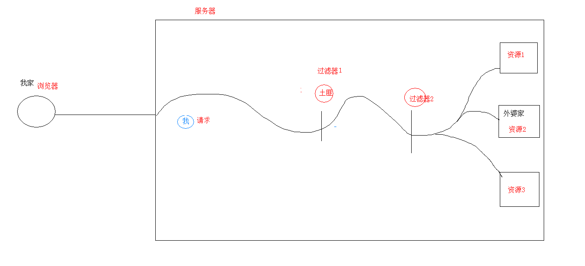

# Filter：过滤器
## 概念：
生活中的过滤器：净水器,空气净化器，土匪、

web中的过滤器：当访问服务器的资源时，过滤器可以将请求拦截下来，完成一些特殊的功能。

过滤器的作用：

- 一般用于完成通用的操作。如：登录验证、统一编码处理、敏感字符过滤...



## 快速入门：
### 步骤：
- 定义一个类，实现接口Filter
- 复写方法
- 配置拦截路径
	- web.xml
	- 注解
	
- 代码：
```java
/**
 * 访问所有资源之前，都会执行该过滤器
 */
@WebFilter("/*")
public class FilterDemo1 implements Filter { 
	@Override
	public void init(FilterConfig filterConfig) throws ServletException {
	}
			
	@Override
	public void doFilter(ServletRequest servletRequest, ServletResponse servletResponse, FilterChain filterChain) throws IOException, ServletException {
		System.out.println("filterDemo1被执行了....");
			
		// 放行
		filterChain.doFilter(servletRequest,servletResponse);
	}
			
	@Override
	public void destroy() {
			
	}
}

```
## 过滤器细节：

### web.xml配置	
```xml
<filter>
	<filter-name>demo1</filter-name>
	<filter-class>cn.itcast.web.filter.FilterDemo1</filter-class>
</filter>

<filter-mapping>
	<filter-name>demo1</filter-name>
	<!-- 拦截路径 -->
	<url-pattern>/*</url-pattern>
</filter-mapping>
```
### 过滤器执行流程

- 1.执行过滤器
- 2.执行放行后的资源
- 3.回来执行过滤器放行代码下边的代码
			
### 过滤器生命周期方法
- `init`:在服务器启动后，会创建Filter对象，然后调用init方法。只执行一次。用于加载资源
- `doFilter`:每一次请求被拦截资源时，会执行。执行多次
- `destroy`:在服务器关闭后，Filter对象被销毁。如果服务器是正常关闭，则会执行destroy方法。只执行一次。用于释放资源
			
### 过滤器配置详解

#### 拦截路径配置：

- 1.具体资源路径： /index.jsp   只有访问index.jsp资源时，过滤器才会被执行
- 2.拦截目录： /user/*	访问/user下的所有资源时，过滤器都会被执行
- 3.后缀名拦截： *.jsp		访问所有后缀名为jsp资源时，过滤器都会被执行
- 4.拦截所有资源：/*		访问所有资源时，过滤器都会被执行
	
#### 拦截方式配置：资源被访问的方式

注解配置：

- 设置dispatcherTypes属性
	- 1.`REQUEST`：默认值。浏览器直接请求资源
	- 2.`FORWARD`：转发访问资源
	- 3.`INCLUDE`：包含访问资源
	- 4.`ERROR`：错误跳转资源
	- 5.`ASYNC`：异步访问资源
			
### web.xml配置

设置`<dispatcher></dispatcher>`标签即可
				
### 过滤器链(配置多个过滤器)

执行顺序：如果有两个过滤器：过滤器1和过滤器2

- 1.过滤器1
- 2.过滤器2
- 3.资源执行
- 4.过滤器2
- 5.过滤器1 

过滤器先后顺序问题：

- 1.注解配置：按照类名的字符串比较规则比较，值小的先执行

	如： AFilter 和 BFilter，AFilter就先执行了。
	
- 2.web.xml配置： <filter-mapping>谁定义在上边，谁先执行

# Listener：监听器

## 概念：web的三大组件之一。

事件监听机制

事件	：一件事情

事件源 ：事件发生的地方

监听器 ：一个对象

注册监听：将事件、事件源、监听器绑定在一起。 当事件源上发生某个事件后，执行监听器代码

## 监听器对象

`ServletContextListener`:监听`ServletContext`对象的创建和销毁

- 方法：
	`void contextDestroyed(ServletContextEvent sce)` ：ServletContext对象被销毁之前会调用该方法
	`void contextInitialized(ServletContextEvent sce)` ：ServletContext对象创建后会调用该方法
	
- 步骤：
	- 定义一个类，实现ServletContextListener接口
	- 复写方法
	- 配置
		- web.xml

```xml	
<listener>
	<listener-class>cn.itcast.web.listener.ContextLoaderListener</listener-class>
</listener>
```

* 指定初始化参数<context-param>
						
### 注解

@WebListener

