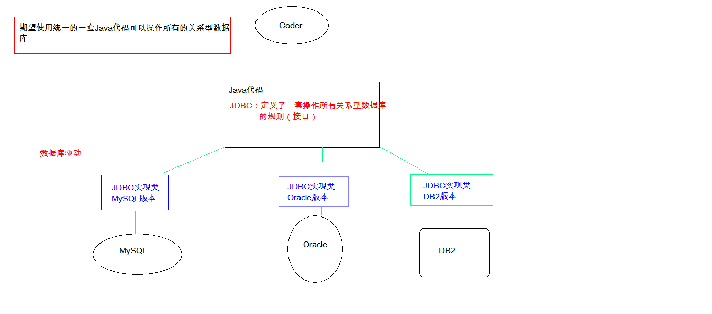

# 概述
JDBC - Java DataBase Connectivity(Java数据库连接)，即使用Java语言操作数据库

- JDBC本质：其实是sun公司定义的一套操作所有关系型数据库的规则，
即接口。各个数据库厂商去实现这套接口，提供数据库驱动jar包。
我们可以使用这套接口（JDBC）编程，真正执行的代码是驱动jar包中的实现类



# 实现

```
// 1.导入驱动jar包 
mysql-connector-java-5.1.37-bin.jar	
// 2.注册驱动 
Class.forName("com.mysql.jdbc.Driver");	
// 3.获取数据库连接对象
Connection	Connection conn = DriverManager.getConnection("jdbc:mysql://localhost:3306/aijiangdb","root", "root");	
// 4.定义sql语句	
String sql = "update account set balance = 500 where id = 1";	
//5.获取执行sql的对象 Statement	
Statement stat = conn.createStatement();	
// 6.执行sql	 
int count = stmt.executeUpdate(sql);
// 7.处理结果	
System.out.println(count);	
// 8.释放资源	
stat.close();
conn.close();

```

# 详解JDBC的各个对象

## DriverManager 驱动管理对象

- 功能

目的是`注册驱动`，告诉程序该使用哪一个数据库驱动 jar 包(当前使用mysql)
	
	// 注册给定的驱动程序 DriverManager
	static void registerDriver(Driver driver);

在写代码时使用
	
	Class.forName("com.mysql.jdbc.Driver");

`com.mysql.jdbc.Driver`在源码中存在静态代码块：
	
	static {
	    try {
	        java.sql.DriverManager.registerDriver(new Driver());
	    } catch (SQLException e) {
	        throw new RuntimeException("Can't register driver!");
	    }
	}

>注意：mysql5.0 之后的驱动 jar 包可以省略注册驱动的步骤

## 获取连接 getConnection

- 方法
	
		static Connection getConnection(String url, String user, String password);

- 参数
	- url：指定连接的路径
		- 语法：jdbc:mysql:ip地址(域名):端口号/数据库名称?
		- 当前数据库连接url为 jdbc:mysql://localhost:3306/aijiangdb?useUnicode=true&characterEncoding=utf-8&serverTimezone=Asia/Shanghai
		- 细节：如果连接的是本机mysql服务器，并且mysql服务默认端口是3306，则url可以简写为：jdbc:mysql://数据库名称
	- user：数据库用户名
		- 当前为：root
	- password：数据库密码
		- 当前为：root

## 连接对象 Connection

- 功能
	- 获取SQL执行对象
		- Statement createStatement()
		- PreparedStatement prepareStatement(String sql)
	- 管理事务
		- 开启事务：setAutoCommit(boolean autoCommit) ：调用该方法设置参数为false，即开启事务
    - 提交事务：commit() 
    - 回滚事务：rollback() 

## SQL执行对象 Statement

- boolean execute(String sql) 可以执行任意的SQL语句

- int executeUpdate(String sql) 执行 DML（insert、update、delete）语句与 DDL（create，alter、drop）语句
	- 返回值：受影响的行数，可用来判断 DML 语句是否执行成功
	
- ResultSet executeQuery(String sql) 执行DQL（select）语句

## SQL高级执行对象 PrepareStatement

1. SQL注入问题：在拼接sql时，有一些sql的特殊关键字参与字符串的拼接。会造成安全性问题
	
		1. 输入用户随便，输入密码：a' or 'a' = 'a
		2. sql：select * from user where username = 'fhdsjkf' and password = 'a' or 'a' = 'a' 

2. 解决sql注入问题：使用 PreparedStatement 对象来解决
3. 预编译的SQL：参数使用 ? 作为占位符
4. 步骤：

>注意：后期都会使用PreparedStatement来完成增删改查的所有操作 1) 可以防止SQL注入 2)效率更高

## 结果集对象 ResultSet

- 方法：
	- boolean next() 游标向下移动一行并判断是否是最后一行
	- Xxx getXxx(参数) 获取数据
		- Xxx 代表数据类型，如 int getInt()、String getString()
	- 参数：
		- int：代表列的编号，从1开始，如 getString(1);
		- String：代表列名称，如 getDouble("username");
	
注意：
- 使用步骤：

	1. 游标向下移动一行		
	2. 判断是否有数据			
	3. 获取数据

## JDBC控制事务：

1. 事务：一个包含多个步骤的业务操作。如果这个业务操作被事务管理，则这多个步骤要么同时成功，要么同时失败。
2. 操作：
	1. 开启事务
	2. 提交事务
	3. 回滚事务
3. 使用Connection对象来管理事务
	* 开启事务：setAutoCommit(boolean autoCommit) ：调用该方法设置参数为false，即开启事务
		* 在执行sql之前开启事务
	* 提交事务：commit() 
		* 当所有sql都执行完提交事务
	* 回滚事务：rollback() 
			* 在catch中回滚事务


```text
driver=com.mysql.jdbc.Driver
url=jdbc:mysql://localhost:3306/newdb3
username=root
password=root
```

```java
import java.io.IOException;
import java.io.InputStream;
import java.sql.Connection;
import java.sql.DriverManager;
import java.sql.SQLException;
import java.util.Properties;

import org.apache.commons.dbcp.BasicDataSource;

public class JDBCUtils {
	public static Connection getConn01() {
		Connection conn = null;
		try {
			// 注册驱动
			Class.forName("com.mysql.jdbc.Driver");
			// 获取连接对象
			conn = DriverManager.getConnection("jdbc:mysql://localhost:3306/newdb3", "root", "root");
			System.err.println(conn);
		} catch (Exception e) {
			e.printStackTrace();
		}
		return conn;
	}

	// 声明为成静态私有的
	private static BasicDataSource ds;

	static {
		// 读取配置文件
		// 创建读取配置文件的对象
		Properties prop = new Properties();
		// 通过类加载器，获取文件输入流
		InputStream ips = DBUtils.class.getClassLoader().getResourceAsStream("jdbc.properties");
		try {
			// 加载输入流
			prop.load(ips);
			// 读取数据
			String driver = prop.getProperty("driver");
			String url = prop.getProperty("url");
			String username = prop.getProperty("username");
			String password = prop.getProperty("password");
			System.out.println(driver + "-" + url/* + "-" + username + "-" + password */);
			// 创建连接池相关对象
			ds = new BasicDataSource();
			// 设置数据库连接信息
			ds.setDriverClassName(driver);
			ds.setUrl(url);
			ds.setUsername(username);
			ds.setPassword(password);
			// 设置初始连接数量
			ds.setInitialSize(2);
			// 设置最大连接数量
			ds.setMaxActive(3);

		} catch (IOException e) {
			e.printStackTrace();
		}
	}

	public static Connection getConn02() throws SQLException {
		// 获取连接，异常抛出
		Connection conn = ds.getConnection();
		return conn;
	}
}
```