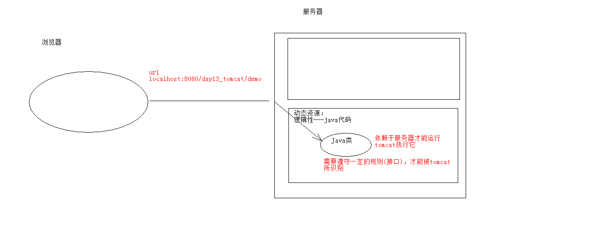

# Web 服务器

Web 服务器概念：`**接收**用户的**请求**，**处理**请求并作出**响应**，有相应的服务器软件部署

常见的Java相关的 Web 服务器：
* `webLogic`：oracle公司，大型的JavaEE服务器，支持所有的JavaEE规范，收费的
* `webSphere`：IBM公司，大型的JavaEE服务器，支持所有的JavaEE规范，收费的
* `JBOSS`：JBOSS公司的，大型的JavaEE服务器，支持所有的JavaEE规范，收费的
* `Tomcat`：Apache基金组织，中小型的JavaEE服务器，仅仅支持少量的JavaEE规范servlet/jsp。开源的，免费的

JavaEE：Java语言在企业级开发中使用的技术规范的总和，一共规定了13项大的规范

请见[JavaEE13种规范介绍](JavaEE13种规范.md)
     
# Servlet -- servlet applet

## 概念：运行在服务端上的小程序

- Servlet 就是一个接口，定义了 Java 类被浏览器访问(Tomcat识别)的规则
- 自定义一个类，实现Servlet接口，复写方法便可将服务程序运行在服务器上



## 操作步骤：
- 1.创建 JavaEE 项目
- 2.定义一个类，实现 Servlet 接口
	
	
	public class ServletClass implements Servlet {}

- 3.实现接口中的方法
	
```java
public class ServletClass implements Servlet { 
    @Override
    public void init(ServletConfig servletConfig) throws ServletException {}
  
    @Override
    public ServletConfig getServletConfig() {return null;}
  
    @Override
    public void service(ServletRequest servletRequest, ServletResponse servletResponse) throws ServletException, IOException {}
  
    @Override
    public String getServletInfo() {return null;}
  
    @Override
    public void destroy() {}
}
```
    
- 4.配置 Servlet，在 web.xml 中配置


```xml
<servlet>
	<servlet-name>demo1</servlet-name>
	<servlet-class>cn.itcast.web.servlet.ServletDemo1</servlet-class>
</servlet>
  	
<servlet-mapping>
	<servlet-name>demo1</servlet-name>
	<url-pattern>/demo1</url-pattern>
</servlet-mapping>
```
## 执行原理
- 1.当服务器接受到客户端浏览器的请求后，会解析请求URL路径，获取访问的Servlet的资源路径
- 2.查找web.xml文件，是否有对应的<url-pattern>标签体内容。
- 3.如果有，则在找到对应的<servlet-class>全类名
- 4.tomcat会将字节码文件加载进内存，并且创建其对象
- 5.调用其方法


## Servlet中的生命周期方法：

- 1.被创建：执行init方法，只执行一次

	- Servlet什么时候被创建？
	
   	- 默认情况下，第一次被访问时，Servlet被创建 
   	- Servlet的init方法，只执行一次，说明一个Servlet在内存中只存在一个对象，Servlet是单例的
   	- 多个用户同时访问时，可能存在线程安全问题
   	- 尽量不要在Servlet中定义成员变量，即使定义了成员变量，也不要对修改值
   	- 可以配置执行Servlet的创建时机，在<servlet>标签下配置
   	
   		
   	 第一次被访问时，创建` <load-on-startup>` 的值为负数
   	 在服务器启动时，创建` <load-on-startup>` 的值为0或正整数
   
   
- 2.提供服务：执行service方法，执行多次
	- 每次访问Servlet时，Service方法都会被调用一次
	
- 3.被销毁：执行destroy方法，只执行一次
	- Servlet被销毁时执行。服务器关闭时，Servlet被销毁
	- 只有服务器正常关闭时，才会执行destroy方法
	- destroy方法在Servlet被销毁之前执行，一般用于释放资源
	
## Servlet3.0 注解配置
- 好处：
	- 支持注解配置。可以不需要web.xml了。

- 步骤：
	1. 创建JavaEE项目，选择Servlet的版本3.0以上，可以不创建web.xml
	2. 定义一个类，实现Servlet接口
	3. 复写方法
	4. 在类上使用@WebServlet注解，进行配置`@WebServlet("资源路径")`
	
## Servlet 抽象继承体系

- Servlet 接口
	- GenericServlet 抽象类
		- HttpServlet 抽象类

**GenericServlet** 将 Servlet 接口中其他的方法做了默认空实现，只将 service() 方法作为抽象方法，
将来定义Servlet类时，可以继承GenericServlet，实现 service() 方法即

**HttpServlet**：对http协议的一种封装，简化操作 1)定义类继承HttpServlet 2)复写doGet/doPost方法

# Request：

**request**对象和**response**对象的原理

- request 和 response 对象是由服务器创建的来供我们使用
- request 对象是来`获取请求消息`，response对象是来`设置响应消息`

## request对象继承体系结构：	
- ServletRequest		--	接口
	- HttpServletRequest	-- 接口
		- org.apache.catalina.connector.RequestFacade -- 实现类( Tomcat 提供实现)

## request功能：

获取请求消息数据

### 获取请求行数据


	GET /day14/demo1?name=zhangsan HTTP/1.1

获取请求行数据的方法：

- 获取请求方式 **GET**： `String getMethod()`  
- (*)获取虚拟目录 **/day14**： `String getContextPath()`
- 获取Servlet路径 **/demo1**： `String getServletPath()`
- 获取get方式请求参数 **name=zhangsan**： `String getQueryString()`
- (*)获取请求URI **/day14/demo1**： 
	- `String getRequestURI():`		    /day14/demo1
	- `StringBuffer getRequestURL()`  :http://localhost/day14/demo1
				
				
>URL:统一资源定位符 ： http://localhost/day14/demo1	中华人民共和国

>URI：统一资源标识符 : /day14/demo1					共和国
						
- 获取协议及版本：**HTTP/1.1** `String getProtocol()`

- 获取客户机的IP地址 `String getRemoteAddr()`
				
### 获取请求头数据

方法：

- (*)`String getHeader(String name)`:通过请求头的名称获取请求头的值

- `Enumeration<String> getHeaderNames()`:获取所有的请求头名称
			
### 获取请求体数据:

请求体：只有POST请求方式，才有请求体，在请求体中封装了POST请求的请求参数

- 步骤：
- 1.获取流对象

	- `BufferedReader getReader()`：获取字符输入流，只能操作字符数据
	- `ServletInputStream getInputStream()`：获取字节输入流，可以操作所有类型数据
	
- 2.再从流对象中拿数据
			
### 其他功能：

#### 获取请求参数通用方式：不论get还是post请求方式都可以使用下列方法来获取请求参数

- 1. String getParameter(String name):根据参数名称获取参数值    username=zs&password=123
- 2. String[] getParameterValues(String name):根据参数名称获取参数值的数组  hobby=xx&hobby=game
- 3. Enumeration<String> getParameterNames():获取所有请求的参数名称
- 4. Map<String,String[]> getParameterMap():获取所有参数的map集合

#### 中文乱码问题：
* get方式：tomcat 8 已经将get方式乱码问题解决了
* post方式：会乱码
* 解决：在获取参数前，设置request的编码request.setCharacterEncoding("utf-8");
		
				
#### 请求转发：一种在服务器内部的资源跳转方式
- 步骤：
	- 通过request对象获取请求转发器对象：RequestDispatcher getRequestDispatcher(String path)
	- 使用RequestDispatcher对象来进行转发：forward(ServletRequest request, ServletResponse response) 

- 特点：
	- 浏览器地址栏路径不发生变化
	- 只能转发到当前服务器内部资源中
	- 转发是一次请求


- 共享数据：
	- 域对象：一个有作用范围的对象，可以在范围内共享数据
	- request域：代表一次请求的范围，一般用于请求转发的多个资源中共享数据
	- 方法：
		- `void setAttribute(String name,Object obj)`:存储数据
		- `Object getAttitude(String name)`:通过键获取值
		- `void removeAttribute(String name)`:通过键移除键值对

- 获取ServletContext：`ServletContext getServletContext()`


			
## 响应消息：服务器端发送给客户端的数据

### 数据格式：

### 响应行

	组成：
		协议/版本 响应状态码 状态码描述
	
### 响应状态码：服务器告诉客户端浏览器本次请求和响应的一个状态。

- 状态码都是3位数字 
- 分类：
	- `1xx`：服务器就收客户端消息，但没有接受完成，等待一段时间后，发送1xx多状态码
	- `2xx`：成功。代表：200
	- `3xx`：重定向。代表：302(重定向)，304(访问缓存)
	- `4xx`：客户端错误，代表：
		- 404（请求路径没有对应的资源） 
		- 405：请求方式没有对应的doXxx方法
	- `5xx`：服务器端错误。代表：500(服务器内部出现异常)
							
					
### 响应头：
- 格式：头名称： 值
- 常见的响应头：
	- `Content-Type`：服务器告诉客户端本次**响应体数据格式**以及**编码格式**
	- `Content-disposition`：服务器告诉客户端以什么格式打开响应体数据
						* 值：
							* in-line:默认值,在当前页面内打开
							* attachment;filename=xxx：以附件形式打开响应体。文件下载
			3. 响应空行
			4. 响应体:传输的数据


 响应字符串格式
 
			HTTP/1.1 200 OK
			Content-Type: text/html;charset=UTF-8
			Content-Length: 101
			Date: Wed, 06 Jun 2018 07:08:42 GMT

## Response对象

功能：设置响应消息

### 设置响应行
- 格式：HTTP/1.1 200 ok
- 设置状态码：`setStatus(int sc)` 

### 设置响应头：

`setHeader(String name, String value)` 
			
### 设置响应体:：

- 1.使用步骤：
	- 获取输出流
		- 字符输出流：`PrintWriter getWriter()`
		- 字节输出流：`ServletOutputStream getOutputStream()`

- 2.使用输出流，将数据输出到客户端浏览器


## ServletContext对象：

### 概念：
代表整个web应用，可以和程序的容器(服务器)来通信

### 获取：

#### 通过request对象获取 

`request.getServletContext()`;

#### 通过HttpServlet获取 
`this.getServletContext()`;

#### 功能：
- 1.获取MIME类型：
	- MIME类型:在互联网通信过程中定义的一种文件数据类型
	- 格式： 大类型/小类型   text/html		image/jpeg
	- 获取：`String getMimeType(String file)`  
			
- 2.域对象：共享数据
	- `setAttribute(String name,Object value)`
	- `getAttribute(String name)`
	- `removeAttribute(String name)`
	- ServletContext对象范围：所有用户所有请求的数据
	
- 3.获取文件的真实(服务器)路径
	- 方法：`String getRealPath(String path)`  


