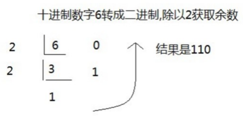
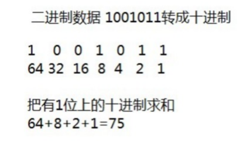
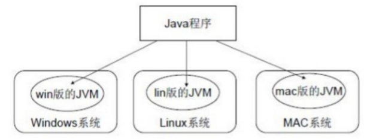
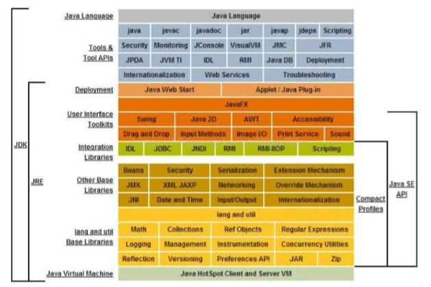
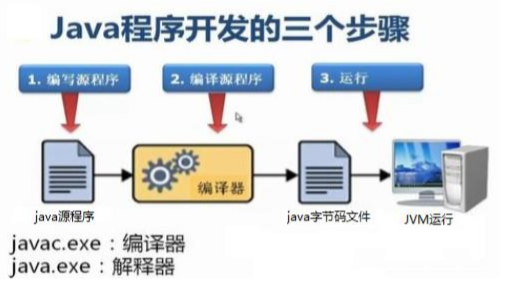

# Java基本常识与知识海概述

## 计算机基本常识：

### 二进制 Binary

计算机中的数据不同于人们生活中的数据，人们生活采用十进制数，而计算机中全部采用**二进制**数表示，
它只包含 0、1两个数，逢二进一，1+1=10。每一个0或者每一个1，叫做一个bit（比特）

十进制转换为二进制数据：使用除以2获取余数的方式




二进制转换为十进制的数据：使用8421编码的方式



### 字节 Byte

字节是我们常见的计算机中小**存储单元**；计算机存储任何的数据，都是以字节的形式存储，右键点击文件属性，我们可以查看文件的字节大小。
8个bit（二进制位） 0000-0000表示为1个字节，写成1 byte或者1 B

- 8 bit = 1 B 
- 1024 B = 1 KB 
- 1024 KB = 1 MB 
- 1024 MB = 1 GB 
- 1024 GB = 1 TB 

### 编码 Coding
编码是信息从一种形式或格式转换为另一种形式的过程，也称为计算机编程语言的代码简称编码。
用预先规定的方法将文字、数字或其它对象编成数码，或将信息、数据转换成规定的电脉冲信号。编码在电子计算机、电视、遥控和通讯等方面广泛使用。
解码，是编码的逆过程

在 Java 中常见的编码体系：

- GBK

- UTF-8

- ISO-8859

## IDE 集成开发环境

集成开发环境（IDE，Integrated Development Environment ）是用于提供程序开发环境的应用程序，一般包括代码编辑器、编译器、调试器和图形用户界面等工具。
集成了代码编写功能、分析功能、编译功能、调试功能等一体化的开发软件服务套，所有具备这一特性的软件或者软件套（组）都可以叫集成开发环境

在Java中常见的 IDE 有：

- Eclipse
- IntelliJ IDEA
- MyEclipse
- Android Studio(安卓平台)

## Java跨平台的本质-JVM

JVM（Java Virtual Machine ）:Java虚拟机，简称JVM，是运行所有Java程序的假想计算机，
是Java程序的 运行环境，是Java 具吸引力的特性之一。我们编写的Java代码，都运行在 JVM 之上。 

跨平台：任何软件的运行，都必须要运行在操作系统之上，而我们用Java编写的软件可以运行在任何的操作系 
统上，这个特性称为Java语言的跨平台特性。该特性是由JVM实现的，我们编写的程序运行在JVM上，而JVM 运行在操作系统上



如图所示，Java的虚拟机本身不具备跨平台功能的，但每个操作系统下都有不同版本的虚拟机使其具备了跨平台的特性 

更多请看：

[JVM模块](../../JVM/ReadMe.md)

## JRE 和 JDK

- `JRE  (Java Runtime Environment)` ：是Java程序的运行时环境，包含 JVM 和运行时所需要的 核心类库 

- `JDK  (Java Development Kit)`：是Java程序开发工具包，包含 JRE 和开发人员使用的工具

我们想要运行一个已有的Java程序，那么只需安装 JRE 即可

我们想要开发一个全新的Java程序，那么必须安装 JDK 



三者的关系：JDK > JRE > JVM

## HellWord

欢迎来到编程世界，请务必成功输出 HelloWorld

	class HelloWorld {
		public static void main(String[] args) {
			System.out.println("Hello World！");
		}
	}

[HelloWorld.java](java/HelloWorld.java)

Java程序开发三步骤：编写、编译、运行。



### 一些Java的doc命令

- `java` 进入java源文件的目录：java 类名字
- `javac` 编译：java源文件名.java

### 编译 Compile 与运行 Run

编译：是指将我们编写的**Java源文件**翻译成JVM认识的**class**文件，在这个过程中， **javac编译器**会检查我们
所写的程序是否有错误，有错误就会提示出来，如果没有错误就会编译成功。 

运行：是指将 class 文件交给**JVM**去运行，此时JVM就会去执行我们编写的程序了。 

### 关于main()方法

main()方法：称为主方法，写法是固定格式不可以更变，main()方法是程序的入口或起始点，无论我们编写多少程序
JVM在运行的时候，都会从main()方法这里开始执行
main方法的格式：

```java
public static void main(String[] args) {

}
```

## 注释 Comment

注释：就是对代码的解释和说明。其目的是让人们能够更加轻松地了解代码。为代码添加注释，是十分必须要的，它不影响程序的编译和运行。 

Java中有单行注释和多行注释 

- 单行注释以  ` //`开头  换行结束 
- 多行注释以   `/*`开头  以`*/`结束
- 文裆注释以   `/**`开头 以`*/`结束

[文档注释模块](../8Java高级语法特性/文档注释/ReadMe.md)

## 关键字 keywords

关键字：是指在程序中，Java已经定义好的单词，具有特殊含义。 

`HelloWorld`案例中，出现的关键字有`public` 、`class`、`static`、`void`等，
这些单词已经被Java定义好

[更多关键字及其导航](Java关键字集合.md)

## 标识符 Identifier

标识符：是指在程序中，我们自己定义内容。比如类的名字、方法的名字和变量的名字等等，都是标识符。 
HelloWorld案例中，出现的标识符有类名字 HelloWorld 

命名规则：**硬性要求**

- 标识符可以包含：英文字母26个(区分大小写) 、`0-9`数字 、`$`（美元符号）和 `_`（下划线）
- 标识符不能以数字开头
- 标识符不能是关键字

命名规范：**软性建议**

* 类名规范：

  首字母大写，后面每个单词首字母大写（大驼峰式）。

* 方法名规范： 

  首字母小写，后面每个单词首字母大写（小驼峰式）。

* 变量名规范：
  全部小写

[你必须要掌握的Java编程规范](../Java编程规范.md)

## 数据类型 Type Of Data

Java是一种**强类型**的语言，这就意味着必须为每一个变量声明一种数据类型

可声明的数据类型：

- 基本数据类型
	- 数值类型：int、short、long、byte
	- 浮点型：float、double
	- 字符类型：char
	- 布尔类型：boolean

- 引用类型
	- 数组类型[]
	- 类类型
	- 接口类型
	- 枚举类型

## 运算 Operation

在 Java 中，可以使用**算术运算符**完成以下基本运算：

- 数值运算的加减乘除及除模运算
- 结合赋值和运算符的赋值运算符
- 自增自减运算符
- 逻辑运算符进行布尔值判断
- 位运算符操作二进制码
- ? 三元运算符完成形如if-else的操作
- instanceof完成类类型判断

> 基本运算符在进行运算时存在着两大机制：自动类型提升与强制类型转换

更加高级的运算：
- [Math数学运算类](../2Java运算与控制流程/4.Math数学运算类/README.md) 该类提供初等数学的各种知识用户
- [BigDecimal精度运算类](../2Java运算与控制流程/4.Math数学运算类/README.md) 使用该类进行高精度运算，一般用于测绘、金融等方面需高精度的场景下

## 万物皆对象 Everything is Object

Java是一种更加纯粹的**面向对象程序设计语言**，在Java的编程思维上你应该视**一切为对象**

构建对象的模板和蓝图是**类**，通过**class**关键字创建，一个类拥有自己的**属性**和**行为**；
创建一个对象是通过实例化，即关键字**new**实例化一个对象，并在**堆内存**中分配空间；

[点击此处去创建一个对象！请见面向对象与类模块](../3面向对象/面向对象与类/ReadMe.md)

### 面向对象中三大特征

- 抽象：面向对象设计的根基
- 继承：复用一个对象，建立对象的抽象继承体系
- 多态：在抽象继承体系下，合理的处理子父类的属性和行为的重名问题

[具体请见抽象继承体系体会三大特征带来的面向对象设计理念](../3面向对象/抽象继承体系/ReadMe.md)

### 用**引用**去操作你的对象

建立一个思想：任何操纵**标识符**实际上是对象的一个**引用 reference**，比如：

	String s = new String;
	
该引用指向着内存中的**堆内存**，这是对象的物理实体，增删改查等操作影响的是这个堆内存的物理实体；

### 垃圾回收器 GC 帮你管理对象的生死

在使用对象时，最关键的问题之一便是它们的生成与销毁方式，每个对象为了生成都需要资源(内存)，当
我们不需要一个对象时，它必须被清理掉使其占用的资源可以释放和重用；

在Java完全采用了**动态内存分配方式**，每当创建新的对象时，就要使用`new`关键字来构建此对象的动态实例；

Java的**垃圾回收器(GC)**被设计用来处理内存释放问题，将由管理对象的生死；GC"知道"对象何时不再被使用时
便会自动释放对象占用的内存；

## Java--基本API

**API（Application Programming Interface，应用程序接口）**是一些**预先定义**的函数，或指软件系统不同组成部分衔接的约定。  
目的是提供应用程序与开发人员基于某软件或硬件得以访问一组例程的能力，而又无需访问原码，或理解内部工作机制的细节

### 所由对象的始祖类--Object

**Object**是Java中所有类的始祖，这是因为创建一个对象都会默认继承Object，Java中的每个类都由它扩展而来！

该类提供了类的一些共性方法

[详情请见Object模块](../4基本API/Object根类/README.md)

### 操作Java中的字符串

**字符串**或**串(String)**是由数字、字母、下划线组成的**一串字符**。一般记为 `s=“a1a2···an”(n>=0)`
它是编程语言中**表示文本**的数据类型。在程序设计中，字符串（string）为符号或数值的一个连续序列，如符号串（一串字符）或二进制数字串（一串二进制数字）

Java中为该类提供了非常丰富的API以操作字符串
- [基本字符串操作类--String](../4基本API/String字符串类/README.md)
- [字符串格式化类--Format](../4基本API/Format字符串格式化类/README.md)
- [正则表达式类--Pattern正则表达式类](../4基本API/Pattern正则表达式类/README.md)

### 操作Java中的时间与日期

[操作日期与时间](../4基本API/时间与日期类/README.md)

## Java中的容器

容器是将多个数据并以某种**数据结构**存储到一起，每个数据称为该容器的元素

------

[回到顶部](#Java基本常识)

[返回上一页](../../KnowledgePoint.md)

