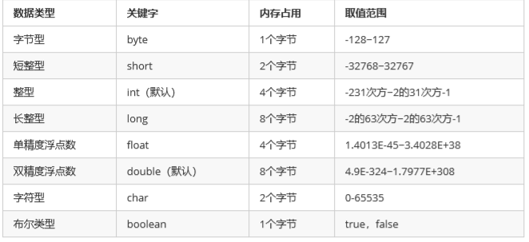
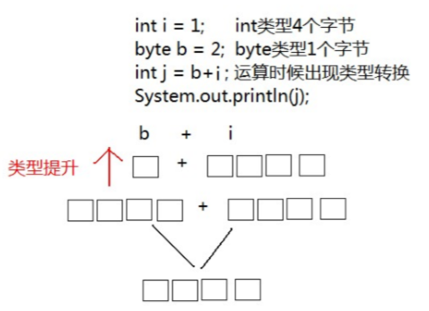
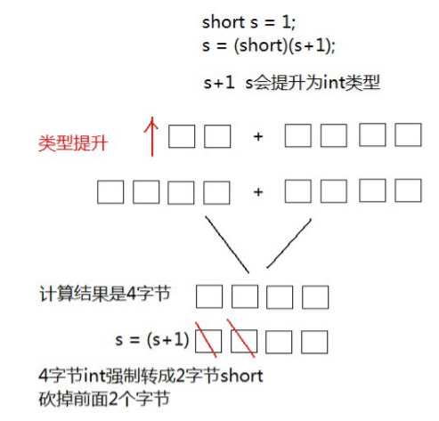

# 数据类型

分类：
- 基本数据类型：包括整数、浮点数、字符、布尔值
- 引用数据类型：类、数组、接口



### 自动类型转换

java程序要求参与计算的数据，必须保证数据的一致性，如果数据类型不一致将发生类型的转换

- 自动类型转换：将取值范围小的类型自动提升为取值范围大的类型



```java
/**
 * 自动类型转换
 */
public class Demo01_BasicDataType {

    public static void main(String[] args) {
    }

    /**
     * 自动类型转换情况一
     *
     * 字面量默认转换
     */
    private static void show03() {
        // 整数，默认是 int 类型
        System.out.println(1024);
        // 浮点数，默认是 double 类型
        System.out.println(3.14);
    }

    /**
     * 自动类型转换情况二
     *
     * 字面量与类型间的转换
     */
    private static void show04() {
        // 右边是 int 类型，左边是 long 类型
        long num1 = 100;
        // int ---> long
        System.out.println(num1);
        int i = 1;
        double d = 2.5;
        double e = i + d;
        System.out.println(e);      // 3.5
        // 右边是 float 类型，左边是 double 类型
        double num2 = 2.5F;
        // float ---> long
        System.out.println(num2);
    }

    /**
     * 自动类型转换情况三
     *
     * float --> long
     */
    private static void show05() {
        float num3 = 30L;
        System.out.println(num3); // 30.0
    }

    /**
     * 自动类型转换情况四
     *
     * byte、short、char类型之间的计算
     *
     * 以下情况计算完成均会转换成 int 类型
     */
    private static void show06() {
        int i = 1;
        byte b = 2;
//        byte x = b + i;   // 编译期报错
        int j = b + i;
        System.out.println(j);      // 3
    }

    /**
     * 自动类型转换情况五
     *
     * char 类型字符型变量视为数值计算
     */
    private static void show07() {
        char c1 = 'A';
        System.out.println(c1 + 1); // 66
    }
}

```

注意：当byte、short、char运算时会自动提升为int类型

转化规则：

```
byte、short、char --> int --> long --> double
```

- 强制类型转换：将取值范围大的类型自动提升为取值范围小的类型



转化格式：

```
数据类型 变量名 = （数据类型）被转数据
```

可能会出现的精度丢失：

(1) 浮点数转换成整数，直接取消小数点，可能造成数据损失精度

(2) int 强制转换成 short 会砍掉2个字节，可能会造成数据丢失

```java
/**
 * 强制类型转换
 *
 * 1. 特点：代码需要进行特殊的格式处理，不能自动完成。
 * 2. 格式：范围小的类型 范围小的变量名 = (范围小的类型) 原本范围大的数据;
 */
public class Demo02_BasicDataType {

    public static void main(String[] args) {
//        show01();
        show02();
    }

    /**
     * 强制类型转换一
     */
    private static void show01() {
        /**
         * 左右类型不一样，long 的类型范围大于 ing
         * 需要强制转换
         */
        int num = (int)100L;
        System.out.println(num);
    }

    /**
     * 精度丢失情况一
     *
     * 长数值丢失，数据溢出
     */
    private static void show02() {
        int num2 = (int) 6000000000L;
        System.out.println(num2);   // 1705032704
    }

    /**
     * 精度丢失情况二
     *
     * 浮点数转换为整数，丢失小数
     */
    private static void show03() {
        int num3 = (int) 3.99;
        System.out.println(num3);
    }

    /**
     * 强制类型转换二
     *
     * short、byte、char之间的变量计算需要转换
     */
    private static void show04() {
        byte b1 = 30;
        byte b2 = 40;
        // 需要加上(byte)，否则编译不通过，可尝试去掉看报错
        byte b3 = (byte) (b1 + b2);
        System.out.println(b3);

        short s1 = 4;
        short s2 = 6;
        // 同理如上
        short s3 = (short) (s1 + s2);
        System.out.println(s3);

        char c1 = 30;
        char c2 = 12;
        // 同理如上
        char c3 = (char) (c1 + c2);
        System.out.println(c3);
    }


}

```

### ASCII编码集

编码集：将文字和一个十进制数对应起来组成一张表格
	


注意：在char类型和int类型计算的过程中，char类型的字符先查询编码集，得到97
再和1求和，结果为98。char类型提升为int类型，char类型内存2个字节，int类型内存4个字节


------

[面试题](Interview.md)

[返回顶部](#变量与数据类型)

[返回上一页](../../KnowledgePoint.md)
