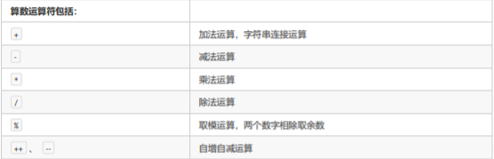
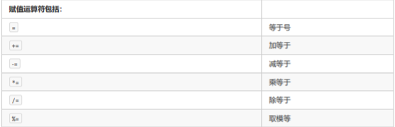
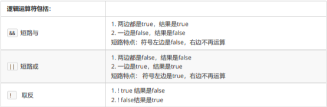

# 算数运算符

运算符：进行特定操作的符号，如 +

表达式：用运算符连起来的式子，如 20 + 5

Java语言包括的算术运算符:



```java
class Demo {
    /**
     * Java中的基本运算
		 */
    private static void show01() {
        // 两个常量之间可以进行数学运算
        System.out.println(20 + 30);
        // 两个变量之间可以进行数学运算
        int a = 20;
        int b = 30;
        System.out.println(a - b);
        
        // 变量与常量之间可以混合使用
        System.out.println(a * 10);
        
        // 整数之间的除法运算可能会造成浮点数丢失，因为两个整数运算只视为整数运算
        int x = 10;
        int y = 3;
        int result1 = x / y;
        System.out.println(result1); // 3
        
        // 取模运算
        int result2 = x % y;
        System.out.println(result2);	// 1
        
        // int 与 double 的运算会自动提升为 double 与 double 之间的运算
        double result3 = x + 2.5;
        System.out.println(result3);	// 12.5
    }
    
}

```

四则运算当中加号 "+" 有常用的三种用法：
- 对数值来说是**加法**
- 对于字符 char 类型来说，会被提升到 int 类型再进行计算
- 对于字符串 String 字符串，会进字符串连接

```java
public class Demo {
    public static void main(String[] args) {
      // 常规的字符串连接
      System.out.println("Hello" + "World");
      // 与数值连接
      String str = "";
      System.out.println(20 + 30 + str);	// 50
      System.out.println(str + 20 + 30);	// 2030
    }
    
}
```


- 注意1：在Java中，整数使用以上运算符，无论怎么计算，都不会得到小数

- 注意2：一旦运算当中有不同类型的数据，那么结果都会自动转换为数据类型范围大的那种

“++”运算，变量自己增1，反之"--"运算，变量自己会减1
	
- 独立运算：
	+ 变量在独立运算时，前++和后++没有区别
	+ 变量前++，例如++i
	+ 变量后++，例如i++

- 混合运算
	+ 和其他变量放在一起，前++和后++就产生了不同
	+ 变量前++，变量a自己加1，将加1后的结果赋值给b，也就是说a先计算，a和b的结果都是2
	+ 变量后++，变量a先将自己的值1，赋值给变量b，此时变量b的值就是1，变量a自己再加1，a的结果为2，b的结果是1
	
"+"符号在字符串中的操作
- +符号在遇到字符串的时候，表示连接、拼接的含义
- "a"+"b"的结果为"ab"，连接含义

```java
public class Demo {
    public static void main(String[] args){
      /**
       * 单独运算，++i 与 i++没有区别
			 */
       int num = 10;
       System.out.println(num);    // 10
       ++ num;
       System.out.println(num);    // 11
       num ++;
       System.out.println(num);    // 12
        
       /**
        * 混合运算下，++i 与单独运算的情况下没有区别
        */
       int num2 = 20;
       System.out.println(++num2); // 21
       System.out.println(num2);   // 21

       /**
        * 混合运算下，i++ 或 i--会先赋值给变量
        * 并在执行下一步时再 +1
        */
       int num3 = 30;
       System.out.println(num3++); // 30
       System.out.println(num3);   // 31
       int num4 = 40;
       int result = num4 --;
       System.out.println(result); // 40
       System.out.println(num4);   // 39

       int x = 10;
       int y = 20;
       // 此刻 x = 11，y = 20
       int result2 = ++x + y--;
       System.out.println(result2);// 31
       System.out.println(x);      // 11
       System.out.println(y);      // 19
    }
}

```

# 赋值运算符	

Java语言包括的赋值运算符:



赋值运算符，就是将符号右边的值，赋值给左边的变量

复合赋值运算符：
- a += 3		相当于		a = a + 3
- b -= 4		相当于		b = b - 4
- c *= 5		相当于		c = c * 5
- d /= 6		相当于		d = d / 6
- e %= 7		相当于		e = e % 7

>注意1：只有变量才能使用赋值运算符，常量不能进行赋值


赋值运算符的计算步骤解析：
```java
public class Demo {
    public static void main(String[] args){
      int a = 10;
      a += 5;
      System.out.println(a);
      
      // 以上赋值运算步骤解构为以下步骤
      int a1 = 10;
      a1 = a1 + 5;
      // 此刻 a1 = 10，会重新赋值等于15
      a1 = 15;
      System.out.println(a1);
    }
    
}

```
>注意2：复合运算符其中隐含一个强制类型转换

```java
public class Demo {
    public static void main(String[] args){
      byte num = 30;
      /**
       * 计算步骤：
       * 1) num = num + 5;
       * 2) 类型提升：num = (int) num + (int) 5;
       * 3) num = 35
       * 4) 类型强转：num = (byte) num;
       */
      num += 5;
      System.out.println(num);
    }
    
}

```

# 比较运算符

Java语言包括的比较运算符:


比较运算符，是两个数据之间进行比较的运算，运算结果都是布尔值true或false

- 注意1：比较运算符结果一定是 boolean 值，成立是 true，不成立是 false

- 注意2：如果进行多次判断，不能连着写；即数学当中的写法，例如：1 < x < 3，程序当中“不允许”这种写法

# 逻辑运算符

Java语言包括的逻辑运算符:



逻辑运算符，是用来连接两个布尔类型结果的运算符，运算结果都是布尔值true或false

短路效果：**与&&**和**或||**具有短路效果，即如果根据左边已经可以判断结果，那么右边的代码将不再执行，从而节省一定的性能
```java
public class Demo {
    public static void main(String[] args){
       int a = 10;
       // 发生短路，后续 ++a 不再执行
       System.out.println(3 > 4 && ++a < 10);  // false
       System.out.println(a);  // 10

       int b = 20;
       System.out.println(3 < 4 && ++b < 100); // true
       System.out.println(b);  // 21
    }
    
}
```
- 注意1：逻辑运算只能用于 boolean 值

- 注意2：与、或需要左右各自有一个boolean值，但是取反只要有唯一的一个boolean值即可

- 注意3：与、或两种运算符，如果有多个条件，可以连续写
	- 两个条件：条件A && 条件B
	- 多个条件：条件A && 条件B && 条件C

# 三元运算符

- X元运算符概念：

	- 一元运算符：只需要一个数据就可以进行操作的运算符，例如：取反!、自增++、自减--
	- 二元运算符：需要两个数据就可以进行操作的运算符，例如：加法+、赋值=
	- 三元运算符：需要三个数据才可以进行操作的运算符，如本节的三元运算符
	

格式：
	
	数据类型 变量名 = 布尔类型表达式？结果1：结果2

三元运算符的计算方式：
	
- 布尔类型表达式结果是true，三元运算符整体结果为结果1，赋值给变量
- 布尔类型表达式结果是false，三元运算符整体结果为结果2，赋值给变量

```java
public class Demo {
    public static void main(String[] args){
        int a = 10;
        int b = 20;
      
        int max = a > b ? a : b;
        System.out.println(max);    // 10
      
        // 错误写法
        // int result = 3 > 4 ? 2.5 : 10;
        // 应进行类型转换
        int result = 3 < 4 ? (int) 2.5 : 10;
        System.out.println(result); // 2
    }
}

```
- 注意事项：
	- 必须同时保证表达式A与表达式B符合左侧数据类型的要求
	- 三元运算符的结果必须被使用
	
```java
public class Demo {
    public static void main(String[] args){
      int a = 10;
      int b = 20;
      
      // 编译错误，注意三元运算符必须被使用
      a > b ? a : b;
      
      // 正确的用法，接收
      System.out.println(a > b ? a : b);
        
    }
}
```