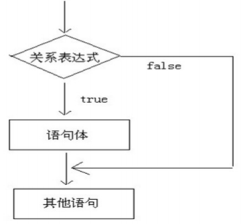
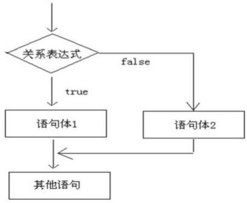
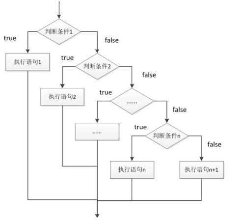
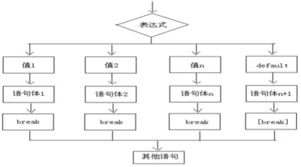
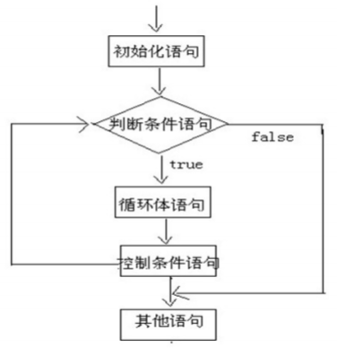
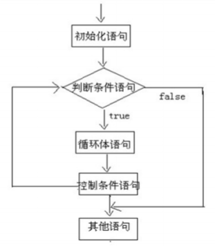

## 概述

在一个程序执行的过程中，各条语句的执行顺序对程序的结果是有直接影响的。也就是说，程序的流程对运行结果
有直接的影响。所以，我们必须清楚每条语句的执行流程。而且，很多时候我们要通过控制语句的执行顺序来实现
我们要完成的功能。

## 判断语句 if-else

#### 格式一: if
	
		if (关系表达式) {
			// 语句体;
		}

执行流程
- 首先判断关系表达式看其结果是true还是false
- 如果是true就执行语句体
- 如果是false就不执行语句体

#### 格式二:if-else

		if (关系表达式) {
			// 语句体;
		} else {
			// 语句体;
		}

执行流程：
- 首先判断关系表达式看其结果是true还是false
- 如果是true就执行语句体1
- 如果是false就执行语句体2

#### 格式三:if-else-if-else

		if (判断条件1) {
			// 语句体;
		} else if (判断条件2) {
			// 语句体;
		} else if (判断条件3) {
			// 语句体;
		} else {
			// 语句体
		}
		
首先判断关系表达式1看其结果是true还是false
- 如果是true就执行语句体1
- 如果是false就继续判断关系表达式2看其结果是true还是false
- 如果是true就执行语句体2
- 如果是false就继续判断关系表达式…看其结果是true还是false
- …
- 如果没有任何关系表达式为true，就执行语句体n+1

#### if-else 与三元运算符的互换

	public static void main(String[] args) {
		  int a = 10;
		  int b = 20;
		  //定义变量，保存a和b的较大值
		  int c;
		  if(a > b) {
		  c = a;
		  } else {
		  c = b;
		  }
		  //可以上述功能改写为三元运算符形式
		  c = a > b ? a:b;
	}

## 选择语句 switch

#### 语法格式

格式：

		switch(表达式) {
			case 常量值1;
				// 语句体
				break;
			case 常量值2;
        // 语句体
      	break;
      case 常量值3;
        // 语句体
      	break;
      default:
        语句体 n+1;
        break;
		}	

switch语句中，表达式的数据类型，可以是byte，short，int，char，enum（枚举），JDK7后可以接收字符串。

#### case的穿透性

在switch语句中，如果case的后面不写break，将出现穿透现象，也就是不会在判断下一个case的值，直接向后运
行，直到遇到break，或者整体switch结束。

		public static void main(String[] args) {
		int i = 5;
		switch (i) {
			case 0:
				System.out.println("执行case0");
				break;
			case 5:
				System.out.println("执行case5");
			case 10:
				System.out.println("执行case10");
			default:
				System.out.println("执行default");
			}
		}

上述程序中，执行case5后，由于没有break语句，程序会一直向后走，不会在判断case，也不会理会break，直接
运行完整体switch。
由于case存在穿透性，因此初学者在编写switch语句时，必须要写上break。

## 循环语句

循环语句可以在满足循环条件的情况下，反复执行某一段代码，这段被重复执行的代码被称为循环体语句，当反复
执行这个循环体时，需要在合适的时候把循环判断条件修改为false，从而结束循环，否则循环将一直执行下去，形
成死循环。

#### 循环语句 for

for循环语句格式：
		
		for(初始化表达式①; 布尔表达式②; 步进表达式④) {
			// 循环体③;
		}

执行流程
- 执行顺序：①②③④>②③④>②③④…②不满足为止。
- ①负责完成循环变量初始化
- ②负责判断是否满足循环条件，不满足则跳出循环
- ③具体执行的语句
- ④循环后，循环条件所涉及变量的变化情况
		

#### 循环语句 while

while循环语句格式：
	
		初始化表达式①;
			while (布尔表达式②) {
				循环体③;
				步进表达式④;
			}

- 执行顺序：①②③④>②③④>②③④…②不满足为止。
- ①负责完成循环变量初始化。
- ②负责判断是否满足循环条件，不满足则跳出循环。
- ③具体执行的语句。
- ④循环后，循环变量的变化情况

#### 循环语句 do-while

do-while循环语句格式：
	
		初始化表达式①;
			do {
				循环体③;
				步进表达式④;
			} while(布尔表达式②);

执行顺序：①③④>②③④>②③④…②不满足为止。
①负责完成循环变量初始化。
②负责判断是否满足循环条件，不满足则跳出循环。
③具体执行的语句
④循环后，循环变量的变化情况

#### 循环语句的区别

for 和 while 的小区别：

控制条件语句所控制的那个变量，在for循环结束后，就不能再被访问到了，而while循环结束还可以继
续使用，如果你想继续使用，就用while，否则推荐使用for。原因是for循环结束，该变量就从内存中消失，能够提高内存的使用效率。

在已知循环次数的时候使用推荐使用for，循环次数未知的时推荐使用while

#### 跳出语句

- break
 + 使用场景：终止switch或者循环
 + 在选择结构switch语句中
 + 在循环语句中
 + 离开使用场景的存在是没有意义的
 
- continue
 + 使用场景：结束本次循环，继续下一次的循环
 
#### 死循环
	
死循环：也就是循环中的条件永远为true，死循环的是永不结束的循环。例如：while(true){}。

#### 嵌套循环

所谓嵌套循环，是指一个循环的循环体是另一个循环。比如for循环里面还有一个for循环，就是嵌套循环。总
共的循环次数=外循环次数*内循环次数

嵌套循环格式：
	
	for(初始化表达式①; 循环条件②; 步进表达式⑦) {
    for(初始化表达式③; 循环条件④; 步进表达式⑥) {
        执行语句⑤;
    }
  }

嵌套循环执行流程：
 - 执行顺序：①②③④⑤⑥>④⑤⑥>⑦②③④⑤⑥>④⑤⑥
 - 外循环一次，内循环多次。
 - 比如跳绳：一共跳5组，每组跳10个。5组就是外循环，10个就是内循环。
