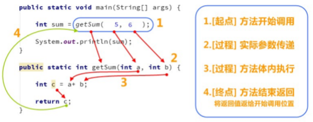

## 概述

方法:就是将一个"功能"抽取出来，把代码单独定义在一个大括号内，形成一个单独的功能
		当我们需要的时候就可以去调用，这样就实现了代码的复用性，也解决了代码冗余的现象；

## 方法的定义

格式:
	
		修饰符 返回值类型 方法名(参数列表) {
			// 代码
			return ;
		}

定义格式解释:
- 修饰符： public static 固定写法
- 返回值类型： 表示方法运行的结果的数据类型，方法执行后将结果返回到调用者
- 参数列表：方法在运算过程中的未知数据，调用者调用方法时传递
- return：将方法执行后的结果带给调用者，方法执行到 return ，整体方法运行结束

## 定义方法的两个明确

- 需求
	+ 明确返回值类型
	+ 明确参数类型

## 方法的调用

方法定义完毕后，方法不会自己运行，必须被调用才能执行，我们可以在主方法main()中调用
我们自定义好的方法，在主方法中，直接写调用的方法名字就可以调用了; 

## 注意事项

- 方法必须定义在一个类中方法外
- 方法不能定义在另一个方法里面
- 不能在 return 后面写代码， return 意味着方法结束，所有后面的代码永远不会执行，属于无效代码

## 调用方法的三种形式

- 直接调用：直接写方法名调用(同类下的静态方法)

- 赋值调用：调用方法，在方法前面定义变量，接收方法返回值

- 输出语句调用：  
	+ 在输出语句中调用方法， System.out.println(方法名()) 
	+ 不能用输出语句调用 void 类型的方法。因为方法执行后没有结果，也就打印不出任何内容
	
## 方法重载

方法重载：指在同一个类中，允许存在一个以上的同名方法，只要它们的参数列表不同即可，与修饰符和返
回值类型无关。
- 参数列表：个数不同，数据类型不同，顺序不同。
- 重载方法调用：JVM通过方法的参数列表，调用不同的方法。(多态的编译时多态)
