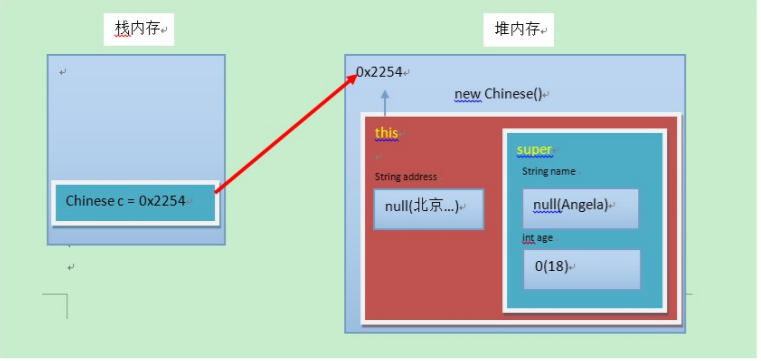

[TOC]

# 继承

## 概述

思想：多个类存在**相同**的属性和行为的时候，将这些内容抽取到单独的一个类中，那么多个类无需再定义这些
属性和行为，只要`extends`这个类即可

继承描述的是事物之间的所属关系，这种关系称为`is-a`，通过继承可以使多种事物之间形成一种关系体系;

通常被继承类称为`超类SupClass`，继承的类称为`基类SubClass`(子类)


## 定义

继承：就是派生类（子类）继承超类（父类）的`属性`和`行为`，使得子类对象具有与父类相同的属性、相同的`行为`，子类可以直接访问父类的`非私有`的属性和行为

继承的好处：
- 提供代码的`复用性`
- 类与类之间产生了关系，是`多态`的前提

## 格式
通过`extends`关键字，可以声明一个子类继承另外一个超类，定义格式：
```java
class 超类名 /* extends Object */ {
    // 属性与方法
}

class 子类名 extends 超类 {
    // 属性与方法
}
```

## 继承后的特点--成员变量

- 成员变量不重名
	如果子类超类中出现`不重名`的成员变量，此时访问没有影响的
	
- 成员变量重名
  如果子类中出现的`重名`的成员变量，这时访问是有影响的

  子类中出现了同名的成员变量的时候，在子类中需要访问父类中非私有的成员变量的时候，需要使用`super`关键字修饰父类成员变量，类似于之前的`this`关键字

  ```java
  super.超类成员变量名;
  ```

>超类中的成员变量是非私有的，子类中可以直接访问。若超类中的成员变量私有了，子类是不能直接访问的。
通常编码时，我们遵循封装的原则，使用private修饰成员变量，可以在父类中提供公共的getting()方法和setting()方法。

## 继承后的特点--成员方法

- 成员变量不重名
  + 如果子类超类中出现`不重名`的成员变量，这时调用是没有影响的，

  + 如果子类超类中出现`重名`的成员变量时，对象调用成员变量（非私有）时，会先在子类中查找有没有对应的成员变量，若子类中存在就会执行子类中的成员变量，若子类中不存在就会调用父类中相应的成员变量

- 成员方法重名--重写（Override）
  + 如果子类中出现了`不重名`的成员方法，这时调用是没有影响的

  + 如果子类中出现了`重名`的成员方法，这时访问的是一种特殊的情况，叫做方法重写(Override)

方法重写：子类中出现与超类中一样的方法时(包括返回值类型、方法名、参数列表相同)，会出现覆盖效果，
这个过程称为重写或复写；即`声明不变，重新实现`


>重写的应用思想：子类可以根据需要，定义特定于自己的行为。既沿袭了父类的功能名称，又根据子类的需要重新实现父类方法，从而进行扩展增强
>注意事项：
>
>1. 子类方法覆盖超类方法，必须要保证`权限`大于或等于超类权限 
>2. 子类方法覆盖`超类方法`，`返回值`、`函数名`、`参数列表`一模一样

- 继承后的特点--构造方法
  + 构造方法必须与类名一致，所以子类是无法继承超类的构造方法的
  + 构造的方法的作用是初始化成员变量，所以子类的初始化过程中，必须`先执行`超类的初始化动作，子类的构造默认有一个`super()`表示调用超类的构造方法，超类成员变量初始化后，才可以给子类使用

## 父类空间优先于子类对象产生

在每次创建子类对象时，先初始化父类空间，再创建其子类对象本身。目的在于子类对象中包含了其对应的父类空
间，便可以包含其父类的成员，如果父类成员非private修饰，则子类可以随意使用父类成员。代码体现在子类的构
造方法调用时，一定先调用父类的构造方法。理解图解如下：



## 继承的特点

1.Java只支持单继承，不支持多继承
2.Java支持多层继承(抽象继承体系)
>顶层超类是Object类，所有的类默认继承Objcet作为超类

3.子类和超类时一种相对的概念
	

# super与this关键字

## 含义
- `super`：代表着超类的`存储空间标识`(对超类的引用)
- `this`：代表着`当前对象的引用`(谁调用就代表谁)

## super和this的用法

1.访问成员

```java
this.成员变量;    // 本类的
super.成员变量;   // 超类的 

this.成员方法名()  // 本类的
this.成员方法名()  // 超类的
```

2.访问构造方法

```java
this(...)  // 本类的构造方法
super(...) // 超类的构造方法
```


>子类的每个构造方法中均有默认的super()，调用父类的空参构造。手动调用父类构造会覆盖默认的super()。
 super() 和 this() 都必须是在构造方法的第一行，所以不能同时出现。

# 抽象类
## 概述

父类中的方法，被它的子类们重写，子类各自的实现都不尽相同。那么父类的方法声明和方法主体，只有声明还有
意义，而方法主体则没有存在的意义了。我们把`没有方法主体`的方法称为`抽象方法`。Java语法规定，包含抽象方法
的类就是抽象类。


## 定义
- 抽象方法：没有方法体的方法
- 抽象类：包含抽象方法的类

## 抽象关键字abstract使用格式

1.抽象方法

使用`abstract`关键字修饰方法，该方法就成了抽象方法，抽象方法只包含一个方法名，而没有方法体；

```java
修饰符 abstract 返回值类型 方法名(参数列表);
```

2.抽象类

使用一个类包含抽象方法，那么该类必须是抽象类

```java
abstract class 类名字 {
}
```

## 抽象类的使用

继承抽象类的子类必须重写父类所有的抽象方法。否则，该子类也必须声明为抽象类。
最终，必须有子类实现该父类的抽象方法，否则，从最初的父类到最终的子类都不能创建对象，失去意义。

此时的方法重写，是子类对父类抽象方法的完成实现，我们将这种方法重写的操作，也叫做`实现方法`。

## 注意事项

1.抽象类不能创建对象，如果创建，编译无法通过而报错。只能创建其非抽象子类的对象。

>理解：假设创建了抽象类的对象，调用抽象的方法，而抽象方法没有具体的方法体，没有意义。

2.抽象类中，可以有构造方法，是供子类创建对象时，初始化父类成员使用的。
>理解：子类的构造方法中，有默认的super()，需要访问父类构造方法。

3.抽象类中，不一定包含抽象方法，但是有抽象方法的类必定是抽象类。

>理解：未包含抽象方法的抽象类，目的就是不想让调用者创建该类对象，通常用于某些特殊的类结构设计。

4.抽象类的子类，必须重写抽象父类中所有的抽象方法，否则，编译无法通过而报错。除非该子类也是抽象类。
>理解：假设不重写所有抽象方法，则类中可能包含抽象方法。那么创建对象后，调用抽象的方法，没有意义。

# 接口
## 概述
接口，是Java语言中一种引用类型，是方法的集合，如果说类的内部封装了成员变量、构造函数和成员方法，
那么接口的内部主要是`封装了方法`，包含抽象方法（JDK 7及以前），默认方法和静态方法（JDK 8），私有方法（JDK 9）


## 定义

接口的定义，它与定义类的方式相似，使用`interface`关键字，它也会被编译成.class文件，但一定要明确它`不是类`，而是一种另外一种`引用数据类型`

>Java的引用的数据类型：数组、类、接口

接口的使用，它不能创建对象，但是可以被`实现implements`(类似于被继承)。一个实现接口的类（可以看做
是接口的子类）需要实现接口中所有的抽象方法，创建该类对象，就可以调用方法了，否则它必须是一个抽象类。

- 定义格式

   ```java
   public interface 接口名称 {
       // 常量属性
       // 抽象方法
       // 默认方法(JDK1.8)
       // 静态方法(JDK1.8)
       // 私有方法(JDK1.9)
   }
   ```

   + 含有`抽象`方法：抽象方法：使用 abstract 关键字修饰，可以省略，没有方法体。该方法供子类实现使用；

      ```java
      public interface InterFaceName {
          public abstract void method();
      }
      ```

   + 含有`默认`方法和`静态`方法

     默认方法：使用 `default` 修饰，不可省略，供子类调用或者子类重写。

     静态方法：使用 `static` 修饰，供接口直接调用。
     ```java
     public interface InterFacaName {
         public default void method() {
             // 执行语句
         }
         public static void method2() {
             // 执行语句
         }
     }
     ```
     

   + 含有`私有`方法和`私有静态`方法

     私有方法：使用 `private` 修饰，供接口中的默认方法或者静态方法调用。
     ```java
     public interface InterFaceName {
         private void method() {
             // 执行语句
         }
     }
     ```

## 基本的实现

类与接口的关系为实现关系，即`类实现了接口`，该类可以称为类的`实现类`，实现的动作与继承相仿，只是关键字不一样
实现关键字使用`implements`关键字

非抽象子类必须实现接口：
	1.必须重写接口中的所有抽象方法
	2.继承了接口的默认方法，即可以直接调用，也可以重写

实现格式：

```java
class 类名 implements 接口名 {
    // 重写接口中抽象方法【必须】
    // 重写接口中默认方法【可选】
}
```

## 接口的多实现

之前学过，在继承体系中，一个类只能继承一个父类。而对于接口而言，一个类是可以实现多个接口的，这叫做接
口的`多实现`。并且，一个类能继承一个父类，同时实现多个接口。

实现格式：

```java
class 类名 [extends 超类名] implements 接口名1, 接口名2, 接口名3... {
    // 重写接口中抽象方法【必须】
    // 重写接口中默认方法【不重名时可选】
}
```

> 多实现时，如果有多个抽象方法时，实现类必须重写所有抽象方法，如果抽象方法有重名的，只需要重写一次。

## 优先级问题

当一个类，既继承一个父类，又实现若干个接口时，超类中的成员方法与接口中的默认方法重名，
子类就近选择执行父类的成员方法。

## 接口的多继承

一个接口能继承另一个或者多个接口，这和类之间的继承比较相似。接口的继承使用`extends`关键字，子接口继
承父接口的方法。如果父接口中的默认方法有重名的，那么子接口需要重写一次。

>子接口重写默认方法时，default关键字可以保留。
>子类重写默认方法时，default关键字不可以保留。

## 其他成员的特点：

- 接口中，无法定义成员变量，但是可以定义常量，其值不可以改变，默认使用public static final修饰。
- 接口中，没有构造方法，不能创建对象。
- 接口中，没有静态代码块。

# 多态

## 概述
多态是继封装、继承之后面向对象的第三大特征；

多态：同一行为，通过不同的事物，可以体现出来的不同的形态。多态描述的就是这样的状态


## 多态的体现

格式体现：
```java
超类类型 变量名 = new 子类对象;
变量名.方法名();
```

>超类类型：指子类对象继承的超类类型，或者实现的超接口类型。


## 多态的动作

- 编译时多态：当使用多态方式调用`重载`方法时，首先检查是否有对应的参数列表的方法，如果没有，则编译错误；如果有，执行的是子类重载后方法。

- 运行时多态：当使用多态方式调用`重写`方法时，首先检查超类中是否有该方法，如果没有，则编译错误；如果有，执行的是子类重写后方法。

## 引用类型转换

多态的转型分为`向上转型`和`向下转型`

- 向上转型：多态本身是子类类型向超类型向上转换，这个过程是默认的，当超类引用指向一个子类时，便是向上转型


```java
超类类型 变量名 = new 子类类型();
```

- 向下转型：超类类型向子类类型向下转换的过程，这个过程是强制的，一个已经向上转型的子类对象，将父类引用转为子类引用，可以使用强制类型转换的格式，便是向下转型。

  ```java
  子类类型 变量名 = (子类类型)超类变量名;
  ```


>为什么要转型：
>当使用多态方式调用方法时，首先检查父类中是否有该方法，如果没有，则编译错误。也就是说，不能调用子类拥有，而父类没有的方法。编译都错误，更别说运行了。这也是多态给我们带来的一点"小麻烦"。所以，想要调用子类特有的方法，必须做向下转型。
>（所以目标就是为了运行子类的特有方法！）
>（所以目标就是为了运行子类的特有方法！）

## `instanceof`数据类型判断关键字

转型的异常：

在向下转型时，会出现`ClassCastException`类型转换异常，这是因为没有正确的使用超类类型进行强制转换；为了避免出现`ClassCastException`类型转换异常，Java提供了`instanceof`关键字来给引用变量做类型的校验

```java
if(变量名 instanceof 数据类型) {
    // 如果变量属于该数据类型，返回true
    // 如果变量不属于该数据类型，返回false
}
```

所以，一般转换前都建议做一次判断！

------

[回到顶部](#继承)

[返回上一页](../../../KnowledgePoint.md)