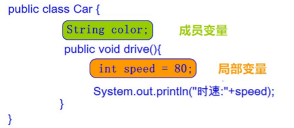

# 面向对象
## 概述

对象：泛指一切事物，每种事物都具备自己的`事物`和`行为`

面向对象思想：在计算机程序设计过程中，参照现实中的事务，将事务的属性特征、行为特征
抽象出来，描述成计算机事件的设计思想，它区别于面向过程思想，强调的是通过调用对象的
行为来实现功能，而不用自己一步步的去操作;

举例：

- 面向过程：把衣服脱下来-->找一个盆-->放点洗衣粉-->加点水-->浸泡10分钟-->揉一揉-->清洗衣服-->拧干-->晾
起来
- 面向对象：把衣服脱下来-->打开全自动洗衣机-->扔衣服-->按钮-->晾起来

区别:
- 面向过程：强调`步骤`
- 面向对象：强调`对象`，这里的对象就是洗衣机

特点：
面向对象思想是一种更符合我们思考习惯的思想，它可以将复杂的事情简单化，并将我们从执行者变成了指挥者
面向对象的语言中，包含了三大基本特征，即`封装`、`继承`和`多态`

## 类与对象

类：是一组相关`属性`和`行为`的集合，可以看成是一类事物的模板，使用事物的属性和行为特征来描述该类事物

属性：该事物的状态信息
行为：该事物能够做什么

对象：是一类事物的具体体现，对象是类的一个实例，必然具备该类事物的属性和行为

类与对象的关系：
- 类是一类对象的描述，是抽象的
- 对象是一类事物的实例，是具体的
- 类是对象的模板，对象是类的实体

## 类的定义

成员变量：对应事物的属性
成员方法：对应事物的行为

### 定义格式
		
		public class ClassName {
		  // 成员变量
		  // 成员方法
		}

- 定义类：就是定义类的成员，包括"成员变量"和"成员方法"
- 成员变量：和定义变量一样，定义在类中、方法外
- 成员方法：定义在类中的方法

### 对象的使用

创建对象

	类名 对象名 = new 类名();

使用对象访问类中的成员

	对象名.成员变量;
	对象名.成员方法();
	
### 成员变量的默认值

- 整数(byte、short、ing、long)  0
- 浮点数（float，double） 0.0
- 字符（char） '\u0000'
- 布尔（boolean） false
- 引用类型 数组，类，接口 null

### 成员变量与局部变量的区别

变量根据定义位置不同，给变量起了不同的名字

- 在类中的位置不同 重点
	- 成员变量：类中，方法外
	- 局部变量：方法中或者方法声明上(形式参数)
- 作用范围不一样 重点
	+ 成员变量：类中
	+ 局部变量：方法中
- 初始化值的不同 重点
	+ 成员变量：有默认值
	+ 局部变量：没有默认值。必须先定义，赋值，最后使用
- 在内存中的位置不同 了解
	+ 成员变量：堆内存
	+ 局部变量：栈内存
- 生命周期不同 了解
	+ 成员变量：随着对象的创建而存在，随着对象的消失而消失
	+ 局部变量：随着方法的调用而存在，随着方法的调用完毕而消失

## 对象的内存图

1.一个对象，调用一个方法内存图

>通过上图，我们可以理解，在栈内存中运行的方法，遵循"先进后出，后进先出"的原则。变量p指向堆内存中
的空间，寻找方法信息，去执行该方法。
但是，这里依然有问题存在。创建多个对象时，如果每个对象内部都保存一份方法信息，这就非常浪费内存
了，因为所有对象的方法信息都是一样的。那么如何解决这个问题呢？请看如下图解。

2.两个对象，调用同一方法内存图

>对象调用方法时，根据对象中方法标记（地址值），去类中寻找方法信息。这样哪怕是多个对象，方法信息
只保存一份，节约内存空间。

3.两个引用，指向同一对象

# 封装

## 概述
面向对象编程语言是对客观世界的模拟，客观世界里成员变量都是隐藏在对象内部的，外界无法直接操作和修改。
封装可以被认为是一个保护屏障，防止该类的代码和数据被其他类随意访问。要访问该类的数据，必须通过指定的
方式。适当的封装可以让代码更容易理解与维护，也加强了代码的安全性。

## 原则
将"属性"隐藏起来，若需要访问某个属性，"提供公共方法"对其访问

## 封装的步骤
- 使用private关键字来修饰成员变量
- 对需要访问的成员变量，提供对应的getting()和setting()方法

## 封装的操作--private关键字
- private的含义
 + private是一个权限修饰符，代表最小权限
 + 可以修饰成员变量和成员方法
 + 被private修饰后的成员变量和成员方法，只有本类才能访问
 
- private的使用格式
	
	
	private 数据类型 变量名;

## 封装优化1--this关键字

- 含义：this代表所在类的当前对象的引用(地址值)，即对象自己的引用
>方法被哪个对象调用，方法中的this就代表那个对象。即谁在调用，this就代表谁。

- 使用格式
	
			
	this.成员变量名;
> ：方法中只有一个变量名时，默认也是使用 this 修饰，可以省略不写

## 封装优化2--构造函数

当一个对象被创建时，构造方法用来初始化该对象，给对象的成员变量初始化

>无论你与否自定义构造方法，所有的类都有构造方法，因为Java自动提供了一个无参数构造方法，
 一旦自己定义了构造方法，Java自动提供的默认无参数构造方法就会失效。

- 定义格式：
	
	
	修饰符 构造方法名(参数列表) {
	   // 方法体
	}

构造方法的写法上，方法名与它所在的类名相同。它没有返回值，所以不需要返回值类型，甚至不需要void。使用
构造方法后，

- 注意事项：
	+ 如果你不提供构造方法，系统会给出无参构造方法
	+ 如果你提供了构造方法，系统将不再提供无参数构造方法
	+ 构造方法时可以重载的，既可以定义参数，也可以不定义参数

## JavaBean
JavaBean 是 Java语言编写类的一种标准规范。符合 JavaBean 的类，该类的设计必须包含：

- 要求类必须是具体的和公共的
- 类属性私有化
- 具有无参数的构造方法
- 提供用来操作成员变量的 set 和 get 方法。
- 实现序列化接口并提供序列化版本号

具体JavaBean的格式
	
	public class ClassName implements Serializable {
		  // 序列化版本号serialVersionUID
		  // 私有成员变量
		  // 无参构造方法【必须】
		  // 有参构造方法【建议】
		  // getXxx()
		  // setXxx()
		  // 重写toString()【推荐】
		  // 重写equals()与hashCode()【推荐】
	}

