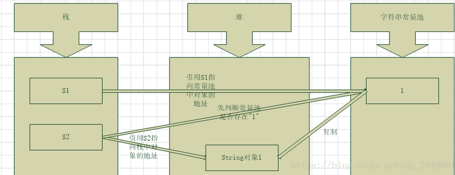
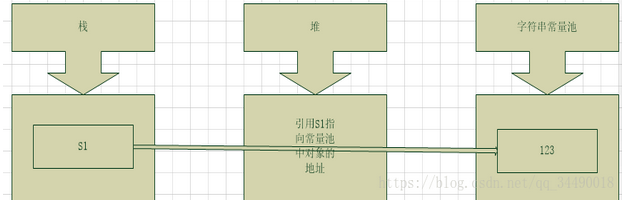
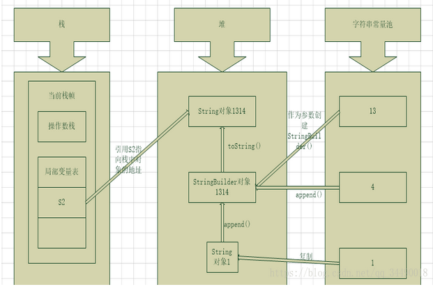
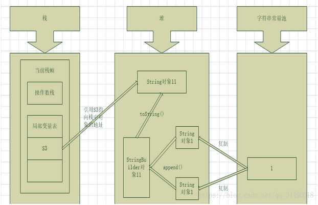

[TOC]

# String概述

## 概述
`java.lang.String` 类代表字符串，Java程序中所有的字符串文字（例如"abc"）都可以被看作
实现此类的实例

类`String`中包括用于检查各个字符串的方法，比如用于`比较`字符串、`搜索`字符串、`提取`子字符串以及创建
具有翻译为`大写`或`小写`的所有字符的字符串副本。

## 特点
1. 字符串不变性：字符串的值在创建后不能被更改
2. 因为String对象是不可变的，所以它们可以被共享
3. `abc`等效于`char[] data = {'a', 'b', 'c'};`

## 构造方法
- `public String()`初始化新创建的 String 对象，以使表示空字符序列
- `public String(char[] value)`通过当前参数中的字符数组来构造新的String
- `public String(byte[] bytes)`通过使用平台的默认字符集解码当前参数中的字节数组来构造新的String

# 常用方法
## 判断功能的方法
- `public boolean equals(Object anObject)`将此字符串与指定对象进行比较
- `public boolean equalsIgnoreCase(String anotherString)`将此字符串与指定对象进行比较，忽略大小写

## 获取功能的方法
- `public int length()`返回此字符串的长度
- `public String concat(String str)`将指定的字符串连接到该字符串的末尾
- `public char charAt(int index)`返回指定索引处的`char`值
- `public int indexOf(String str)`返回指定子字符串第一次出现在该字符串内的索引
- `public String substring(int beginIndex)`返回一个子字符串，从`beginindex`开始截取字符串到字符串结尾
- `public String substring(int beginIndex, int endIndex)` 返回一个字符串，从`beginIndex`到`endIndex`截取字符串，含头不含尾

## 转换功能的方法
- `public char[] toCharArray()`将此字符串转换成新的字符数组
- `public byte[] getBytes()`使用平台的默认字符集将该`String`编码转换成新的字节数组
- `public String replace(CharSequence target, CharSequence replacement)`将与`target`匹配的字符串使用`replacement`字符替换

## 分割功能的方法
- `public String[] split(String regex)`将此字符串按照给定的regex(规则)拆分为字符串数组

# String源码分析

```java
/**
 * String的部分源码
 * 
 * 可知该类被 final 修饰是是不可被继承
 * 
 * 实现的接口：
 * Serializable 标识序列化
 * Comparable<String> 用于两个实例化对象比较大小
 * CharSequence 只读字符序列，
 */
public final class String implements Serializable, Comparable<String>, CharSequence { 
    /**
     * String的本质：
     * 使用 char[] 数组存储 String 字符串的内容
     */
    private final char value[];
    /**
     * 存储的第一个索引
     */
    private final int offset;
    /**
     * 记录字符串中的字符数
     */
    private final int count;
    /**
     * String实例化的hashcode的一个缓存，
     * String的哈希码被频繁使用，将其缓存起来，
     * 每次使用就没必要再次去计算，
     * 这也是一种性能优化的手段
     * 这也是String被设计为不可变的原因之一
     */
    final int hash;

    // substring()方法的解析

    /**
     * substring()方法解析
     * 
     * @param beginIndex 起始值
     * @param endIndex 末尾值(不含)
     * @return 已截取的子串
     */
    public String substring(int beginIndex, int endIndex) {
        if (beginIndex < 0) {
            throw new StringIndexOutOfBoundsException(beginIndex);
        } 
        if (endIndex > count) {
            throw new StringIndexOutOfBoundsException(endIndex);          
        }
        if (beginIndex > endIndex) {
            throw new StringIndexOutOfBoundsException(endIndex - beginIndex);
        }
        return ((beginIndex == 0) && (endIndex == count)) ? this :
        /**
         * 返回的是 new String()，说明修改操作是不会改变最初传入的 String，
         * 都会返回一个新的字符串
         */ 
        new String(offset + beginIndex, endIndex - beginIndex, value);
    }
}
```

# String字符串存储原理
## JVM常量池

常量池：(线程共享数据区)

静态常量池常被分为两大类：`静态常量池`和`运行时常量池`。

静态常量池也就是Class文件中的常量池，存在于Class文件中。

运行时常量池（Runtime Constant Pool）是方法区的一部分，存放一些运行时常量数据。

字符串常量池存在运行时常量池之中（在JDK7之前存在运行时常量池之中，在JDK7已经将其转移到堆中）。

字符串常量池的存在使JVM提高了性能和减少了内存开销

## 创建字符串形式
首先形如声明为 String 类型的变量 s 是一个类 String 的引用变量 s（我们常常称之为句柄），
而对象一般通过new创建。所以这里的变量 s 仅仅是引用变量，并不是对象！


```java
/**
 * 创建字符串的两种形式：
 */
public class StringCreate {
    String s1 = "1";
    String s2 = new String("1");
}
```


- s1使用””引号（也是平时所说的字面量）创建字符串，在编译期的时候就对常量池进行判断是否存在该字符串，如果存在则不创建直接返回对象的引用；如果不存在，则先在常量池中创建该字符串实例再返回实例的引用给s1。

  > 注意：编译期的常量池是`静态常量池`

- s2使用关键词new创建字符串，JVM会首先检查字符串常量池，如果该字符串已经存在常量池中，那么不再在字符串常量池创建该字符串对象，而直接复制该对象的副本将堆中对象的地址赋值给引用s2，如果字符串不存在常量池中则实例化该字符串并且将其放到常量池中，然后复制该对象的副本将堆中对象的地址赋值给引用s2。

  > 注意：此时是运行期，那么字符串常量池是在`运行时常量池`中的

## "+"号拼接字符串形式

在 Java 的 String 类中，我们可以直接使用"+"号进行字符串的拼接，它有三种表现形式

```java
/**
 * 字符串拼接的三种表现形式
 */
public class StringCreate {
    public static void main(String[] args){
        String s1 = "1" + "2" + "3";
        String s2 = "1" + "3" + new String("1") + 4;
        String s3 = new String("1") + new String("1");
        System.out.println(s1);
        System.out.println(s2);
        System.out.println(s3);
    }
}
```

- `String s1 = "1" + "2" + "3";`

使用包含常量的字符串连接创建是也是常量，编译期就能确定了，直接入字符串常量池，当然同样需要判断是否已经存在该字符串


- `String s2 = "1" + "3" + new String("1") + 4;`

当使用`+`进行多个字符串连接时，实际上是产生了一个`StringBuilder`对象和一个String对象

实际运行过程：`String s2 = new StringBuilder(“13”).append(new String(“1”)).append(“4”).toString();`



`String s3 = new String("1") + new String("1");`该过程与上述相同



```java
public class String_ConstantPool01 {

    public static void main(String[] args) {
//        test01();
//        test02();
//        test03();
//        test04();
        test05();
    }

    /**
     * 第一种情况
     *
     * 字符串常量池直接存储
     *
     * JVM中提供了一个字符串常量池保存着许多的 String 对象
     * 里边的 String 对象可以被同一线程下的程序共享以提高效率
     * 由于 String 是不可变类(final)，它的值一经创建就不可更改
     */
    private static void test01() {
        // 在字符串常量池里创建一个对象
        String s1 = "abc";
        String s2 = "abc";
        // "==" 号表示指向着的地址值是否相等
        System.out.println("s1 == s2：" + (s1 == s2));  // s1 == s2 ：true
        // String 重写了 toString() 方法，equals()方法用来比较内容的相等性
        System.out.println("s1.equals(s2)：" + (s1.equals(s2))); // s1.equals(s2) ：true
    }

    /**
     * 第二种情况
     *
     * 关于 new String("")
     *
     * 第一次使用 new String("") 时会创建两个对象，它们分别会存方法在字符串常量池和堆内存中
     * 第二次创建相同的 new String("")那么会先从字符串常量池中寻找，如果存在则返回并且只会在堆内存创建一个对象
     */
    private static void test02() {
        String s1 = "abc";
        // 实例化一个字符串
        String s2 = new String("abc");
        String s3 = new String("abc");
        /**
         * 说明"=="号比较两个字符串时，堆内存的比较优先级较高
         */
        // 比较堆内存的地址值，s1 没有在堆内存中存在内存，s2 有
        System.out.println("s1 == s2：" + (s1 == s2));  // s1 == s2 ：false
        // s2 与 s3 是通过 new 关键字，new 关键字都会在堆内存中开辟内存
        System.out.println("s2 == s3：" + (s2 == s3));  // s1 == s2 ：false
        // String 重写了 toString() 方法，equals()方法用来比较内容的相等性
        System.out.println("s1.equals(s2) ：" + (s1.equals(s2))); // s1.equals(s2) ：true
    }

    /**
     * 第三种情况
     *
     * 关于使用"+"号拼接字符串
     *
     * 使用"+"号拼接字符串时，它会在编译期就会被确定
     * 上述第一种与第二种情况的分析建立在运行期之上
     */
    private static void test03() {
        // 该拼接字符串处理在编译期就会编译为 String s1 = "abc"
        String s1 = "a" + "b" + "c";
        String s2 = "abc";
        System.out.println("s1 == s2：" + (s1 == s2));  // s1 == s2 ：true
    }

    /**
     * 第四种情况
     *
     * 关于使用"+"号拼接字符串变量
     *
     * 当两个字符串变量相加时，在运行期JVM会创建一个 StringBuilder 对象并将其赋值给
     * 第一个变量(s1)，然后使用其.append()的方法相连第二个变量(s2)
     *
     * 注意：该过程内存中存在了五个对象(s1、s2、StringBuilder(s1)、String(s2)、s4)
     */
    private static void test04() {
        String s1 = "ab";
        String s2 = "cd";
        // 等效于 String s3 = new StringBuilder(s1).append(new String(s2)).toString();
        String s3 = s1 + s2;
        String s4 = "abcd";
        System.out.println("s3 == s4：" + (s3 == s4));   // s3 == s4 ：false
    }

    /**
     * 第五种情况
     *
     * 关于使用"+"号拼接字符串常量和字符串变量
     *
     * 直接与变量用"+"拼接会导致运行期在堆内存中创建一个新的对象
     * 当如果该变量存储的是一个"常量"，那么它会在编译期得到解析并拼接
     */
    private static void test05() {
        // 常量
        final String S1 = "a";
        // 变量
        String s2 = "bc";
        // 字符串 + 变量
        String s3 = "a" + s2;
        // 字符串 + 常量
        String S3 = S1 + "bc";
        String s4 = "abc";
        System.out.println("s3 == s4：" + (s3 == s4));  // s3 == s4：false
        System.out.println("S3 == s4：" + (S3 == s4));  // S3 == s4：true
    }
}

```


------

[回到顶部](#String概述)

[返回上一页](../../../KnowledgePoint.md)

