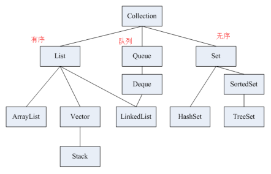

# Collection

## 概述   

单列集合类的根接口，用于存储一些了符合某种规则的元素，它有两个重要的子接口，分别是：
- `java.util.List`
  元素有序、可重复，主要的实现类有`java.util.ArrayList`和`java.util.LinkedList`
- `java.util.Set` 元素无序、而且不可重复，主要实现类有`HashSet`和`TreeSet`

集合的继承体系：



## Collection 常用方法

Collection 是所有单列集合的父接口，因此在 Collection
中定义了单列集合(List和Set)的一些通用方法，这些方法可以用于操作所有的单列集合

- `public boolean add(E e)` 把给定的对象添加到当前集合中
- `public void clear` 清空集合中的所有元素
- `public boolean remove(E e)` 把给定的对象在当前集合中删除
- `public boolean contains(E e)` 判断当前集合中释放包含给定的对象
- `public boolean isEmpty()` 判断当前集合是否为空
- `public Object[] toArray` 把集合中的元素，存储到数组当中

```java
/**
 * 共性方法测试
 */
public class Demo01_Collection {

    public static void main(String[] args) {
        // 创建集合对象，可以使用多态
        Collection<String> coll = new ArrayList<>();
        // 重写了toString()方法，返回了一个 []
        System.out.println(coll);   // []

        /**
         * public boolean add(E e) 把给定的对象添加到当前集合中
         * 返回值是一个boolean值，一般都会返回true，所以可以不用接收
         */
        boolean b1 = coll.add("张三");
        System.out.println("b1:" + b1);     // b1:true
        System.out.println(coll);           // [张三]
        coll.add("李四");
        coll.add("王五");
        coll.add("赵六");
        coll.add("田七");                     // [张三, 李四, 王五, 赵六, 田七]
        System.out.println(coll);

        /**
         * public boolean remove(E e) 把给定的元素在当前集合中删除
         * 返回值是一个boolean值，集合中存在元素，删除元素，返回true；集合中不存在元素，删除失败，则返回false
         */
        boolean b2 = coll.remove("赵六");
        System.out.println("b2:" + b2);     // b2:true
        boolean b3 = coll.remove("赵四");
        System.out.println("b3:" + b3);     // b3:false
        System.out.println(coll);           // [张三, 李四, 王五, 田七]

        /**
         * public boolean contains(E e) 判断当前集合中是否包含给定的对象
         * 包含返回true，不包含则返回false
         */
        boolean b4 = coll.contains("李四");
        System.out.println("b4:" + b4);     // b4:true
        // 返回一个不存在的
        boolean b5 = coll.contains("赵四");
        System.out.println("b5:" + b5);     // b5:false

        /**
         * public boolean isEmpty()
         * 判断当前集合是否为空，集合为空返回true，集合不为空则返回false
         */
        boolean b6 = coll.isEmpty();
        System.out.println("b6:" + b6);     // b6:false

        /**
         * public int size()
         * 返回集合中元素的个数
         */
        int size = coll.size();
        System.out.println(size);           // 4

        /**
         * public Object[] toArray()
         * 把集合中的元素，存储到数组中
         */
        Object[] arr = coll.toArray();
        for (int i = 0; i < arr.length; i++) {
            System.out.println(arr[i]);
            /*
              张三
              李四
              王五
              田七
            */
        }

        /**
         * public void clear()
         * 清空集合中所有的元素，但是不删除集合，集合还存在
         */
        coll.clear();
        System.out.println(coll);   // []
    }
}
```

# Collections 

## 概述

`java.util.Collections`是集合工具类，用来对集合进行操作，部分方法如下：

- `public static <T> boolean addAll(Collection<T>, T...elements)`
  往集合中添加一些元素

- `public static void shuffle(List<?> list)` 打乱集合中的顺序
- `public static <T> void sort(List<?> list)` 将集合中的元素按照默认规则排序
- `public static <T> void sort(List<T> list, Comparator<? super T)`
  将集合中的元素按照指定的规则排序

### 添加多个元素

`public static <T> boolean addAll(Collection<T>, T...elements)`
  往集合中添加一些元素
  
> 该方法的参数使用语法糖之一："可变参数"的特性

```java
import java.util.ArrayList;
import java.util.Collections;
import java.util.List;

public class Demo01_Collections {
    public static void main(String[] args) {
        
        List<String> list = new ArrayList<>();

        // 使用Collections.addAll(...)方法往集合中添加多个元素
        Collections.addAll(list, "a","b","c","d"); // [a, b, c, d]
        System.out.println(list);
    }
}
```
### 打乱顺序
`public static void shuffle(List<?> list)` 打乱集合中的顺序

```java
import java.util.ArrayList;
import java.util.Collections;
import java.util.List;

public class Demo01_Collections {
    public static void main(String[] args) {
        List<String> list = new ArrayList<>();

        // 使用Collections.addAll(...)方法往集合中添加多个元素
        Collections.addAll(list, "a","b","c","d");
        System.out.println(list);  // [a, b, c, d]

        // 使用Collections.shuffle(List<?> list)方法打乱集合中元素的顺序
        Collections.shuffle(list);
        System.out.println(list);  // [b, a, c, d]
    }
}
```

## sort 方法对集合进行排序

### `public static <T> void sort(List<?> list)` 

将集合中的元素按照默认规则排序

> 注意：有序集合的意思是存取的顺序，而不是字符的顺序(123ABCadc这样的默认顺序) 

```java
import java.util.ArrayList;
import java.util.Collections;
import java.util.List;

public class Demo01_Collections {
    public static void main(String[] args) {
        List<String> list = new ArrayList<>();

        // 使用Collections.addAll(...)方法往集合中添加多个元素
        Collections.addAll(list, "5","3","1","2","d","D","B","c","a","C","A","b");
        System.out.println(list);   // [5, 3, 1, 2, d, D, B, c, a, C, A, b]

        // 使用Collection.sort(List<T> list)对list集合进行排序
        Collections.sort(list);
        System.out.println(list);   // [1, 2, 3, 5, A, B, C, D, a, b, c, d]

    }
}
```
该方法指定传入的对象类型必须实现`java.lang.Comparable<T>`接口并重写`CompareTo(T o)
`方法，该方法才能生效，比如当前指定传入的对象类型`String`就重写了该接口，如果自定义的类没有重写该接口则编译器会报错！

### Comparable<T> 接口
`java.lang.Comparable<T>`接口可以定义类的排序规则

```java
import java.util.ArrayList;
import java.util.Collections;
import java.util.List;

/**
 * 一个实现了 Comparable 接口的类
 * 重写排序的接口
 */
class Demo01_Person implements Comparable<Demo01_Person> {

    private String name;
    private int age;
    
    
    /**
     * 务必重写 toString() 方法，否则将返回地址值
     * @return 返回集合的属性
     */
    @Override
    public String toString() {
        return "Demo01_Person{" +
                "name='" + name + '\'' +
                ", age=" + age +
                '}';
    }
    
    public int getAge() {
        return age;
    }
    
    /**
     * 实现排序规则的方法
     * @param p
     * @return 返回正负数决定排序规则，如果是0则默认相同不排序，当前为按年龄升序进行排序
     * 降序：p.getAge() - this.getAge()
     */
    @Override
    public int compareTo(Demo01_Person p) {
        return this.getAge() - p.getAge();
    }
}


public class Collections {
    public static void main(String[] args) {
        List<Person> list = new ArrayList<>();

        // 使用Collections.addAll(...)方法往集合中添加多个元素
        Collections.addAll(list,
                new Person("王刚",21),
                new Person("王云",18),
                new Person("王宏",25));

        System.out.println(list);
        // [Person{name='王刚', age=21}, Person{name='王云', age=18}, Person{name='王宏', age=25}]

        Collections.sort(list);
        System.out.println(list);
        // [Person{name='王云', age=18}, Person{name='王刚', age=21}, Person{name='王宏', age=25}]

    }
}

```


### `public static <T> void sort(List<T> list, Comparator<? super T)`

将集合中的元素按照指定的规则排序

与`Comparable<T o>`方法的区别：

- Comparable：自己(this)和别人(参数)比较，自己需要实现 Comparable
  接口，重写比较的规则 comparaTo() 方法<br>
- Comparator：相当于找一个第三方的裁判，比较两个

```java
import java.util.ArrayList;
import java.util.Collections;
import java.util.Comparator;
import java.util.List;

public class Collections {

    public static void main(String[] args) {
        List<Person> list = new ArrayList<>();

        // 使用Collections.addAll(...)方法往集合中添加多个元素
        Collections.addAll(list,
                new Person("王刚", 21),
                new Person("王云", 18),
                new Person("王宏", 25));
        System.out.println(list);

        Collections.sort(list, new Comparator<Demo01_Person>() {

            @Override
            public int compare(Person p1, Person p2) {
//                return p1.getAge() - p2.getAge(); // 按照年龄“升序”排序
//                return p2.getAge() - p1.getAge(); // 按照年龄“降序”排序
                return 0;   // 不排序

            }
        });

        System.out.println(list);
    }
}

```