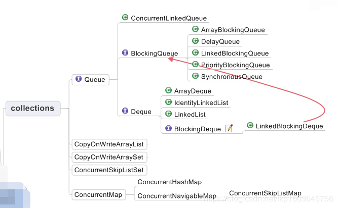

# Concurrent的集合并发包
## concurrent 概述
`java.util.concurrent` 是 JDK1.5 之后添加的并发包，用于解决在设计多线程时有效的减少
**竞争条件**和**死锁线程**，concurrent 包很好的解决了这些问题，为我们提供了更实用的并发程序模型

基于集合下的 concurrent 下并发类，可见下图：

这些集合的统一特性：线程安全、支持并发操作

## 非阻塞队列

队列无数据，操作队列产生异常或返回Null，不具备等待/阻塞的特色

- CopyOnWriteArrayList
- CopyOnWriteArraySet
- ConcurrentHashMap
- ConcurrentSkipListMap
- ConcurrentSkipListSet
- ConcurrentLinkedQueue
- ConcurrentLinkedDeque

## 阻塞队列

- ArrayBlockingQueue：有界阻塞队列
- LinkedBlockingQueue：无界阻塞队列，基于单向链表的实现
- PriorityBlockingQueue：无界有序的阻塞队列，基于数组
- SynchronousQueue：同步队列，插入需等待移除，移除需等待插入 
- DelayQueue：延时执行任务的队列，集合元素需实现java.util.concurrent.Delayed接口
- LinkedTransferQueue：与SynchronousQueue功能类似，但有嗅探功能，能尝试性的添加数据（tryTransfer()方法）

## CopyOnWriteArrayList
用于读操作 >> 写操作的情况。在写时拷贝，也就是如果需要对CopyOnWriteArrayList的内容进行改变，
首先会拷贝一份新的List并且在新的List上进行修改，最后将原List的引用指向新的List。线程安全地遍历，
因为如果另外一个线程在遍历的时候修改List的话，实际上会拷贝出一个新的List上修改，
而不影响当前正在被遍历的List。ArrayList非线程安全

## ConcurrentHashMap