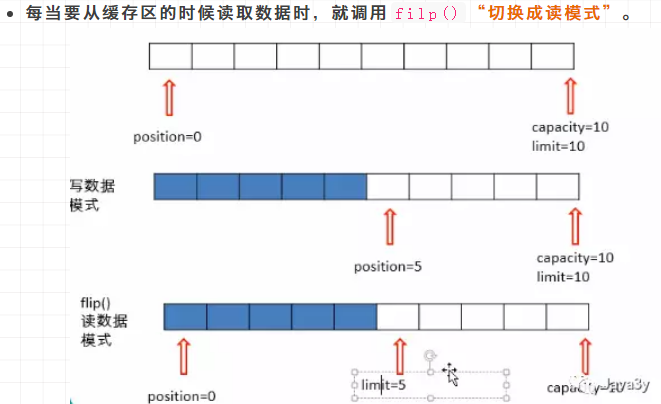

# NIO

## 概述
JDK1.4 中的`java.nio.*`中引入的新的**Java I/O**库，其目的是**提高速度**；实际上，旧的
I/O包已经使用NIO重新实现过了，即使我们不显示地使用NIO编程，也能从中收益；

> 在《Java编程思想》中说道“即使我们不显式地使用 NIO 编程，也能从中收益”

NIO 往往运用在**文件IO**和**网络IO**，其重点运用在**网络IO**

IO与NIO的区别：
- IO是面向**流**的处理，NIO是面向**块(缓冲区)**的处理
- 一个面向块(缓冲区)的 I/O 系统以**块**的形式处理数据

NIO主要由三个核心部分组成：
- buffer 缓冲区
- Channel 管道
- Selector 选择器

在 NIO 中并不是以流的形式来处理数据的，而是以 buffer 缓冲区和 Channel 管道配合使用来处理数据的；<br>
即 NIO就是通过 Channel 管道运输着存储数据的 Buffer 缓冲区来实现数据的处理

    Channel --> 运输
    Buffer --> 数据
    Channel 不与数据打交道，只负责运输数据，与数据打交道的是 Buffer 缓冲区
    
相对于传统 IO 而言，流是**单向**的；<br>
对于 NIO 而言，有了 Channel 管道这个概念，我们的读写都是**双向**的

## Buffer

Buffer 是缓冲区的抽象类，以下是部分源码：

```java
package java.nio;

import jdk.internal.HotSpotIntrinsicCandidate;
import jdk.internal.misc.JavaNioAccess;
import jdk.internal.misc.SharedSecrets;
import jdk.internal.misc.Unsafe;
import jdk.internal.misc.JavaNioAccess.BufferPool;

public abstract class Buffer {
    static final Unsafe UNSAFE = Unsafe.getUnsafe();
    static final int SPLITERATOR_CHARACTERISTICS = 16464;
    private int mark = -1;  // 标记
    private int position = 0;  // 位置
    private int limit;  // 上界
    private int capacity;  // 容量
    long address;
    .....
```

Buffer 类维护着4个核心变量属性来提供关于其所包含的数组信息，它们是
- `容量 capacity`<br>
缓冲区能够**容纳的数据元素的最大数量**，容量在缓冲区创建时被设定且永远不能改变(原因是底层实现是数组)

- `上界 limit`<br>
缓冲区里的**数据的总量**，代表着当前缓冲区中一共有多少数据

- `位置 position`<br>
下一个要被读或写元素的位置，position会自动由相应的`get()`和`put()`函数更新

- `标记 mark`<br>
一共备忘录，**用于记录上一次读写的位置**<br>

在 Java NIO 中负责数据的存取，缓冲区是**数组**，用于存储不同数据类型的数据：<br>
根据数据类型不同(boolean 除外)，提供了相应的缓冲区：
- ByteBuffer (最常用)
- CharBuffer
- ShortBuffer
- IntBuffer
- LongBuffer
- FloatBuffer
- DoubleBuffer

> 上述的缓冲区的管理方式几乎一样，通过`allocate()` 获取缓冲区

#### 读写方法

拿到一个缓冲区的目的是**读**缓冲区的数据/**写**数据到缓冲区，其读/写的核心方法为：
- `put()` 写操作，存入数据到缓冲区
- `get()` 读操作，获取缓冲区中的数据

#### 切换读写模式

NIO 还提供了一个`flip()`方法，这个方法可以改动 position 和 limit 的位置；<br>
即 limit 变成了 position 的位置了，而 position 变成了0



当调用完`flip()`方法时：limit 是限制读到哪里，而 position 是从哪里读；当切换到**读模式**之后就可以读取缓冲区的数据了

    String 中有一个方法可以输出缓冲区：
    System.out.println(new String(bytes, 0, bytes.length));

#### 清空缓冲区

`clear()`函数，这个函数会**清空**缓冲区：


- 缓冲区代码测试：

```java
import java.nio.ByteBuffer;

public class Demo01_Buffer {
    public static void main(String[] args) {

        // 新建一个缓冲区，其容量为 1024
        ByteBuffer byteBuffer = ByteBuffer.allocate(1024);

        // 查看核心变量的初始值
        System.out.println("容量：" + byteBuffer.capacity());
        System.out.println("上界：" + byteBuffer.limit());
        System.out.println("位置：" + byteBuffer.position());
        System.out.println("标记(目前可视为初始位置)：" + byteBuffer.mark());
        /* 输出结果
            容量：1024
            上界：1024
            位置：0
            标记(目前可视为初始位置)：java.nio.HeapByteBuffer[pos=0 lim=1024 cap=1024]
         */

        // 添加一些数据到缓冲区
        String talk = "lalalalala hahahahaha";
        byteBuffer.put(talk.getBytes());

        // 再次输出核心变量的值
        System.out.println("容量：" + byteBuffer.capacity());
        System.out.println("上界：" + byteBuffer.limit());
        System.out.println("位置：" + byteBuffer.position());
        System.out.println("标记：" + byteBuffer.mark());
        /* 输出结果
            容量：1024
            上界：1024
            位置：21
            标记：java.nio.HeapByteBuffer[pos=21 lim=1024 cap=1024]
         */

        // 切换到读模式
        byteBuffer.flip();
        System.out.println("容量：" + byteBuffer.capacity());
        System.out.println("上界：" + byteBuffer.limit());
        System.out.println("位置：" + byteBuffer.position());
        System.out.println("标记：" + byteBuffer.mark());
        /* 输出结果
            容量：1024
            上界：21
            位置：0
            标记：java.nio.HeapByteBuffer[pos=0 lim=21 cap=1024]
         */
        // 读取缓冲区的数据

        // 创建一个 limit() 大小的字节数组
        byte[] bytes = new byte[byteBuffer.limit()];
        // 将读取的数据装进字节数组中
        byteBuffer.get(bytes);
        // 输出数据
        System.out.println(new String(bytes, 0, bytes.length)); // lalalalala hahahahaha
        // 再次输出核心变量的值
        System.out.println("容量：" + byteBuffer.capacity());
        System.out.println("上界：" + byteBuffer.limit());
        System.out.println("位置：" + byteBuffer.position());
        System.out.println("标记：" + byteBuffer.mark());
        /* 输出结果
            容量：1024
            上界：21
            位置：21
            标记：java.nio.HeapByteBuffer[pos=21 lim=21 cap=1024]
         */

        // 清空缓冲区
        byteBuffer.clear();
        // 再次输出核心变量的值
        System.out.println("容量：" + byteBuffer.capacity());
        System.out.println("上界：" + byteBuffer.limit());
        System.out.println("位置：" + byteBuffer.position());
        System.out.println("标记：" + byteBuffer.mark());
        /* 输出结果
            容量：1024
            上界：1024
            位置：0
            标记：java.nio.HeapByteBuffer[pos=0 lim=1024 cap=1024]
         */
    }
}

```

## FileChannel

### 管道 Channel
用于源节点与目标节点的连接，在 Java NIO 中负责缓冲区中**数据的传输**，Channel 本身**不存储数据**，因此
会配合缓冲区进行传输；操作数据都是通过 Buffer 缓冲区进行操作

- 管道的主要实现类<br>
    - FileChannel
    - SocketChannel
    - ServerSocketChannel
    - DatagramChannel

Java 针对支持管道的类提供了 getChannel() 方法<br>
- 本地IO
    - FileInputStream/FileOutputStream
    - RandomAccessFile
- 网络IO
    - Socket
    - ServerSocket
    - DatagramSocket
    


