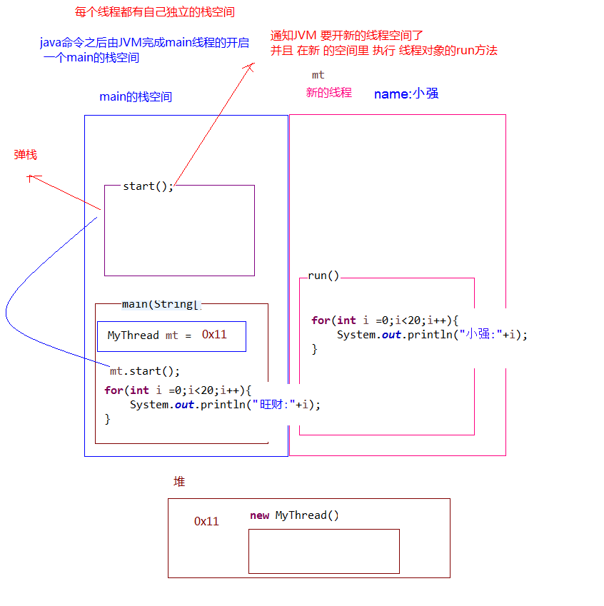

# Java创建多线程

# 创建线程方式一：Thread 类

Java 使用`java.lang.Thread`类代表**线程**，所有的程序对象都必须是 Thread 类或子类的实例，每个线程的作用是完成一定的任务，实际上就是执行一段**线程流**即一段顺序的代码；Java使用线程的执行体来代表这线程流；

Java 中通过继承`java.lang.Thread`类来创建并启动多线程步骤：
- 1.定义 Thread 类的子类，并重写`run()`方法，该`run() `法的方法体就代表了线程需要完成的任务，因此把`run()`方法称为**线程执行体**
- 2.创建 Thread 子类的实例，即创建了线程的对象
- 3.调用线程对象的`start()`方法来启动该线程

[多线程程序测试类.java](java/Demo01_Thread.java)

> 注意：请务必使用多态的形式实例化自定义线程的对象，以下线程的章节同理；图中未使用也请视为多态的形式！

## 多线程执行原理

上述的测试类中的代码如下：

```java
class MyThread extends Thread {

    @Override
    public void run() {
        for (int i = 0; i < 20; i++) {
            System.out.println("run():" + i);
        }
    }
}

public class Demo01_Thread {
    public static void main(String[] args) {
    	// 以多态的形式创建线程
        Thread my = new MyThread();
        my.start();
        for (int i = 0; i < 20; i++) {
            System.out.println("main():" + i);
        }
		}
}
```


程序启动 main() 方法的时候，JVM 就会启动一个进程；主线程main在 main() 调用时候被创建，随着 mt 对象
调用 start() 方法，另外一个新的线程也会启动，这样整个应用就在多线程下运行

### 多线程的内存原理
多线程执行时，在栈内存中，其实**每一个执行线程都有一片自己所属的栈内存空间**，进行方法的压栈和弹栈




当执行线程的任务结束后，线程自动在栈内存中释放，当所有的执行线程都结束了，那么进程也就结束了！

## Thread 类的方法

### 构造方法

- `public Thread()` 分配一个新的线程对象
- `public Thread(String name)` 分配一个指定名字的新的线程对象
- `public Thread(Runnable target)` 分配一个带有指定目标的新的线程对象(Runnable接口主要开启方法)
- `public Thread(Runnable target, String name)` 分配一个带有指定目标新的线程对象并指定名字

### 常用方法：
- `public String getName()` 获取当前线程的名称
- `public void start()` 导致此线程开始执行；JVM调用此线程的 run() 方法
- `public void run()` 此线程要执行的任务在此定义代码
- `public static void sleep(long millis)` 使当前正在执行的线程以指定的毫秒数暂停(暂时停止执行)
- `public static Thread currentThread()` 返回对当前正在执行的线程对象的引用

# 创建线程方式二：Runnable 接口

## 实现 Runnable 接口实现多线程

采用`java.lang.Runnable`接口的方式，只需重写`run()`方法并传入`new Thread(Runnable target)`构造方法即可

- 步骤：
	- 定义 Runnable 接口的实现类，并重写该接口的`run()`方法，该`run()`方法的方法体同样是该线程的线程执行体
	- 创建 Runnable 实现类的实例并以该实例作为 Thread 的`target`来创建 Thread 对象，Thread 对象才是真正的线程对象
	
通过实现`Runnable`接口，使得类有了多线程的特征，`run()`方法是多线程程序的执行目标，所有的多线程代码都在`run()`方法里面，Thread 类实际上也是实现了 Runnable 接口的类

在启动的多线程的时候，需要先通过 Thread 类的构造方法`Thread(Runnable target)`构造出对象，然后调用 Thread 对象的`start()`方法来运行多线程代码

实际上所有的多线程代码都是通过运行 Thread 的 start() 方法来运行的。因此，不管是继承 Thread 类还是实现 Runnable 接口来实现多线程，最终还是通过Thread的对象的API来控制线程的!

```java
// 继承 Runnable 接口使其成为自定义线程任务对象
class MyRunnable implements Runnable {
    @Override
    public void run() {
        for (int i = 0; i < 20; i++) {
            System.out.println(Thread.currentThread().getName()+ " " + i);
        }
    }
}

public class Demo01_Runnable {
    public static void main(String[] args){
        // 以多态的形式自定义线程任务对象
        Runnable mr = new MyRunnable();
        // 创建线程对象
        Thread t = new Thread(mr);
        t.start();
        for (int i =0; i < 20; i ++) {
            System.out.println("main():" + i);
        }
    }
}

```

>Runnable对象仅仅作为 Thread 对象的 target，Runnable 实现类里包含的 run() 方法仅作为线程执行体。而实际的线程对象依然是 Thread 实例，只是该Thread线程负责执行其 target 的 run() 方法

## Thread 和 Runnable 的区别

实现 Runnable 接口比继承 Thread 类所具有的优势：
- 1.适合多个相同的程序代码的线程去共享同一个资源
- 2.可以避免 Java 中的单继承的局限性
- 3.增加程序的健壮性，实现**解耦**操作，代码可以被多个线程共享，代码和线程独立
- 4.**线程池**只能放入实现 Runnable 接口或 Callable 类线程，不能直接放入继承 Thread 类

>在java中，每次程序运行至少启动2个线程。一个是**main线程**，一个是**垃圾收集线程**。因为每当使用
 java命令执行一个类的时候，实际上都会启动一个JVM，每一个JVM其实在就是在操作系统中启动了一个进程

## 匿名内部类实现线程的创建

使用匿名内部类的方式实现 Runnable 接口，重写 Runnable 接口中的run方法：

```java
public class Demo02_Runnable {
    public static void main(String[] args) {
        // 以多态的形式通过匿名内部类实现自定义线程任务对象
        Runnable r = new Runnable() {
            @Override
            public void run() {
                for (int i = 0; i < 20; i++) {
                    System.out.println("Runnable：" + i);
                }
            }
        };

        // 传入自定义线程任务对象
        new Thread(r).start();

        for (int i = 0; i < 20; i++) {
            System.out.println("main()：" + i);
        }
    }
}
```
------

[面试题](Interview.md)

[下一章节](../线程同步与安全/ReadMe.md)

[回到顶部](#Java创建多线程)

[返回上一页](../../KnowledgePoint.md)