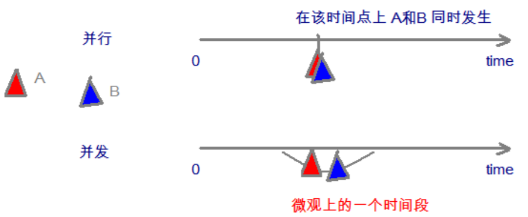
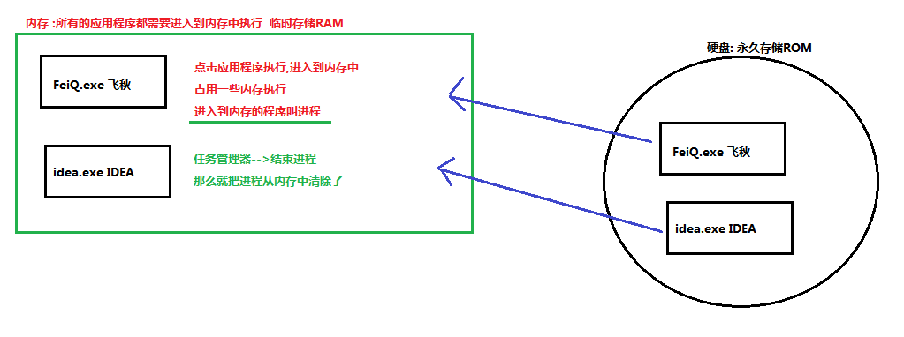
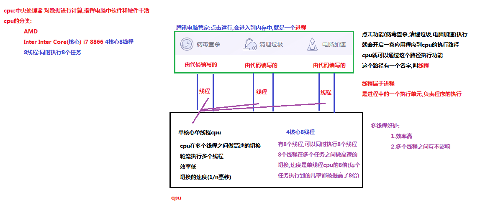

# 多线程
## 并发与并行概念

**并发**：指两个或多个事件在**同一时间段**内发生

**并行**：指两个或多个事件在**同一时刻**发生(同时发生)

在操作系统中，安装了多个程序，**并发**指的是在一段时间内**宏观上**有多个程序同时运行，这在单 CPU 系统中，
每一时刻只能有一道程序执行，即**微观上**这些程序是**分时交替运行**，只不过是给人的感觉是同时运行，那是因为分
时交替运行的时间是非常短的

而在多个 CPU 系统中，则这些可以并发执行的程序便可以分配到多个处理器上（CPU），实现多任务并行执行，
即利用每个处理器来处理一个可以并发执行的程序，这样多个程序便可以同时执行。目前电脑市场上说的多核
CPU；多核处理器核越多，并行处理的程序越多，能大大的提高电脑运行的效率

## 进程与线程概念

**进程**：是指一个内存中运行的应用程序，每一个进程都有一个独立的内存空间，一个程序可以同时运行
多个程序；进程也是程序的一次执行过程，是系统运行程序的**基本单位**；系统运行一个程序即是一个进程从
创建、运行到消亡的过程

**线程**：线程是进程中的一个**执行单元**，负责**当前**进程中程序的执行，一个进程中至少有一个进程；
一个进程中可以有多个线程的，这个应用程序也可以称之为多线程程序

>简之而言：一个程序运行后至少有一个进程，一个进程中可以包含多个线程；

## 线程的调度概念

- 分时调度

	所有线程轮流使用 CPU 的使用权，平均分配每个线程占用 CPU 的时间

- **抢占式调度**

	优先让优先级高的线程使用 CPU ，如果线程的优先级相同，那么会随机选择一个(线程的随机性)，Java使用的为抢占式调度
	
	- 设置线程的优先级
	
### 抢占式调度详解
CPU 使用抢占式调度模式在多个线程间进行高速的切换，对于 CPU 的一个核而言，在某个时刻只能运行一个线程，而 CPU 在多个线程间
切换速度相对来说感觉很非常快，宏观上就是**同一时刻**运行；其实多线程并不能提高程序的**运行速度**，但是能提供程序的**运行效率**，让 CPU
的使用率更高

------

[面试题](Interview.md)

[下一章节](../Java多线程/ReadMe.md)

[回到顶部](#多线程)

[返回上一页](../../KnowledgePoint.md)

