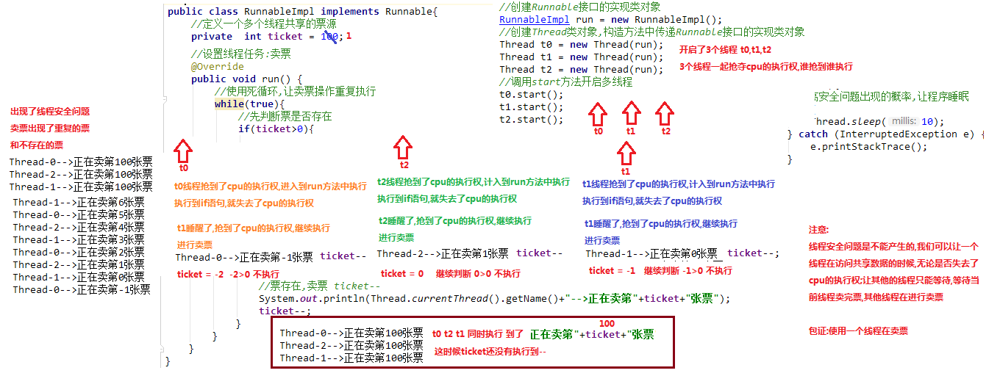

# 线程安全

## 线程安全

线程安全问题都是由**全局变量**及**静态变量**引起的，若每个线程都对全局变量和静态变量
只有**读**操作，而无**写**操作，一般来说这个全局变量是线程安全的；若多个线程同时执行写操作
一般都需要考虑线程同步的问题，否则就会影响线程安全

[电影票案例.java](java/Demo01_Synchronize.java)

 

 

## 线程同步

当使用**多个线程**访问**同一资源**的时候，且多个线程对资源有**写**的操作时，就容易出现线程安全问题；

要解决上述多线程并发访问同一资源的安全性问题，Java提供了**同步机制synchronized**来解决

为了保证每个线程都能正常执行原子操作，Java 引入了线程的同步机制，它有三种使用形式：
- 同步代码块
- 同步机制
- 锁机制

 

### 同步代码块

**同步代码块**：`synchronized`关键字可以用于方法的某个区块中，表示只对这个区块的资源实行**互斥**访问

- 格式：


        synchronized(同步锁) {
        // 需要同步操作的代码块
        }    

**同步锁**：对象的同步锁只是一个概念，可以想象在对象上上了个**锁**
 - 1.锁对象，可以是任意类型
 - 2.多个线程对象，要使用同一把锁
   
>在任何时候,最多允许一个线程拥有同步锁,谁拿到锁就进入代码块,其他的线程只能在外等着
(BLOCKED)

为上述卖电影票上锁及锁的关键字定义位置：
```java
class Ticket implements Runnable {

    private int ticket = 100;

    /**
     * 执行卖票的操作
     */
    @Override
    public void run() {
        // 每个窗口卖票的操作且窗口永远开启
        while (true) {
            
            // 上锁         
            synchronized (lock) {
                
                // 有票，可以卖
                if (ticket > 0) {
                    // 出票操作，使用 sleep() 模拟出票时间
                    try {
                        Thread.sleep(100);
                    } catch (InterruptedException e) {
                        e.printStackTrace();
                    }
                    // 获取当前线程对象的名字
                    String name = Thread.currentThread().getName();
                    System.out.println(name + "正在卖：" + ticket--);
                }
                
            }
            
        }
    }
}
```

### 同步方法

**同步方法**：使用`synchronized`修饰的方法，就叫做同步方法，保证A线程执行该方法的时候，其他线程只能在方法外等着

格式：

        public synchronized void method() {
            // 可能会产生线程安全问题的代码块
        }
        
      
为上述卖电影票案例使用同步方法：
```java
class Ticket implements Runnable {

    private int ticket = 100;

    /**
     * 执行卖票的操作
     */
    @Override
    public void run() {
        // 每个窗口卖票的操作且窗口永远开启
        while (true) {
                sellTicket();
            }
        }
        
        /**
         * 哪个对象调用了这个方法就是锁对象
         * 隐含锁对象就是 this
         */
        public synchronized void sellTicket() {
        
        // 有票，可以卖
        if (ticket > 0) {
            // 出票操作，使用 sleep() 模拟出票时间
            try {
                Thread.sleep(100);
            } catch (InterruptedException e) {
                e.printStackTrace();
            }
            // 获取当前线程对象的名字
            String name = Thread.currentThread().getName();
            System.out.println(name + "正在卖：" + ticket--);
        }
        
    }
    
}
```

## Lock 锁
`java.util.concurrent locks.Lock`机制提供了比**synchronized**代码和**synchronized**方法
更广泛的锁定操作，同步代码块/同步方法具有的功能`Lock`都有，除此之外更加强大，更能体现面向对象

Lock 锁也称**同步锁**，加锁与释放锁方法化了，如：
- `public void lock()` 加同步锁
- `public void unlock()` 释放同步锁

还是上述的卖电影票的案例，加锁位置：

```java
class Ticket implements Runnable {

    private int ticket = 100;

    // 实例化一个锁
    Lock lock = new ReentrantLock();

    /**
     * 执行卖票的操作
     */
    @Override
    public void run() {
        // 每个窗口卖票的操作且窗口永远开启
        while (true) {

            // 加同步锁
            lock.lock();

            // 有票，可以卖
            if (ticket > 0) {
                // 出票操作，使用 sleep() 模拟出票时间
                try {
                    Thread.sleep(100);
                } catch (InterruptedException e) {
                    e.printStackTrace();
                }
                // 获取当前线程对象的名字
                String name = Thread.currentThread().getName();
                System.out.println(name + "正在卖：" + ticket--);
            }

            // 释放同步锁
            lock.unlock();

        }
    }
}
```
# 死锁

## 概念

多线程以及多进程改善了系统资源的利用率并提高了系统的处理能力，然而并发执行也带来了新的问题——**死锁**<br>
所谓死锁是指多个线程因**竞争资源**而造成的一种僵局（互相等待）；若无外力作用，这些进程都将无法向前推进<br>

Java发生死锁的根本原因是：当一个线程永远地持有一个锁，并且其他线程都尝试获得这个锁时，那么它们将永远被阻塞。
如在线程A持有锁L并想获得锁M的同时，线程B持有锁M并尝试获得锁L，那么这两个线程将永远地等待下去。这种就是最简答的死锁形式


