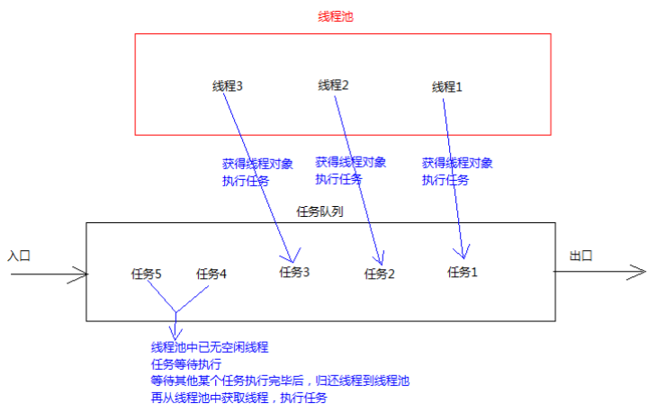

# 线程池

## 思想概述
如果并发的线程数量很多，并且每个线程都是执行一个时间很短的任务就结束了，这样频繁创建线程就会大大降低
系统的效率，因为频繁创建线程和销毁线程需要时间 

那么有没有一种办法使得线程可以复用，就是执行完一个任务，并不被销毁，而是可以继续执行其他的任务？

在Java中可以通过**线程池**来达到这样的效果

## 线程池概念

- **线程池**：一个能够容纳多个线程的**容器**，其中的线程可以**反复使用**，
  省去频繁创建销毁线程对象的操作，无需反复创建线程而消耗过多资源

 

合理利用线程池能够带来三个好处：

- 1.**降低资源消耗**；减少了创建和销毁线程的次数，每个工作线程都可以被重复利用，可执行多个任务
- 2.**提高响应速度**；当任务到达时，任务可以不需要的等到线程创建就能立即执行
- 3.**提高线程的可管理性**；可以根据系统的承受能力，调整线程池中工作线线程的数目，防止因为消耗过多的内
  存，而把服务器累趴下(每个线程需要大约1MB内存，线程开的越多，消耗的内存也就越大，最后死机)


## 线程池的使用

`java.util.concurrent.Executor`是Java的**线程池**的**顶级接口**，这并不是一个线程池，
而是一个执行线程的工具，真正的线程池接口是`java.util.concurrent.ExecutorService`

要配置线程池是比较复杂的，尤其对原理的情况下配置线程池并不是较优的，因此在`java.util.concurrent.Executors`
线程工厂里面提供了一些**静态工厂**，生成一些常用的线程池；

> 官方建议使用**Executors**工程类来创建线程池对象

**Executor**类有个创建线程池的方法如下：

- `public static ExecutorService newFixedThreadPool(int nThreads)`
  返回线程池对象(创建的是有界线程池，也就是池中的线程个数可以指定最大数量)

**ExecutorService**类是用来获取线程池对象的类，它定义了一个使用线程池对象的方法：

- `public Future<?> submit(Runnable task)` 获取线程池中的某一个线程对象并执行

> **Future**接口：用来记录线程任务执行完毕后产生的结果，线程池创建与使用；

## 使用线程池的步骤

- 1.创建线程池对象
- 2.创建实现 Runnable 接口的自定义线程对象
- 3.提交自定义的线程对象
- 4.关闭线程池(一般不做)

```java

import java.util.concurrent.ExecutorService;
import java.util.concurrent.Executors;

/**
 * 线程池测试
 */
public class Demo01_ThreadPool {
    public static void main(String[] args) {
        // 创建线程池对象，并设置线程池容量
        ExecutorService service = Executors.newFixedThreadPool(2);
        // 创建 Runnable 实例对象
        SwimTrainee trainee = new SwimTrainee();

        // 从线程池中获取线程对象，然后调用 SwimTrainee 中的 run()
        service.submit(trainee);
        // 再获取一个线程对象，调用 SwimTrainee 的 run()
        service.submit(trainee);
        service.submit(trainee);

        /**
         * 注意：submit()方法调用完后，程序并不终止，这是因为线程池控制了线程的关闭
         * 将使用完的线程又归还到了线程池中
         */

        // 关闭线程池，但一般不关闭
        // service.shutdown();
    }
}

/**
 * 实现 Runnable 接口的游泳学员 SwimTrainee 自定义线程对象
 */
class SwimTrainee implements Runnable {

    @Override
    public void run() {
        System.out.println("我要一个教练");
        try {
            Thread.sleep(2000);
        } catch (InterruptedException e) {
            e.printStackTrace();
        }

        System.out.println("教练来了：" + Thread.currentThread().getName());
        System.out.println("教完我游泳了，教练回到了游泳池");
    }
}

```


