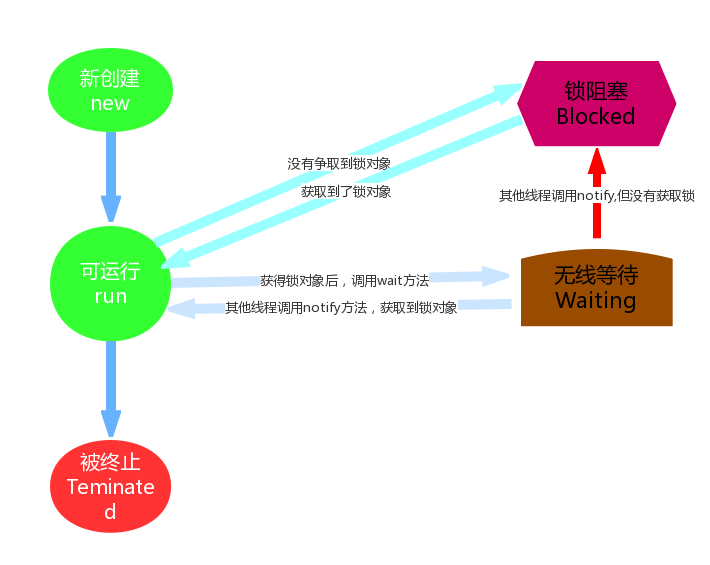

# 线程状态

## 概述
当线程被创建并启动以后，它既不是一启动就进入执行状态，也不是一直处于执行状态，
在线程的生命周期可以在API`java.lang.State`这个枚举给出了六种线程状态


## Timed Waiting (计时等待)

`Timed Waiting`在API中的描述：

    一个正在限时等待另一个线程执行一个（唤醒）动作的线程处于这一状态

一个计时器： 

```java
public class Demo01_State extends Thread {

    @Override
    public void run() {
        for (int i = 0; i < 100; i++) {
            if ((i) % 10 == 0) {
                System.out.println("-----" + i);
            }
            System.out.println(i);

            try {
                Thread.sleep(1000);
                System.out.println("线程睡眠了1秒钟");
            } catch (InterruptedException e) {
                e.printStackTrace();
            }
        }
    }

    public static void main(String[] args) {
        new Demo01_State().start();
    }
}
```

`Thread.sleep(Long millisecond)`方法调用很简单，这个方法有几个点：
- 进入`TIMED_WAITIMG`状态的一种情形便是调用了`sleep()`方法，单独的线程也可以调用，不一定非要协作关系
- 为了让其他线程有机会执行，可以将Thread.sleep()的调用放线程run()之内。这样才能保证该线程执行过程中会睡眠
- sleep与锁无关，线程睡眠到期自动苏醒，并返回到Runnable（可运行）状态

>sleep()中指定的时间是线程不会运行的最短时间。因此，sleep()方法不能保证该线程睡眠到期后就开始立刻执行

 

## BLOCKED (锁阻塞)

`Blocked`状态在API中的介绍为：

    一个正在阻塞等待一个监视器锁（锁对象）的线程处于这一状态

比如，线程A与线程B代码中使用同一锁，如果线程A获取到锁，线程A进入到Runnable状态，那么线程B就进入到Blocked锁阻塞状态

这是由 Runnable 状态进入 Blocked 状态,除此 Waiting 以及 Time Waiting
状态也会在某种情况下进入阻塞状态

 

## Waiting (无限等待)

`Waiting`状态在API中介绍为：

    一个正在无限期等待另一个线程执行一个特别的（唤醒）动作的线程处于这一状态

[无限等待案例.java](java/Demo02_State.java) 

一个调用了某个对象的`Object.wait`方法的线程会等待另一个线程调用此对象的
`Object.notify()`方法 或`Object.notifyAll()`方法

其实**waiting**状态并不是一个线程的操作，它体现的是多个线程间的通信，可以理解为多个线程之间的协作关系，
多个线程会争取锁，同时相互之间又存在协作关系


当多个线程协作时，比如A，B线程，如果A线程在**Runnable（可运行）**状态中调用了`wait()`方法那么A线程就进入
了**Waiting（无限等待）**状态，同时失去了同步锁。假如这个时候B线程获取到了同步锁，在运行状态中调用了
`notify()`方法，那么就会将无限等待的A线程唤醒。注意是唤醒，如果获取到锁对象，那么A线程唤醒后就进入
**Runnable（可运行）**状态；如果没有获取锁对象，那么就进入到**Blocked（锁阻塞状态）**

Waiting 线程状态图 



# 等待唤醒机制

## 线程间通信

- 概念：多个线程在处理同一资源，但处理的动作(线程的任务)却不相同

比如：线程A用来生成包子的，线程B用来吃包子的，包子可以理解为同一资源，线程A与线程B处理的动作，一个
是生产，一个是消费，那么线程A与线程B之间就存在线程通信问题


- 为什么要处理线程间通信：

多个线程并发执行时, 在默认情况下CPU是**随机切换线程**的，当我们需要多个线程来**共同完成**一件任务，并且我们
希望他们有规律的执行,那么多线程之间需要一些**协调通信**，以此来帮我们达到多线程共同操作一份数据

- 如何保证线程间通信有效利用资源：

多个线程在处理同一个资源，并且任务不同时，需要线程通信来帮助解决线程之间对同一个变量的使用或操作， 就是多个线程在操作同一份数据时，
避免对**同一共享变量**的争夺。也就是我们需要通过一定的手段使各个线程能有效 的利用资源。而这种手段即——**等待唤醒机制**

## 等待唤醒机制

这是多个线程间的一种协作机制。谈到线程我们经常想到的是线程间的**竞争（race）**，比如去争夺锁，但这并不是
故事的全部，线程间也会有**协作机制**

就是在一个线程进行了规定操作后，就进入**等待状态（wait()）**，
等待其他线程执行完他们的指定代码过后
再将其**唤醒（notify()）**;在有多个线程进行等待时，
如果需要，可以使用`notifyAll()`来唤醒所有的等待线程。
`wait()`/`notify()`就是线程间的一种协作机制

### 等待唤醒中的方法

等待唤醒机制就是用于解决线程间通信的问题的

- wait：线程不再活动，不再参与调度，进入 **wait set** 中，因此不会浪费 CPU
  资源，也不会去竞争锁了，这时的线程状态即是**WAITING**。
  它还要等着别的线程执行一个特别的动作，也即是 **通知（notify）** 在这个对象
  上等待的线程从 wait set 中释放出来，重新进入到调度队列（ready queue）中
  
- notify：则选取所通知对象的 wait set 
  中的一个线程释放；例如，餐馆有空位置后，等候就餐最久的顾客最先 入座
    
- notifyAll：则释放所通知对象的 wait set 上的全部线程

注意：

哪怕只通知了一个等待的线程，被通知线程也不能立即恢复执行，因为它当初中断的地方是在同步块内，而
此刻它已经不持有锁，所以它需要再次尝试去获取锁（很可能面临其它线程的竞争），成功后才能在当初调
用 wait 方法之后的地方恢复执行
 
总结如下： 
- 如果能获取锁，线程就从 WAITING 状态变成 RUNNABLE 状态； 
- 否则，从 wait set 出来，又进入 entry set，线程就从 WAITING 状态又变成 BLOCKED 
  状态
  
调用wait和notify方法需要注意的细节

- `wait()`方法与`notify()`方法必须要由同一个锁对象调用。因为：对应的锁对象可以通过
  `notify()`唤醒使用同一个锁对 象调用的 `wait()` 方法后的线程
- `wait()`方法与`notify()`方法是属于Object类的方法的。因为：锁对象可以是任意对象，而任意对象的所属类都是继
  承了Object类的
- `wait()`方法与`notify()`方法必须要在**同步代码块**或者是**同步函数**中使用。因为：必须要通过锁对象调用这2个方
  法
  
# 生产者与消费者问题

[吃货与包子铺间生产消费案例.java](java/Demo03_State.java) 

.bmp) 