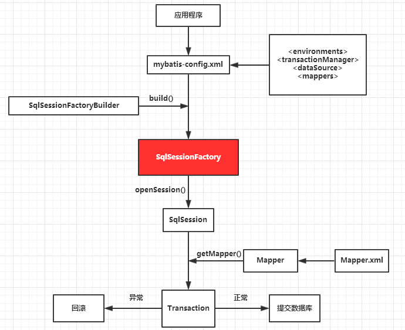
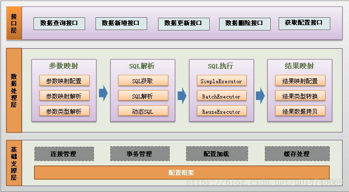

# MyBatis 框架

## 什么是MyBatis框架
MyBatis 本是apache的一个开源项目iBatis, 2010年这个项目由apache software foundation
迁移到了google code，并且改名为MyBatis。是一个基于 Java 的 ORM (持久层)框架

无论是 MyBatis、Hibernate 都是对 ORM 的一种实现框架，即对 JDBC 的一种封装！

前置知识：<br>
- [SQL结构化查询语言]
- [JDBC]
- 设计模式
    - [建造者设计模式]
    - [工厂设计模式]

## 对比其他 ORM 技术的优势

#### Hibernate
这是一个比较老旧的框架，会用十分舒服，因为什么 SQL 语句都不用写，但它的缺点也很明显：处理复杂业务时，灵活性较差且复杂的 HQL 难写难理解，比如多表查询的 HQL 语句

#### JDBC
原生 JavaEE 组件，只要写了 DButils 封装获取 Connection 方法，然后自己动手写 SQL 既可，JDBC 的做法是“什么都是自己做”

#### Spring DAO
对 JDBC 的一层封装，作用与 DButils 差不多

#### Spring Data JAP
待定

## 搭建 MyBatis 工作环境

### 导入 Jar 包

MyBatis是封装了 JDBC ,即 JDBC 的相关数据库 jar 包即连接池 jar 包也要导入

- mysql-connector-java
- commons-dbcp
- org.mybatis

```xml
<?xml version="1.0" encoding="UTF-8"?>
<project xmlns="http://maven.apache.org/POM/4.0.0"
         xmlns:xsi="http://www.w3.org/2001/XMLSchema-instance"
         xsi:schemaLocation="http://maven.apache.org/POM/4.0.0 http://maven.apache.org/xsd/maven-4.0.0.xsd">
    <modelVersion>4.0.0</modelVersion>

    <groupId>cn.aijiang</groupId>
    <artifactId>Mybatis</artifactId>
    <version>1.0-SNAPSHOT</version>

    <dependencies>
        <!-- Junit单元测试框架 -->
        <dependency>
            <groupId>junit</groupId>
            <artifactId>junit</artifactId>
            <version>4.12</version>
        </dependency>
        <!-- Mysql数据库连接 -->
        <dependency>
            <groupId>mysql</groupId>
            <artifactId>mysql-connector-java</artifactId>
            <version>8.0.16</version>
        </dependency>
        <!-- 数据库连接池 -->
        <dependency>
            <groupId>commons-dbcp</groupId>
            <artifactId>commons-dbcp</artifactId>
            <version>1.4</version>
        </dependency>
        <dependency>
            <groupId>org.apache.commons</groupId>
            <artifactId>commons-lang3</artifactId>
            <version>3.4</version>
        </dependency>
        <!-- mybatis持久层框架 -->
        <dependency>
            <groupId>org.mybatis</groupId>
            <artifactId>mybatis</artifactId>
            <version>3.5.1</version>
        </dependency>
        <!-- log4j日志 -->
        <dependency>
            <groupId>log4j</groupId>
            <artifactId>log4j</artifactId>
            <version>1.2.17</version>
        </dependency>
    </dependencies>

</project>
```

### 配置 MyBatis 的配置信息

注意当前配置数据库的环境信息：

- 当前本测试代码的数据库 url 为：jdbc:mysql://localhost:3306/aijiangdb?useUnicode=true&amp;characterEncoding=utf-8&amp;serverTimezone=Asia/Shanghai
- 当前数据库名为：aijiangdb
- 当前使用的是根数据库：root

```xml
<?xml version="1.0" encoding="UTF-8"?>
<!DOCTYPE configuration PUBLIC "-//mybatis.org//DTD Config 3.0//EN"
        "http://mybatis.org/dtd/mybatis-3-config.dtd">

<!-- Mybatis的基础配置文件，通常只有一个：主要是配置一些最基本的上下文参数和运行环境 -->
<configuration>

    <!-- 指明 Mybatis 所用的日志的具体实现 -->
    <settings>
        <setting name = "logImpl" value = "LOG4J"/>
    </settings>

    <!-- 定义一个别名 mybatis，它代表着 cn.tedu.mybatis.MyBatis 这个类，
    这样定义后，在 MyBatis 上下文就可以使用别名去代替全限定名 -->
    <typeAliases>
        <typeAlias alias = "mapper" type = "cn.aijiang.mapper.UserMapper" />
    </typeAliases>

    <!-- 数据库环境设置 -->
    <environments default = "development">
        <!-- 配置事务管理器 -->
        <environment id = "development">
            <!-- 此处采用的是 MyBatis 的 JDBC 管理器方式 -->
            <transactionManager type="JDBC" />
            <!-- 配置数据库 -->
            <!-- 属性type="POOLED"代表采用 MyBatis 内部连接池方式 -->
            <dataSource type = "POOLED">
                <property name = "driver" value = "com.mysql.jdbc.Driver"/>
                <property name = "url" value = "jdbc:mysql://localhost:3306/aijiangdb?useUnicode=true&amp;characterEncoding=utf-8&amp;serverTimezone=Asia/Shanghai" />
                <property name = "username" value = "root" />
                <property name = "password" value = "root" />
            </dataSource>
        </environment>
    </environments>

    <!-- 对应 mapper 映射文件 -->
    <mappers>
        <mapper resource = "UserMapper.xml" />
    </mappers>

</configuration>
```

### 编写 Mapper 映射接口

```java
package cn.aijiang.mapper;

import cn.aijiang.entity.User;

/**
 * Mapper 映射接口
 */
public interface UserMapper {

    /**
     * 查询数据库中用户的行数
     * @return 用户的总数
     */
    Integer count();
}
```

### 配置 Mapper 映射文件

```xml
<?xml version="1.0" encoding="UTF-8" ?>
<!DOCTYPE mapper PUBLIC "-//mybatis.org//DTD Mapper 3.0//EN"
        "http://mybatis.org/dtd/mybatis-3-mapper.dtd">


<!-- 引入的映射器 -->
<!-- namespace 属性对应了一个接口的全限定名，MyBatis上下文就可以通过它找到对应的接口-->
<mapper namespace = "cn.aijiang.mapper.UserMapper">

    <!-- 配置实体与数据表的映射 -->
    <resultMap id = "UserEntityMap" type = "cn.aijiang.entity.User">
        <id column = "id" property = "id" />
        <result column = "username" property = "username" />
        <result column = "password" property = "password" />
        <result column = "age" property = "age" />
        <result column = "phone" property = "phone" />
        <result column = "email" property = "email" />
        <result column = "is_delete" property = "isDelete" />
        <result column = "department_id" property = "departmentId" />
    </resultMap>

    <!-- 查看用户数量 -->
    <select id = "count" resultType = "java.lang.Integer">
	    SELECT
	        COUNT(*)
	    FROM
	        user
    </select>

</mapper>
```

注意在上述的 MyBatis 的配置中的 <mappers> 写入该映射文件

### Junit 写测试代码

```java
package cn.aijiang.mapper;

import org.apache.ibatis.io.Resources;
import org.apache.ibatis.session.SqlSession;
import org.apache.ibatis.session.SqlSessionFactory;
import org.apache.ibatis.session.SqlSessionFactoryBuilder;
import org.junit.After;
import org.junit.Before;
import org.junit.Test;

import java.io.IOException;
import java.io.InputStream;

public class MapperTest {

    private InputStream in;
    private SqlSession session;
    private UserMapper mapper;

    @Before
    public void doBefore() throws IOException {
        // 读取mybatis-config.xml文件
        in = Resources.getResourceAsStream("aijiangConfiguration.xml");
        // 初始化SqlSession工厂的建造类
        SqlSessionFactoryBuilder builder = new SqlSessionFactoryBuilder();
        // 获取一个工厂类，创建SqlSessionFactory类的实例
        SqlSessionFactory factory = builder.build(in);
        // 通过SqlSessionFactory类的工厂模式获得一个session实例
        session = factory.openSession();
        mapper = session.getMapper(UserMapper.class);
    }

    @After
    public void doAfter() throws IOException {
        session.close();
        in.close();
    }

    @Test
    public void testInsert() {
        Integer rows = mapper.count();
        // 得保证数据库中有数据
        System.out.println("用户的总数：" + rows);    // 用户的总数：6
    }

}

```

## MyBatis 工作原理



（1）构建`SqlSession`工厂：MyBatis 应用程序通过`SqlSessionFactoryBuilder`(SqlSession工厂建造者)从`mybatis-config.xml`配置文件中
构建出`SqlSessionFactory`

```
// 读取mybatis-config.xml文件
InputStream in = Resources.getResourceAsStream("aijiangConfiguration.xml");
// 初始化SqlSession工厂的建造类
SqlSessionFactoryBuilder builder = new SqlSessionFactoryBuilder();
// 获取一个工厂类，创建SqlSessionFactory类的实例
SqlSessionFactory factory = builder.build(in);
```

（2）获取`SqlSeesion`对象：SqlSessionFactory 的实例通过`openSession()`方法开启了一个`SqlSession`

```
// 通过SqlSessionFactory类的工厂模式获得一个session实例
SqlSession session = factory.openSession();
```

（3）通过`SqlSession`实例获取`Mapper`并运行`Mapper`映射的`SQL`语句，完成对数据库的操作和事务提交，之后关闭 SqlSession

```
UserMapper mapper = session.getMapper(UserMapper.class);

// 通过 UserMapper 对象执行接口的映射方法
Integer rows = mapper.count();
// 得保证数据库中有数据
System.out.println("用户的总数：" + rows);    // 用户的总数：6

```

> SqlSession 是单线程对象，因为它是非线程安全的，是持久化操作的共享对象，类似 JDBC 中的 Connection，底层就封装了 JDBC 连接

### MyBatis 详细流程
1.加载 MyBatis 全局配置文件(数据源、mapper映射文件等)，解析配置文件，MyBatis 基于 XML 配置文件生成
`Configuration`，和一个个 MappedStatement (包括了参数映射配置、动态SQL语句、结果映射配置)，其对应着
<select> | <updata> | <delete> | <insert> 标签项
<br>
	
2.SqlSessionFactoryBuilder 通过 Configuration 对象生成 SqlSessionFactory，用来开启 SqlSession
<br>

3.SqlSession 对象完成与数据库的交互
- (1) 用户程序调用 mybatis 接口层 API (即 Mapper 接口中方法)
- (2) SqlSession 调用 API 的 Statement ID找到对应的 MappedStatement 对象
- (3) 通过 Executor(负责动态SQL的生成和查询缓存的维护) 将 MappedStatement 对象进行解析、SQL参数转化、动态SQL拼接、生成`JDBC Statement`对象
- (4) JDBC 执行 SQL
- (5) 借助 MappedStatement 中的结果映射关系，将返回的结果转换为 HashMap、JavaBean 等存储结构并返回

<br>
MyBatis层次结构：


