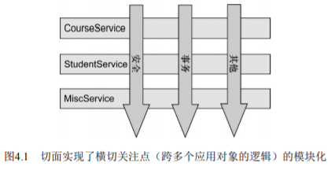
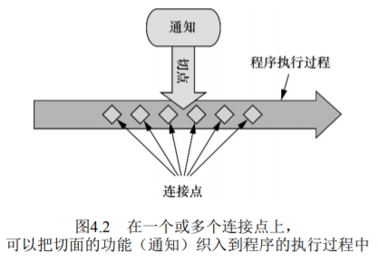

# 面向切面编程 AOP

## AOP 思维概述

在写这个文档时，在南方正处于9月份，此刻以及非常热的季节了，天天回到家和到学校的路上都会热成dog！
当然，每次一回到家或到学校的时候就能享受到空调，空调真实爽啊！但空调唯一缺点恐怕就是耗钱，电就需要钱，
但我们每次吹着空调，都不会去关注电在消耗，它只是每个月底会被查，连同水表一样被查；然后记个数给我。在这个过程中
我没有时时刻刻的关注电量，但它又时时刻刻的在改变，这是一件非常**被动**的事情

在软件系统中有一些功能也像我们的电表一样，这些功能需要用到应用程序的多个地方，但是我们又不想在每个点都明确调用它们；
这些诸如**日志**、**事务管理**、**安全**都很重要，但我们只想关注业务本身，这些东西就应该由其他的地方去处理；

这些散布于应用多处的**被动**功能称为**横切关注点 Cross-cutting concern**，这些横切关注点从概念上是从应用的业务逻辑相分离的(但
又会以另一种方式嵌入到业务逻辑中)，把这些横切关注点与业务逻辑代码分离正是**面向切面编程(AOP) **所要学习和理解的

前置知识：
[抽象继承体系]()
[代理模式]()
[Spring-IOC]()

## 面向切面编程概述

**切面**能帮助我们模块化横切关注点，横切关注点可以被描述为**影响应用多处的功能**



> 如上图，许多 Service 都会存在一些相同辅助功能，它们基本上都是“贯穿”整个软件系统而存在

如果要重用通用功能的话，最基本的Java语法便是**继承**或**委托**，如果整个应用都使用相同的基类，继承
往往会导致一个脆弱的对象体系，而使用委托可能需要对委托对象进行复杂的调用；

**面向切面编程**就是取代继承和委托的可选方案，在使用面向切面编程我们仍然在一个地方定义通用功能，但是可以通过**声明**
的方式定义这些功能**以何种方式在何处应用**，而无需修改受影响的类！

横切关注点可以被模块化为特殊的类，这些类被称为**切面 aspect**，这样有两个好处：
- 现在每个关注点都集中在一个地方，而不是分散在多处代码中
- 其次，模块更加简洁，因为它们只包含主要关注点的代码，而次要关注点的代码转移到了切面上

## 定义 AOP 术语

AOP 拥有自己的术语，描述切面的常用技术有**通知 advice**、**切点 pointcut**、**连接点 join point**



### 通知 Advice
通知定义了切面是什么以及**何时使用**，除了描述切面要完成的工作，通知还解决了**何时执行**这个工作的问题

Spring切面提供了5种类型的通知；
- `前置通知(Before)` ：在目标方法被调用之前调用通知功能；
- `后置通知(After)` ；在目标方法完成之后调用通知，此时不会关心方法的输出是什么；
- `返回通知(After-returning)` ：在目标方法成功执行之后调用通知；
- `异常通知(After-throwing)` ：在目标方法抛出异常后调用通知；
- `环绕通知(Around)` ：通知包裹了被通知的方法，在被通知的方法调用之前和调用之后执行自定义的方法

### 连接点 Join Point

我们的应用可能也有数以千计的时机应用通知，这些时机被称为**连接点**，连接点是在应用执行过程中能够插入
切面的一个点；这个点可以是调用方法时、抛出异常时、甚至修改一个字段时；切面代码可以利用这些点插入到应用
的正常流程中，并添加新的行为

### 切点 Poincut
通知定义了切面的**什么**和**何时**，那么切点就定义了**何处**；

切点的定义匹配通知所要织入的一个或多个连接点，我们通常使用明确的类和方法名称，或是利用
正则表达式定义所匹配的类和方法名称来指定这些切点；

### 切面 Aspect
切面是通知和切点的结合，通知和切点共同定义了切面的全部内容--它是什么，在何时和何处完成其功能

### 引入 Introduction
引入允许我们向现有的类添加新的方法或属性，如我们创建一个 Auditable 通知类，该类记录了对象最后一次修改时的
状态，这很简单，只需一个方法`setLastModified(Date)`，和一个实例变量来保存这个状态，然后新方法和实例变量就可以被
引入到现有的类中，从而可以在无需修改这些现有的类的情况下，让他们具有新的行为和状态；

### 织入 Weaving
织入是把切面应用到目标对象并创建新的代理对象的过程，切面在指定的连接点被织入到目标对象中，在目标对象的生命周期中有多个点可以织入：

- 编译期：切面在目标类编译时被织入，这种方式需要特殊的编译器，AspectJ的织入编译器就是以这种方式织入切面的
- 类加载期：切面在目标类加载到JVM被织入，这种方式需要特殊的类加载期，它可以在目标类被引入应用之前增强该目标类的字节码，AspectJ5
  的加载织入(load-time weaving，LTW)就支持以这种方式织入切面
- 运行期：切面在应用运行的某个时刻被织入，一般情况下，在织入切面时，AOP容器会为目标对象动态地创建一个代理对象，
  Spring AOP就是以这种方式织入切面的
  
通知包含了需要用于多个应用对象的横切行为；
连接点是程序执行过程中能够应用通知的所有点；
切点定义了通知被应用的具体位置(在哪些连接点)

## Spring 对 AOP 的支持

Spring 提供了4种类型的 AOP 支持：

- 基于代理的经典 Spring AOP
- 纯 POJO 切面
- @AspectJ注解驱动的切面
- 注入式 AspectJ 切面(适用于 Spring 各版本)

前三种都是Spring AOP实现的**变体**，Spring AOP构建在**动态代理**基础
之上，因此，Spring对AOP的支持局限于**方法拦截**

## 通过切点来选择连接点

切点用于准确定位应该在什么地方应用切面的通知，通知和切点是切面的最基本的元素；<br>
在 Spring AOP 中，要使用**AspectJ**的切点表达式语言来定义切点<br>
关于 Spring AOP 的 AspectJ 切点，最重要的一点就是 Spring 仅支持**AspectJ切点指示器**的
一个子集，Spring是基于**代理**的，而某些切点表达式是基于代理的 AOP 无关的！

以下是 Spring AOP 所支持的 AspectJ 切点指示器：
- `arg()` ：限制连接点匹配参数为指定类型的执行方法
- `@arg()` ：限制连接点匹配参数由指定注解标注的执行方法
- `execution()` ：用于匹配是连接点的执行方法
- `this()` ：限制连接点匹配 AOP 代理的 bean 引用为指定类型的类
- `target` ：限制连接点匹配目标对象未指定类型的类
- `@target` ：限制连接点匹配的执行对象，这些对象对应的类要具有指定类型的注解
- `within()` ：限制连接点匹配指定的类型
- `@within()` ：限制连接点匹配指定注解所标注的类型(当使用 Spring AOP时，方法定义在由指定的注解所标注的类型)
- `@annotation` ：限定匹配带有指定注解的连接点

在 Spring 中尝试使用 AspectJ 其他指示器时，将会抛出 IllegalArgumentException 异常


### 编写切点

需要个主题来定义切面的切点：
```java
package cn.aijiang.aop;

/**
 * Performance 可以代表任何类型的现场表演
 */
public interface Performance {
    /**
     * 触发的通知
     */
    void perform();
}
```

### 定义切面

```java
package cn.aijiang.aop;

import org.aspectj.lang.annotation.AfterReturning;
import org.aspectj.lang.annotation.AfterThrowing;
import org.aspectj.lang.annotation.Aspect;
import org.aspectj.lang.annotation.Before;

/**
 * 定义一个切点
 *
 * 对于演出这个整体业务来说，观众在现实上表现得很重要(观众多，恰到钱就越多嘛)
 * 但在业务代码里，我们只关心演出业务，观众应作为切面来看待
 */
@Aspect
public class Audience {

    /**
     * 表演开始前的表现一
     */
    @Before("execution(* cn.aijiang.aop.Performance.perform(..))")
    public void silenceCellPhones() {
        System.out.println("手机静音了嗷。");
    }

    /**
     * 表演开始前的表现二
     */
    @Before("execution(* cn.aijiang.aop.Performance.perform(..))")
    public void takeSeats() {
        System.out.println("谈话停止了嗷。");
    }

    /**
     * 表演精彩时的表现
     */
    @AfterReturning("execution(* cn.aijiang.aop.Performance.perform(..))")
    public void applause() {
        System.out.println("喔喔喔喔！精彩极了啊！");
    }

    /**
     * 表演失败之后的表现
     */
    @AfterThrowing("execution(* cn.aijiang.aop.Performance.perform(..))")
    public void demandRefund() {
        System.out.println("这表演真是太下饭，建议退钱！");
    }

}

```

这样好像切点表达式重复很多，可以使用 @Point 注解定义切点表达式

```java
package cn.aijiang.aop;

import org.aspectj.lang.annotation.*;

/**
 * 定义一个切点
 *
 * 对于演出这个整体业务来说，观众在现实上表现得很重要(观众多，恰到钱就越多嘛)
 * 但在业务代码里，我们只关心演出业务，观众应作为切面来看待
 */
@Aspect
public class Audience {

    /**
     * 定义命名的切点
     */
    @Pointcut("execution(* cn.aijiang.aop.Performance.perform(..))")
    public void performance() {

    }

    /**
     * 表演开始前的表现一
     */
    @Before("performance()")
    public void silenceCellPhones() {
        System.out.println("手机静音了嗷。");
    }

    /**
     * 表演开始前的表现二
     */
    @Before("performance()")
    public void takeSeats() {
        System.out.println("谈话停止了嗷。");
    }

    /**
     * 表演精彩时的表现
     */
    @AfterReturning("performance()")
    public void applause() {
        System.out.println("喔喔喔喔！精彩极了啊！");
    }

    /**
     * 表演失败之后的表现
     */
    @AfterThrowing("performance()")
    public void demandRefund() {
        System.out.println("这表演真是太下饭，建议退钱！");
    }

}
```
