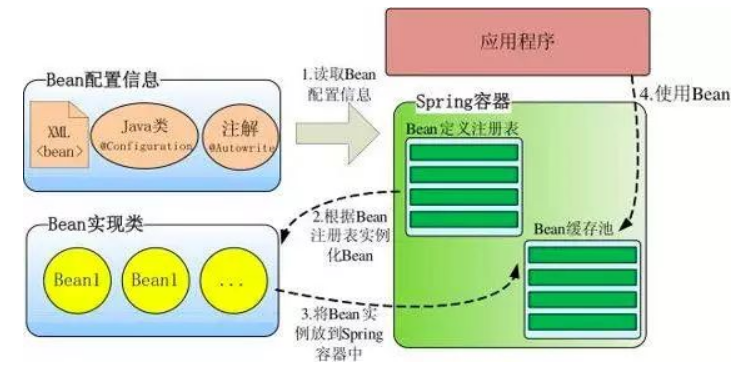
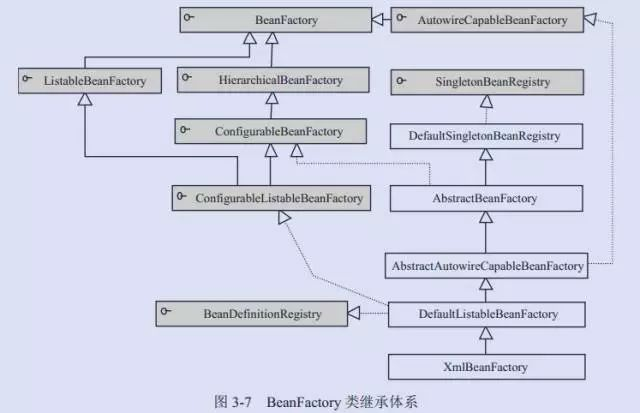
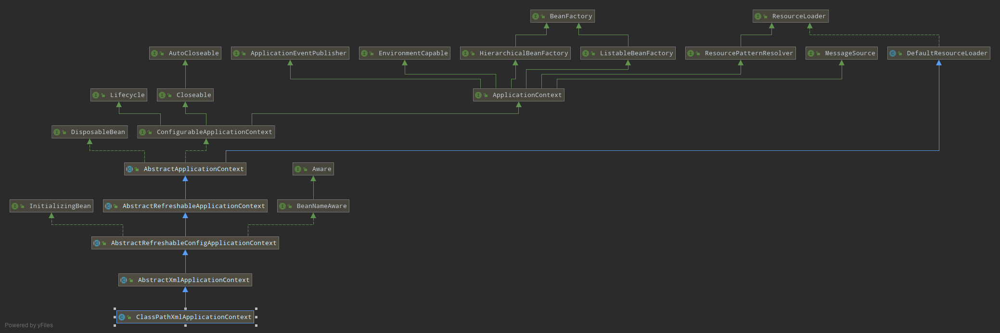
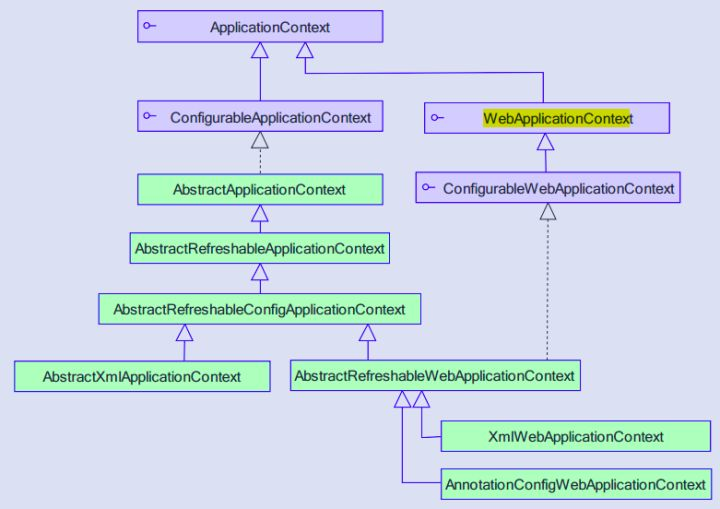
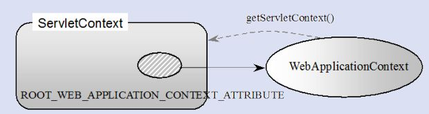
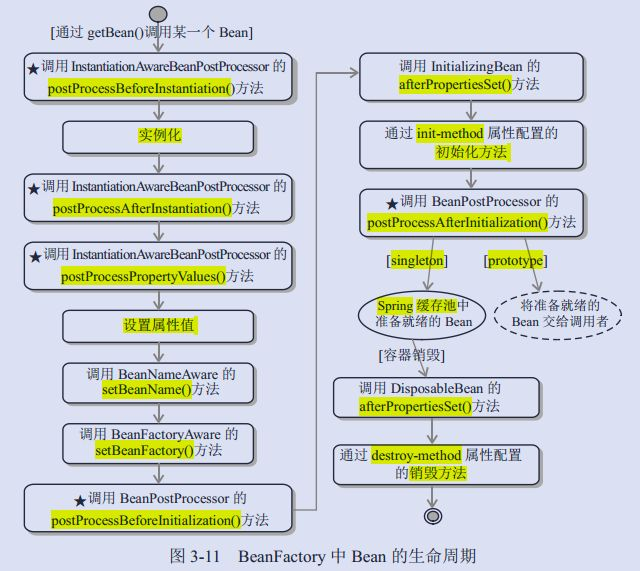

# Spring IOC 

## 高层视图
1.Spring 启动时读取应用程序提供的 Bean 配置信息<br> 2.并在 Spring
容器中生产一份相应的Bean 配置注册表<br> 3.然后根据这张注册表实例化 Bean，装配好
Bean 之间的依赖关系放入 Bean 缓存池中，为上层应用提供准备就绪的运行环境<br>
4.应用程序调用 Bean时， Spring会根据配置信息从缓存池中生产响应的 Bean



> Bean缓存池：存储键值对的容器是`ConcurrentHashMap`

## 概述
Spring 通过一个**配置文件**描述 Bean 及 Bean 之间的依赖关系，利用 Java
语言的**反射**功能实例化 Bean 并创建 Bean 之间的依赖关系<br> 

Spring 的 IOC 容器在完成这些底层工作的基础上，还提供了 Bean 实例缓存、生命周期管理、
Bean 实例代理、事件发布、资源装载等高级服务；<br>

- BeanFactory 是 Spring 框架的基础设施，面向 Spring 本身；
- ApplicationContext 面向使用 Spring
  框架的开发者，几乎所有的应用场景我们都直接使用 ApplicationContext 而非底层的
  BeanFactory
  
请先补充前置知识：
- [反射](../JavaSE/8Java高级语法特性/ReadMe.md)
- [注解](../JavaSE/注解/ReadMe.md)
- [单例设计模式](../设计模式/创建型模式/单例模式/ReadMe.md)
- [工厂设计模式](../设计模式/创建型模式/工厂模式/ReadMe.md)

## BeanFactory 体系架构

- `XmlBeanFactory`(Spring3.1之前使用，后面被标记为Deprecated)：用 xml 来定义
  IOC 容器中的 bean 通过使用**模板模式**来得到对 IOC 容器的抽象 -
  `AbstractBeanFactory`,`DefaultListableBeanFactory`
  这些抽象类为其提供模板服务； 在 spring4.0 中加载配置文件的类发生了变化，spring
  不在支持使用 XmlBeanFactory 创建 factory 加载配置文件。而是采用了
  ClassPathXmlApplicationContext 创建factory
 
- `DefaultListableBeanFactory`：是接口`ConfigurableListableBeanFactory`和`BeanDefinitionRegistry`的默认实现，
  可以理解为 Spring 容器中对象工厂的**默认实现**，是一个比较全面的对象工厂

- `BeanDefinitionRegistry`： Spring 配置文件中每一个<bean>节点元素在 Spring
  容器里都通过一个 BeanDefinition 对象表示，它描述了**Bean的配置信息**。而
  BeanDefinitionRegistry 接口提供了向容器注册 BeanDefinition 对象的方法

- `BeanFactory`接口位于类结构树的顶端，它最主要的方法就是**getBean(String
  beanName)**，该方法从容器中返回特定名称的 Bean，BeanFactory
  的功能通过其他的接口得到不断扩展

- `ConfigurableListableBeanFactory`：提供 bean definition
  的解析,注册功能,再对单例来个预加载(解决循环依赖问题)

- `ListableBeanFactory`：该接口定义了**访问**容器中 Bean
  **基本信息**的若干方法，如查看 Bean 的个数、获取某一类型 Bean
  的配置名、查看容器中是否包括某一 Bean 等方法

- `HierarchicalBeanFactory`：父子级联 IoC
  容器的接口，子容器可以通过接口方法访问父容器；通过 HierarchicalBeanFactory
  接口， Spring 的 IoC
  容器可以**建立父子层级关联**的容器体系，子容器可以访问父容器中的
  Bean，但父容器不能访问子容器的 Bean。Spring 使用父子容器实现了很多功能，比如在
  Spring MVC 中，视图层 Bean 位于一个子容器中，而业务层和持久层的 Bean
  位于父容器中。这样，视图层 Bean 就可以引用业务层和持久层的 Bean，而业务层和持久层的
  Bean 则看不到视图层的 Bean

- `ConfigurableBeanFactory`：是一个重要的接口，增强了 IoC
  容器的**可定制性**，它定义了设置类装载器、属性编辑器、容器初始化后置处理器等方法

- `AutowireCapableBeanFactory`：定义了将容器中的 Bean
  按某种规则（如按名字匹配、按类型匹配等）进行**自动装配**的方法
  
- `SingletonBeanRegistry`：定义了允许在运行期间向容器注册单实例 Bean 的方法；



## 案例执行：

```xml
<?xml version="1.0" encoding="UTF-8"?>
<beans xmlns="http://www.springframework.org/schema/beans"
       xmlns:xsi="http://www.w3.org/2001/XMLSchema-instance"
       xmlns:context="http://www.springframework.org/schema/context"
       xsi:schemaLocation="http://www.springframework.org/schema/beans http://www.springframework.org/schema/beans/spring-beans.xsd http://www.springframework.org/schema/context https://www.springframework.org/schema/context/spring-context.xsd">

    <bean id="HelloWorld" class="cn.aijiang.spring.HelloWorld" />
    
</beans>
```
通过 BeanFactory 装载配置文件，启动 Spring IOC 容器；

```java
package cn.aijiang.spring;

import org.springframework.beans.factory.BeanFactory;
import org.springframework.beans.factory.xml.XmlBeanFactory;
import org.springframework.core.io.Resource;
import org.springframework.core.io.support.PathMatchingResourcePatternResolver;
import org.springframework.core.io.support.ResourcePatternResolver;

public class HelloWorldTest {
    public static void main(String[] args) throws Throwable {
        ResourcePatternResolver resolver = new PathMatchingResourcePatternResolver();
        Resource res = resolver.getResource("classpath:spring-config.xml");
        // 弃用的实现类，已不推荐使用
        BeanFactory bf = new XmlBeanFactory(res);
        System.out.println("工厂初始化完成！");
        HelloWorld helloWorld= bf.getBean("HelloWorld",HelloWorld.class);
        System.out.println(helloWorld.toString());
    }
}

```

- ClassPathXmlApplicationContext 通过
  Resource(ClassPathXmlApplication的顶级接口) 装载 Spring 配置信息并启动 IoC
  容器，然后就可以通过 BeanFactory 的 getBean(beanName) 方法从 IoC 容器中获取
  Bean 了。通过 BeanFactory 启动IoC 容器时，并不会初始化配置文件中定义的
  Bean，初始化动作发生在第一个调用

- 对于单实例的 Bean 来说，BeanFactory 会缓存 Bean 实例，所以第二次使用获取 Bean
  时将直接从 IoC 容器的缓存中获取 Bean 实例。Spring 在
  DefaultSingletonBeanRegistry 类中提供了一个用于缓存单实例 Bean
  的缓存器，它是一个用HashMap 实现的缓存器，单实例的 Bean 以 beanName
  为键保存在这个HashMap 中。

- 值得一提的是，在初始化 BeanFactory 时，必须为其提供一种日志框架，比如使用Log4J，
  即在类路径下提供 Log4J 配置文件，这样启动 Spring 容器才不会报错
  
## ApplicationContext

`Application`是由`BeanFactory`派生而来的，提供了很多面向实际应用的功能<br> 在
BeanFactory中，很多功能是以**编程**的方式实现的，而在 ApplicationContext
中则可以通过配置的方式实现

ClassPathXmlApplicationContext继承体系：



ApplicationContext 继承了 HierarchicalBeanFactory 和 ListableBeanFactory
接口 ，在此基础上，还通过多个其他的接口扩展了 BeanFactory 的功能：

- `ClassPathXmlApplicationContext`：默认从类路径加载配置文件
- `FileSystemXmlApplicationContext`：默认从文件系统中装载配置文件
- `ApplicationEventPublisher`：让容器拥有发布应用上下文事件的功能，包括容器启动事件、
  关闭事件等。实现了 ApplicationListener 事件监听接口的 Bean 可以接收到容器事件
  ， 并对事件进行响应处理 。 在 ApplicationContext 抽象实现类 
  AbstractApplicationContext 中，我们可以发现存在一个
  ApplicationEventMulticaster，它负责保存所有监听器，以便在容器产生上下文事件时通知这些事件监听者
- `MessageSource`：为应用提供 i18n 国际化消息访问的功能
- `ResourcePatternResolver` ： 所有 ApplicationContext 实现类都实现了类似于 
  PathMatchingResourcePatternResolver 的功能，可以通过带前缀的 Ant
  风格的资源文件路径装载 Spring 的配置文件
- `LifeCycle`：该接口是 Spring 2.0 加入的，该接口提供了 start()和
  stop()两个方法，主要用于控制异步处理过程。在具体使用时，该接口同时被
  ApplicationContext 实现及具体 Bean 实现， ApplicationContext 会将
  start/stop 的信息传递给容器中所有实现了该接口的 Bean，以达到管理和控制
  JMX、任务调度等目的
- `ConfigurableApplicationContext` 扩展于
  ApplicationContext，它新增加了两个主要的方法： refresh() 和 close()，让
  ApplicationContext
  具有启动、刷新和关闭应用上下文的能力。在应用上下文关闭的情况下调用 refresh()
  即可启动应用上下文，在已经启动的状态下，调用 refresh()
  则清除缓存并重新装载配置信息，而调用close()则可关闭应用上
  下文。这些接口方法为容器的控制管理带来了便利，但作为开发者，我们并不需要过多关心这些方法

```java
package cn.aijiang.spring;

import org.junit.After;
import org.junit.Before;
import org.junit.Test;
import org.springframework.context.support.ClassPathXmlApplicationContext;

public class HelloWorldTest {

    // 上下文依赖对象，读取XML文件
    ApplicationContext ac;

    // Before:之前，@Before注释的方法会在测试案例之前
    // 执行，可以用于初始化资源
    @Before
    public void init() {
        // 读取对应的XML文件
        ac = new ClassPathXmlApplicationContext("spring-config.xml");
    }

    // After:之后，@After注释的方法会在测试案例之后执行
    // 可以用于测试后回收资源
    @After
    public void destroy() {
        ctx.close();
    }

    @Test
    public void testDemoBean() {
        // 通过 getBean 方法获取一个bean
        HelloWorld b2 = ctx.getBean("HelloWorld", HelloWorld.class);
        System.out.println(b2);
    }
}
```
ApplicationContext 的两个读取实现类用法：
- 如果配置文件放置在**类路径**下，用户可以优先使用
  `ClassPathXmlApplicationContext` 实现类
- 如果配置文件放置在**文件系统**的路径下，则可以优先考虑使用
  `FileSystemXmlApplicationContext` 实现类


## WebApplicationContext

知识源点：[SpringMVC](../SpringMVC/ReadMe.md)



WebApplicationContext 是专门为 Web 应用准备的，它允许从相对于 Web
根目录的路径中装载配置文件完成初始化工作。从WebApplicationContext 中可以获得
ServletContext 的引用，整个 Web 应用上下文对象将作为属性放置到 ServletContext
中，以便 Web 应用环境可以访问 Spring 应用上下文。 WebApplicationContext
定义了一个常量ROOT_WEB_APPLICATION_CONTEXT_ATTRIBUTE，在上下文启动时，
WebApplicationContext 实例即以此为键放置在 ServletContext
的属性列表中，因此我们可以直接通过以下语句从 Web 容器中获取WebApplicationContext

```
WebApplicationContext wac = (WebApplicationContext)servletContext.getAttribute(WebApplicationContext.ROOT_WEB_APPLICATION_CONTEXT_ATTRIBUTE);
```

### Spring 和 Web 应用的上下文融合



WebApplicationContext 的初始化方式：WebApplicationContext 需要
ServletContext 实例，它必须在拥有 Web 容器的前提下才能完成启动的工作。可以在
web.xml 中配置自启动的 Servlet 或定义 Web 容器监听器（
ServletContextListener），借助这两者中的任何一个就可以完成启动 Spring Web
应用上下文的工作。Spring 分别提供了用于启动 WebApplicationContext 的 Servlet 和
Web 容器监听器：
- org.springframework.web.context.ContextLoaderServlet
- org.springframework.web.context.ContextLoaderListener
- 由于 WebApplicationContext 需要使用日志功能，比如日志框架使用Log4J，用户可以将
  Log4J 的配置文件放置到类路径 WEB-INF/classes 下，这时 Log4J
  引擎即可顺利启动。如果 Log4J 配置文件放置在其他位置，用户还必须在 web.xml 指定
  Log4J 配置文件位置 

## Bean 的生命周期



