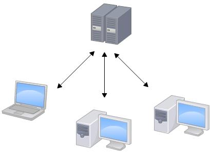
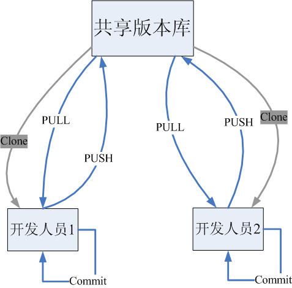
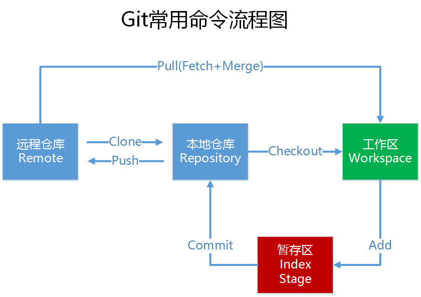
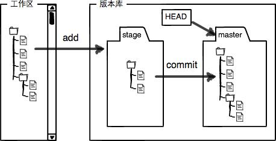

# Git 分布式版本控制工具
## Git 的诞生

同生活中的许多伟大事件一样，Git 诞生于一个极富纷争大举创新的年代。
Linux 内核开源项目有着为数众广的参与者。绝大多数的 Linux 内核维护工作都花在
了提交补丁和保存归档的繁琐事务上（1991－2002年间）。
到 2002 年，整个项目组开始启用分布式版本控制系统 BitKeeper 来管理和维护代码。
到 2005 年的时候，开发 BitKeeper 的商业公司同 Linux 内核开源社区的合作关系结束，
他们收回了免费使用 BitKeeper 的权力。这就迫使 Linux 开源社区（特别是 Linux的缔造者 Linus Torvalds ）不得不吸取教训，
只有开发一套属于自己的版本控制系统才不至于重蹈覆辙。他们对新的系统订了若干目标：
- 速度
- 简单的设计
- 对非线性开发模式的强力支持（允许上千个并行开发的分支）
- 完全分布式
- 有能力高效管理类似 Linux 内核一样的超大规模项目（速度和数据量）

### SVN 集中式版本控制
SVN是**集中式版本控制系统**，**版本库**是集中放在**中央服务器**的，而干活的时候，用的都是自己的电脑，
所以首先要从中央服务器哪里得到最新的版本，然后干活，干完后，需要把自己做完的活推送到中央服务器。
集中式版本控制系统是必须联网才能工作，如果在局域网还可以，带宽够大，速度够快，如果在互联网下，如果网速慢的话，就郁闷了。
下图就是标准的集中式版本控制工具管理方式：

集中管理方式在一定程度上看到其他开发人员在干什么，而管理员也可以很轻松掌握每个人的开发权限。
但是相较于其优点而言，集中式版本控制工具缺点很明显：
- 服务器单点故障
- 容错性差

## Git 概述
Git 是**分布式版本控制系统**，那么它就没有中央服务器的，**每个人的电脑就是一个完整的版本库**，
这样，工作的时候就不需要联网了，因为版本都是在自己的电脑上。既然每个人的电脑都有一个完整的版本库，那多个人如何协作呢？
比如说自己在电脑上改了文件A，其他人也在电脑上改了文件A，这时，你们两之间只需把各自的修改推送给对方，就可以互相看到对方的修改了。
下图就是分布式版本控制工具管理方式：

## 工作流程

一般的**工作流**如下：
- 1.从远程仓库中克隆 Git 资源作为本地仓库
- 2.从本地仓库中 checkout 代码，然后进行代码修改
- 3.从提交前线将代码提交到暂存库
- 4.提交修改，提交到本地仓库；本地仓库中保存修改的各个历史版本
- 5.在修改完成后，需要和团队成员共享代码时，可以将代码**push**到远程仓库

## 使用 Git 管理文件版本
### 创建版本库
什么是版本库呢？版本库又名仓库，英文名repository，你可以简单理解成一个目录，这个目录里面的所有文件都可以被Git管理起来，
每个文件的修改、删除，Git都能跟踪，以便任何时刻都可以追踪历史，或者在将来某个时刻可以“还原”。
由于git是分布式版本管理工具，所以git在不需要联网的情况下也具有完整的版本管理能力

- 创建仓库执行命令：

    $ git init

> 版本库：“.git”目录就是版本库，将来文件都需要保存到版本库中。
工作目录：包含“.git”目录的目录，也就是 .git 目录的上一级目录就是工作目录。只有工作目录中的文件才能保存到版本库中

#### 工作区和暂存区
Git和其他版本控制系统如SVN的一个不同之处就是有暂存区的概念 

什么是**工作区（Working Directory）** 
工作区就是你在电脑里能看到的目录，比如我的 reporstory 文件夹就是一个工作区。
其实**repository**目录是**工作区**，在这个目录中的 **.git** 隐藏文件夹才是版本库； 
Git 的版本库里存了很多东西，其中最重要的就是称为**stage（或者叫index）的暂存区**，
还有Git为我们自动创建的第一个分支**master**，以及指向master的一个指针叫**HEAD**

因为我们创建 Git 版本库时，Git 自动为我们创建了唯一一个 master 分支，所以，现在，git commit 就是往 master 分支上提交更改。
你可以简单理解为，需要提交的文件修改通通放到暂存区，然后，一次性提交暂存区的所有修改

