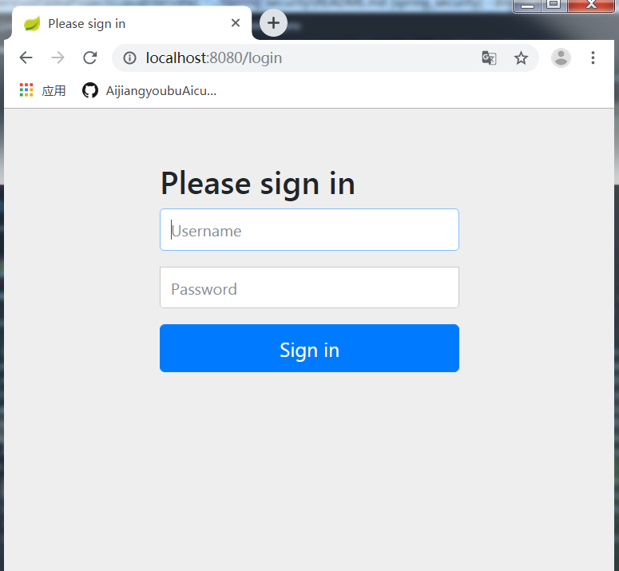
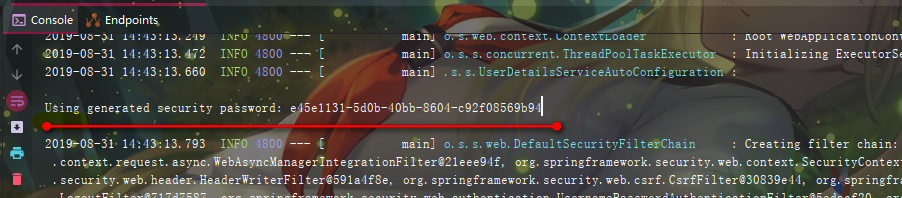

# Spring Security
## 概述
一个能够为基于Spring的企业应用系统提供声明式的**安全訪问控制**解决方式的安全框架（简单说是对访问权限进行控制），
应用的安全性包括**用户认证（Authentication）**和**用户授权（Authorization）**两个部分。

- **用户认证**指的是验证某个用户是否为系统中的**合法主体**，也就是说用户能否访问该系统。
用户认证一般要求用户提供用户名和密码。系统通过校验用户名和密码来完成认证过程；

- **用户授权**指的是验证某个用户是否**有权限**执行某个操作。在一个系统中，不同用户所具有的权限是不同的。
比如对一个文件来说，有的用户只能进行读取，而有的用户可以进行修改。
一般来说，系统会为不同的用户分配不同的**角色**，而每个角色则对应一系列的权限；

spring security的主要核心功能为**认证**和**授权**，所有的架构也是基于这两个核心功能去实现的；

前置知识：
- [Filter 拦截器](../JavaEE/src/main/directory/Filter与Listener/ReadMe.md)

## 框架原理
在该框架之前，一般都使用 JavaEE 的两个组件`Filter`拦截器和`Linstencr`过滤器，最好的办法莫过于`Filter`并使用 Spring 的 AOP 对
方法调用进行保护；

Spring Security 在我们进行用户认证以及授予权限的时候，通过各种各样的拦截器来控制权限的访问，从而实现安全

- `WebAsyncManagerIntegrationFilter` 
- `SecurityContextPersistenceFilter` 
- `HeaderWriterFilter` 
- `CorsFilter` 
- `LogoutFilter`
- `RequestCacheAwareFilter`
- `SecurityContextHolderAwareRequestFilter`
- `AnonymousAuthenticationFilter`
- `SessionManagementFilter`
- `ExceptionTranslationFilter`
- `FilterSecurityInterceptor`
- `UsernamePasswordAuthenticationFilter`
- `BasicAuthenticationFilter`

## 核心 jar 包

运行 Demo 所需

```xml
<!-- spring 权限组件jar包 -->
 <dependency>
     <groupId>org.springframework.boot</groupId>
     <artifactId>spring-boot-starter-security</artifactId>
</dependency>

<!-- springMVC web组件jar包 -->
<dependency>
    <groupId>org.springframework.boot</groupId>
    <artifactId>spring-boot-starter-web</artifactId>
</dependency>

```

编写一个 Controller 的 Demo

```java

package cn.aijiang.spring.spring_security.controller;

import org.springframework.stereotype.Controller;
import org.springframework.web.bind.annotation.RequestMapping;
import org.springframework.web.bind.annotation.ResponseBody;

@Controller
public class AppController {

    @RequestMapping("/hello")
    @ResponseBody
    String home() {
        return "Hello，Spring Security!";
    }
}

```

启动 springboot，并输出`http://localhost:8080/hello`，会看到：



看输出控制台会有密钥：



账号是`user`

> spring boot 集成 security 后每次启动 springboot 都会默认提供了表单登录的功能
