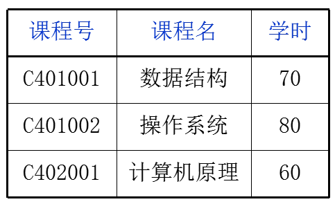
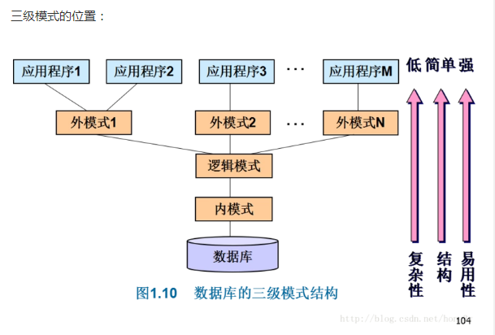
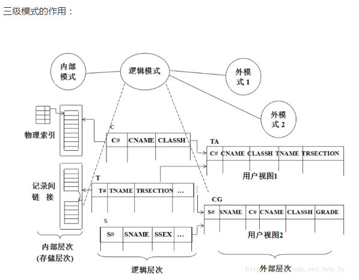
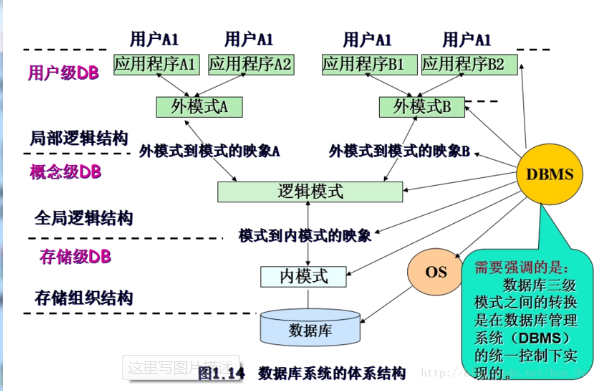

# 数据库定义
	
数据库是一个"以某种有组织的方式"存储的数据集合，也就是：保存"有组织数据"的容器(一个文件或一组文件);
	
#数据库需要的必要性
	
类比：Excel，相比数据库，Excel有一些缺陷：

- Excel存储的数据量太少了，存储量远远不能支持我们的需求；
- Excel数据无法多人分析，只是一个单一的文件，只能当前用户使用并修改；
- 数据安全性，对Excel数据的修改是随意的；
	
数据库就解决了以上的问题，并且数据库以"特殊的机制管理"数据文件，

对数据有极高的读写速度，大大超过了操作系统对常规文件的读写速度；
		
# 数据库系统的组成
	
数据库系统有三个层次组成：

- 数据库(dataBase) DB

	存放数据的仓库，按照一定的格式(有组织的方式)进行存储；
	
- 数据库管理系统(dataBase Manager System) DBMS

	建立、管理、维护数据库的系统软件
				
- 数据库应用系统(dataBase Application System) DBAS

	使用数据库技术的应用软件

# 数据描述与数据模型

将“某个事物”(按Java的理解就是“对象”)抽象出来，形成信息世界的概念模型，然后将概念模型
形式化成DBMS支持的数据模型，存储在计算机中；
	
"数据描述"定义：数据描述就是将现实世界中的实物抽象出来，形成概念模型，把概念模型的形式转换成是
DBMS支持的类型然后存储到计算机中！
	
"数据模型"定义：主要用来描述数据，当想在计算机上存储现实事物的数据时，需要抽象成概念模型，将概念模型转换
成DBMS支持的数据模型，就可以把事物存储到计算机中，数据模型一般分为三个部分：
- 数据结构(对象与对象之间的关系)
- 数据操作(增删改查)
- 完整性约束(限定数据是有一定的规则的，比如：年龄不能为负数)
		
数据模型也经历一定的发展：
- 层次模型：是一种树形(层次)结构来组织数据的数据模型
- 网状模型：是用有向图结构来描述数据的数据模型
- 关系模型：是一种用二维表格表示数据与数据之间联系的数据模型	
	
#关系模型术语

	
	
- 实体(Entity)

	客观存在并可相互区别的事物称之为实体，可看作Java类；
	如“课程关系表”这张表就是一个实体；
	
- 属性(Attribute)

	实体所具有的某一特性称之为"属性"，可视为Java的成员变量，属性在数据库中又称为"字段"(列)；
	如"课程号"、“课程名”、“学时”就是属性名
		
- 元组

	除含有属性名所在的行之外的其他行称之为"元组"；
	即表中(除了第一列的属性)的所有数据；
	
- 码(Key)
	
	码也被称作是"关键字"，它可以唯一标识一个"实体"
	
	分为"候选码"和“主码”：
	
	候选码：如果一组属性集能唯一地标识一个关系中的元租而又不含有多余的属性，则称该属性集为该关系的候选码(不止一个)；
	
	主码：用户选定的那个候选码称为"主键"
			
		例如：邮寄地址（城市名，街道名，邮政编码，单位名，收件人）
       它有两个候选键:{城市名，街道名} 和 {街道名，邮政编码}
       如果我选取{城市名，街道名}作为唯一标识实体的属性，那么{城市名，街道名} 就是主码
		
	
#关系模式
	
关系名与其属性集合的组合称之为"关系模型"
	
关系模型就是关系模式组成的集合
	
关系模式例子：课程关系表(课程号,课程名,学时)
	
# 域

关系模型要求元组的每一个分量都具有"原子性"，也就是说它必须属于某种元素类型，
如Integer、String等等，不能是列、集合、记录、数组！
	
域就代表着该元租中每个分量的类型，从课程关系表中可知：
- 课程号：String
- 课程名：String
- 学时：int
			
#数据库体系内部结构
	
数据库体系内部结构可分为三层：
- 外模式
- 逻辑模式
- 内模式
	

(1) 逻辑模式		

定义：对数据库全部数据的整体逻辑结构的描述
			
	例如：有一个数据库有操作权限、角色、用户之间的关系
	  有以下的关系模式：
	  - 权限关系(权限编号、权限名称、权限描述)
	  - 角色关系(角色编号、角色名称、角色描述)
	  - 用户关系(用户编号、用户名称、用户密码)
					
	在数据库中所有关系模式的集合就组成了逻辑模式！
				
(2) 外模式 

定义：是对数据库用户能看见和使用的局部数据逻辑结构的描述，是与某一应用有关的数据的逻辑表示
			
外模式可以由多个的，外模式是用户和DBAS的接口，是对局部逻辑结构的描述！
				
	当用户应用程序只需要显示用户名称和密码时：
    用户关系(用户名称，用户密码)			
      
      在数据库中操作局部逻辑结构就称为"外模式"！
	
内模式
			
定义：是对数据库表物理存储结构的描述，它定义了数据的内部记录类型、记录寻址技术、索引和
文件的组织方式及数据控制方面的内容；
	
#DB内部体系结构的两级映像
	
两级影像分别是：
- 外模式和逻辑模式的映像
- 逻辑模式和内模式的映像
		

		
提出两级映射的概念有什么用呢？为什么需要有这两级映像呢？？

当数据库的逻辑模式结构因某种原因修改时，只要没有改变逻辑模式中与外模式定义有关的属性及与其关系模式名的隶属关系，
就可使外模式保持不变，从而不需修改应用程序。

当数据库的内模式由于某种原因要修改时，可通过对逻辑模式与内模式之间的映象的修改，使逻辑模式尽可能地保持不变，
实现内模式的改变尽可能地不修改应用程序。
  
也就说：在改变内部结构的时候，只要不会触及外部的数据时，外部的数据并不需要做改变。两级映像概念的提出也就是程序中耦合的问题！