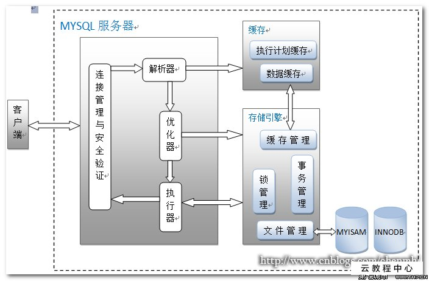

## 什么是MySql

MySql是一种**关系型数据库**，在Java企业级开发中非常常用，开源免费易扩展并且稳定性有保障；
MySql是**开放源代码**的，因此所有人都可以在**GPL许可**下下载并根据个性化需要对其修改，默认端口是3306；

## MySQL基本架构概述

	
## MySQL分层架构

- Server层：主要包括**连接器**，**查询缓存**(MySQL8.0没有)、**分析器**(解析器)、**优化器**、**执行器**等，所有跨存储引擎的功能都在这一层实现；
  比如存储过程、触发器、视图、函数等，还有一个通用的日志模块 binglog 日志模块；
	
- 存储引擎：主要负责数据的**存储**和**读取**，采用可以替换的插件式架构，支持
  InnoDB、MyISAM、Memory 等多个存储引擎，	其中 InnoDB 引擎有自有的日志模块 redlog
  模块，现在最常用的存储引擎是 InnoDB，它从 MySQL5.5.5 版本设为默认存储引擎
	
## Server层组件：

### 连接器
		
连接器主要是和**身份认证**和**权限相关**的功能相关；
 主要负责登录数据库，进行用户的身份认证，包括校验账户密码，权限等操作，如果用户账户密码已通过，连
接器会到权限表中查询该用户的所有权限，之后在这个连接里的**权限逻辑判断**都是会依赖此时读取到的权限数据，
也就是说，后续只要这个连接不断开，即使管理员修改了该用户的权限，该用户也是不受影响的；
		
	大致执行步骤：
				
	用户登录 --> 身份认证 --> 检验账户密码及权限 
	--> 连接器查询权限表 --> 得到该用户的权限 --> 分配对应权限能读取到数据 	
				
### 查询缓存 (MySQL8.0版本已移除)
				
查询缓存主要用来缓存我们所执行的**SELECT语句**以及该语句的**结果集**；
	
连接建立后，执行查询语句的时候会先查询缓存；MySQL会校验这个 SQL 是否执行过，以
Key-Value 的形式缓存到 内存中，Key 是查询预计，Value 是结果集，如果缓存 key
被命中，就会直接返回给客户端，
	
如果没有命中，则执行后续的操作，完成后也会把结果缓存起来，方便下一次调用。当然在真正执行缓存查询的时候还是会校验用户的权限，是否有该表的查询条件；
				
>MySQL 查询不建议使用缓存，因为缓存失效在实际业务场景中可能会非常频繁，假如你对一个表更新的话，这个表上的所有的查询缓存
都会被清空，对于不经常更新的数据来说，使用缓存还是可以的；
				
### 分析器

没有命中缓存的话，SQL语句会经过分析器，分析器的目的就是分析我们的SQL语句要执行什么操作，以及检查SQL语句语法是否正确；
				
- 分为两步： 
  - 1.词法分析：一条SQL语句有多个字符串组成，首先要提取**关键字**，比如
    SELECT，提出查询的表、字段名、查询条件等等，之后进入第二步
  - 2.语法分析：主要判断输入的SQL是否正确，是否符合 MySQL 的语法；
  
完成上述两步后，MySQL就准备开始执行了，但是如何执行，怎么样执行的最好就要依靠优化器
			
		
- 优化器

按照MySQL认为**最优的方案**去执行(有可能也不一定是最优的)，比如多个索引的时候该如何选择索引，多表查询的时候如何关联顺序等；

经过优化器，该SQL语句该如何执行才被定下来；
			
- 执行器

当选择了执行方案后，MySQL就准备开始执行了，首先执行前会检验该用户有没有权限，如果没有权限会返回错误信息，如果有权限
就会去调用**引擎的接口**，返回接口执行的结果

# 语句分析
	
SQL语句分为两种：一种是**查询**，一种是**更新(增删改)**
	
- 查询语句

		SELECT * FROM tb_student A WHERE A.age='18' and A.name='张三';
		
执行流程： 

1.判断是否有权限：有则下一步，没有返回错误信息 

2.缓存数据：在MySQL8.0版本前会缓存查询，以这条 SQL 语句为 key
在内存中查询是否有结果，如果有直接缓存，没有下一步  

3.分析器进行词法分析：提取 SQL 句的关键元素，如上述提取的便是
SELECT、tb_student所有需要查询的列，查询条件是这个表的	'id=1'，然后判断 SQL
是否有语法错误，比如关键字是否正确，检查无问题进入下一步； 

4.优化器分析执行方案：可执行的方案有：
"先查询学生表中姓名为"张三"的学生，然后判断是否年龄是18"
"先找出学生中年龄是18岁的学生，然后再查询姓名是"张三"的学生"
优化器根据自己的优化算法选择其一效率最高的方案，确认了执行计划后开始执行； 

5.进行权限校验：没有权限则返回错误信息，有则调用数据库引擎接口，返回引擎的执行的结果；
		
- 更新语句
		
        UPDATE tb_student A set A.age='19' WHERE A.name='张三'; 
    // 注：一般不会改这种"固死"的数据，否则会被技术负责人调出日志然后乱棍打死！
		
条件语句的基本会沿着上述的查询的语句走，不过执行更新的时候肯定要**记录日志**，这就引入日志模块，MySQL自带的日志模块式
**binlog (归档日志)** 

所有存储引擎都可以使用，常用的 InnoDB 引擎还自带一个日志模块**redo log 
(重做日志)**；
		
		
- 以 InnoDB 模式执行流程：

1.先查询到张三这一条数据，如果有缓存，也是会用到缓存  

2.拿到查询到的语句，把age改为19，然后调用引擎 API 
接口，写入这一条语句，InnoDB引擎把数据保存到内存中，同时记录 redo log，此时 redo
log	进入 prepare 状态，然后告诉执行器，执行完成随时可以提交 redo log 为提交状态

3.执行器收到通知后记录 binlog，然后调用引擎接口，提交 redo log 为提交状态

4.更新完成
	
## 为什么要用两个日志模块，用一个日志模块不行吗?

这是因为最开始 MySQL 并没与 InnoDB 引擎( InnoDB 引擎是其他公司以插件形式插入 MySQL 的) ，
MySQL 自带的引擎是 MyISAM，但是我们知道 redo log 是 InnoDB 引擎特有的，其他存储引擎都没有，
这就导致会没有 crash-safe 的能力(crash-safe 的能力即使数据库发生异常重启，之前提交的记录都不会丢失)，binlog 日志只能用来归档。
  
 并不是说只用一个日志模块不可以，只是 InnoDB 引擎就是通过 redo log 来支持事务的。
那么用两个日志模块，但是不要这么复杂行不行，为什么 redo log 要引入 prepare 预提交状态？这里我们用反证法来说明下为什么要这么做？
  
先写 redo log 直接提交，然后写 binlog，假设写完 redo log 后，机器挂了，binlog 日志没有被写入，
那么机器重启后，这台机器会通过 redo log 恢复数据，但是这个时候 bingog 并没有记录该数据，
后续进行机器备份的时候，就会丢失这一条数据，同时主从同步也会丢失这一条数据。
    
先写 binlog，然后写 redo log，假设写完了 binlog，机器异常重启了，由于没有 redo log，本机是无法恢复这一条记录的，
但是 binlog 又有记录，那么和上面同样的道理，就会产生数据不一致的情况。
  
如果采用 redo log 两阶段提交的方式就不一样了，写完 binglog 后，然后再提交 redo log 就会防止出现上述的问题，
从而保证了数据的一致性。那么问题来了，有没有一个极端的情况呢？假设 redo log 处于预提交状态，binglog 也已经写完了，这个时候发生了异常重启会怎么样呢？ 
这个就要依赖于 MySQL 的处理机制了，MySQL 的处理过程如下：
  
    判断 redo log 是否完整，如果判断是完整的，就立即提交。
    如果 redo log 只是预提交但不是 commit 状态，这个时候就会去判断 binlog 是否完整，如果完整就提交 redo log, 不完整就回滚事务。
  
这样就解决了数据一致性的问题。
			
			
		
