# 概述
## 数据结构概述
数据结构是指相互之间存在一种或多种关系的数据元素的集合或该集合中的数据元素之间的关系组成

## 数据的存储结构
- 顺序存储结构

是把数据元素存放在地址`连续的存储单元`里，其数据间的逻辑关系和物理关系是一致的，
`数组`就是顺序存储结构的典型代表；

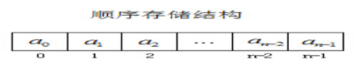

- 链式存储结构

是把数据元素存放在内存中的`任意存储单元`里，
也就是把数据存放在内存的各个位置，把这些数据在内存中的地址是连续的，也可以是不连续的

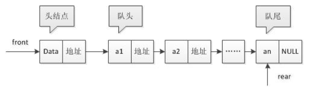

## 数据的逻辑结构

- 集合结构

集合结构中的数据元素同属于一个集合，它们之间是并列关系，除此之外没有其他关系

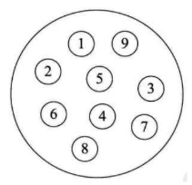

- 线性关系：

线性结构中的元素存在一对一的相互关系

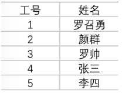

- 树形结构

树形结构中的元素存在一对多的相互关系

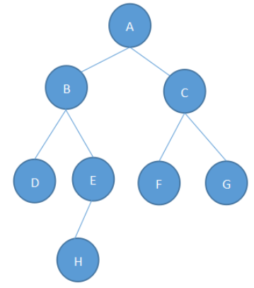

- 图形结构

图形结构中的元素存在多对多的相互关系

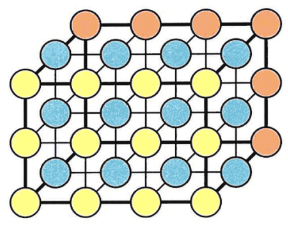

# 算法概述
## 算法定义
是指解题方案的准确而完整的描述，是一系列解决问题的清晰指令，算法代表着用系统的方法描述解决问题的策略机制

## 算法的特性
- 输入
- 输出
- 有穷性
- 确定性
- 可行性

## 算法的基本要求
- 正确性
- 可读性
- 健壮性
- 时间复杂度
- 空间复杂度

## 时间与空间复杂度

语句频度T(n)：一个算法中的语句的执行次数称为语句频度，记为T(n)

时间复杂度：

一般情况下，算法中的基本操作语句的重复执行次数是问题规模n的某个函数，
用T(n)表示，若有某个辅助函数f(n)，使得当n趋近于无穷大时，T(n) / f(n) 的极限值为不等于零的常数，
则称f(n)是T(n)的同数量级函数。记作 T(n)=Ｏ( f(n) )，称Ｏ( f(n) )  为算法的渐进时间复杂度，简称时间复杂度。
T(n) 不同，但时间复杂度可能相同。 如：T(n)=n²+5n+6 与 T(n)=3n²+3n+2 它们的T(n) 不同，但时间复杂度相同，都为O(n²)。

常见的时间复杂度

- 常数阶O(1)
- 对数阶O(log2n)
- 线性阶O(n)
- 线性对数阶O(nlog2n)
- 平方阶O(n2)
- 立方阶O(n3)
- k次方阶O(nk)
- 指数阶O(2n)

随着问题规模n的不断增大，上述时间复杂度不断增大，算法的执行效率越低。

>计算时间复杂度的方法：
用常数1代替运行时间中的所有加法常数 
修改后的运行次数函数中，只保留最高阶项 
去除最高阶项的系数

# 线性结构
## 数组
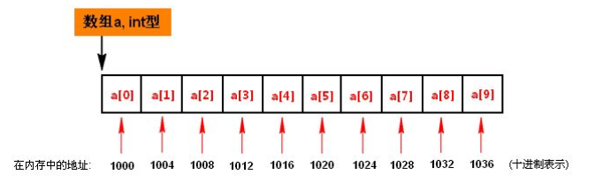

- 数组的基本使用

- 面向对象的数组

- 查找算法
	- 线性查找
	- 二分法查找

## 栈
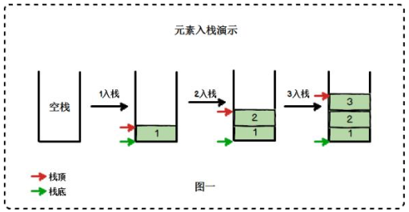

## 队列
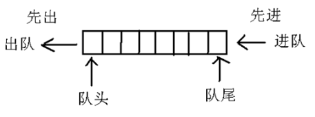

## 单链表
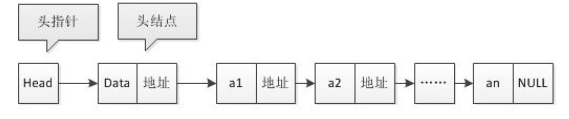

- 节点的删除
- 节点的插入

## 循环链表
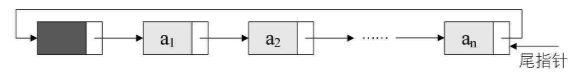

## 双向链表
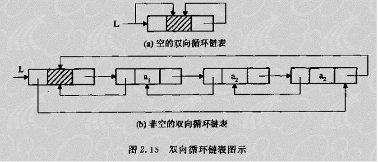

## 递归
在一个方法(函数)的内部调用该方法(函数)本身的编程方式

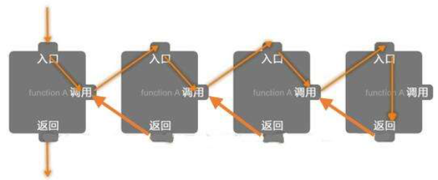

- 斐波那契数列

- 汉诺塔问题

# 排序算法
## 交换排序
- 冒泡排序
- 快速排序

## 插入排序
- 直接插入排序
- 希尔排序

## 选择排序
- 简单选择排序
- 堆排序

## 归并排序

## 基数排序