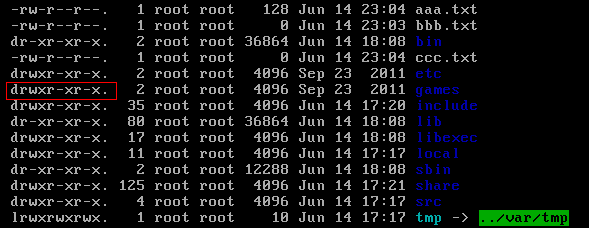

# Linux 概述
Linux是一套免费使用和自由传播的**类Unix**操作系统，Linux存在着许多不同的Linux版本，但它们都使用了
**Linux内核**。Linux可安装在各种计算机硬件设备中，比如手机、平板电脑、路由器、视频游戏控制台、台式计算机
、大型机和超级计算机。严格来讲，Linux这个词本身只表示Linux内核，但实际上人们已经习惯了用Linux来形容整个基于Linux内核，并且使用GNU 工程各种工具和数据库的操作系统。

## 概述
- **类Unix系统**：Linux是一种自由的、开放源码的类Unix的操作系统
- **Linux内核**：Linux这个词只表示其内核
- Linux之父** 林纳斯·托瓦兹**：一个编程领域的传奇式人物。他是Linux内核的最早作者，随后发起了这个开源项目，担任Linux内核的首要架构师与项目协调者，
	是当今世界最著名的电脑程序员、黑客之一。他还发起了Git这个开源项目，并为主要的开发者
	
	
## Linux的分类
Linux根据**原生**程度，分为两种：

- 内核版本： Linux不是一个操作系统，严格来讲，Linux只是一个操作系统中的内核。内核是什么？
	内核建立了计算机软件与硬件之间通讯的平台，内核提供系统服务，比如文件管理、虚拟内存、设备I/O等；
- 发行版本： 一些组织或公司在内核版基础上进行二次开发而重新发行的版本。Linux发行版本有很多种
	(ubuntu和CentOS用的都很多)
	
## Linux 文件系统
建立一个观念：**Linux一切都是文件**；在Unix系统中，Unix把任何一切资源视为文件，包括硬件设备也被Unix视为文件，称为**设备文件**；

所以在Linux操作系统中，所有被操作系统管理的资源，例如网络接口卡、磁盘驱动器、打印机、输入输出设备、普通文件或
目录都视为一个文件；

### 文件类型与目录结构

Linux文件系统的结构层次鲜明，是一个树状结构：

- `/bin`： 存放二进制可执行文件(ls、cat、mkdir等)，常用命令一般都在这里
- `/etc`： 存放系统管理和配置文件
- `/home`： 存放所有用户文件的根目录，是用户主目录的基点，比如用户user的主目录就是/home/user，可以用~user表示
- `/usr` ： 用于存放系统应用程序
- `/opt`： 额外安装的可选应用程序包所放置的位置。一般情况下，我们可以把 tomcat 等都安装到这里
- `/proc`： 虚拟文件系统目录，是系统内存的映射。可直接访问这个目录来获取系统信息
- `/root`： 超级用户（系统管理员）的主目录
- `/sbin`: 存放二进制可执行文件，只有root才能访问。这里存放的是系统管理员使用的系统级别的管理命令和程序。如ifconfig等
- `/dev`： 用于存放设备文件
- `/mnt`： 系统管理员安装临时文件系统的安装点，系统提供这个目录是让用户临时挂载其他的文件系统
- `/boot`： 存放用于系统引导时使用的各种文件
- `/lib`： 存放着和系统运行相关的库文件 
- `/tmp`： 用于存放各种临时文件，是公用的临时文件存储点
- `/var`： 用于存放运行时需要改变数据的文件，也是某些大文件的溢出区，比方说各种服务的日志文件（系统启动日志等）等
- `/lost+found`： 这个目录平时是空的，系统非正常关机而留下“无家可归”的文件（windows下叫什么.chk）就在这里

## 常用命令

### 目录切换命令

- `cd usr` 切换到该目录下 usr 目录
- `cd..(或cd../)` 切换到上一层目录
- `cd /` 切换到系统根目录
- `cd ~` 切换到用户主目录
- `cd -` 切换到上一个操作所在目录

### 目录的操作命令(增删改查)
- `mkdir 目录名称` 增加目录
- `ls 或 ll` 查看目录信息(ll 是`ls -l`的别名，用于查看该目录下所有目录和文件的详细信息)
- `find 目录 参数` 寻找目录(查)
	- 列出当前目录及子目录下的所有文件和文件夹：`find.`
	- 在 /home 目录下查找以 .txt 结尾的文件名为：`find/home -name "*.txt"`
	- 同上，忽略大小写：`find /home -iname "*.txt"`
	- 当前目录及子目录下查找所有以 .txt 和 pdf 结尾的文件：`find .\( -name "*.txt" -o -name ".pdf" \)`
		或`find . - name "*.txt" -o -name "*.pdf"`

- `mv 目录名称 新目录名称` 修改目录的名称

>注意：mv 的语法不仅可以对目录进行重命名而且也可以对各种文件，压缩包等进行重命名的操作。 mv 命令用来对文件或目录命名，或者将
文件从一个目录移到另一个目录中；

- `mv 目录名称 目录的新位置` 移动目录的位置(剪切操作)

>注意：mv 的语法不仅可以对目录进行剪切操作，对文件和压缩包等可执行剪切操作。另外 mv 与 cp 的结果不同，mv 好像文件"搬家"，文件个数
并未增加，而 cp 对文件进行复制，文件个数增加了

- `cp -r 目录名称 目录拷贝的目标位置` 拷贝目录，`-r`代表递归拷贝

>注意：cp 命令不仅可以拷贝目录还可以拷贝文件、压缩包等，拷贝文件和压缩包时不用写 -r 递归

- `rm [-rf]` 目录：删除目录

>注意：rm 不仅可以删除目录，也可以删除其他或压缩包，无论删除任何目录或文件都可以使用`rm -rf 目录/文件/压缩包` 

### 文件的操作命令
- `touch 文件名` 文件的创建
- `cat/more/less/tail 文件名称` 文件的查看
	- `cat` 查看文件的内容
	- `more` 显示百分百，回车可向下一行，空格可以下一页，q 可以退出查看
	- `less` 使用键盘上的 pgUp 和 pgDn 向下和向下翻页，q 结束查看
	- `tail-10` 查看文件的后10行，Ctrl + C 结束

>注意：命令`tail -f`文件 可以对某个文件进行动态监控，例如tomcat的日志文件，
会随着程序的运行，日志会变化，可以使用 tail -f catalina-2016-11-11.log 监控文件的变化

- `vim 文件名` 修改文件的内容

使用**vim编辑器**主要作用就是修改配置文件，下面是一般步骤：

	vim 文件------>进入文件----->命令模式------>
	按i进入编辑模式----->编辑文件 ------->按Esc进入底行模式----->
	输入： wq/q! （输入wq代表写入内容并退出，即保存；输入q!代表强制退出不保存）

- `rm -rf 文件` 删除文件（删）

同目录删除：熟记 rm -rf 文件 即可

### 压缩文件的操作命令

#### 打包并压缩文件
Linux 中的打包文件一般是`.tar`结尾的，压缩的命令一般是`.gz`结尾的；

而一般情况下打包和压缩是一起进行的，打包并压缩后的文件的后缀名一般为**.tar.gz**

- `tar -zcvf 打包压缩后的文件名 要打包压缩的文件`
	- `z` 调用 gzip 压缩命令进行压缩
	- `c` 打包文件
	- `v` 显示运行过程
	- `f` 指定文件名

比如：假设 test 目录下有三个文件分别是 aaa.txt、bbb.txt、ccc.txt，如果我们要打包 test 目录
并指定要压缩后的压缩包名为 test.tar.gz 可使用命令：`tar -zcvf test.tar.gz aaa.txt bbb.txt ccc.txt` 或 `tar -zcvf test.tar.gz /test/`

#### 解压压缩包
- `tar[-xvf]` 压缩文件
	- `x` 解压

比如： 
1.将 /test 下的 test.tar.gz 解压到当前目录下可以命令：`tar -xvf test.tar.gz` 
2.将 /test 下的 test.tar.gz 解压到根目录 /usr 下： `tar -xvf test.tar.gz -C /usr`(-C代表指定解压的位置)

### Linux 的权限命令

操作系统中每个文件都拥有特定的权限、所属用户和所属组；权限是操作系统用来限制资源访问的机制，在 Linux 中权限一般分为：
- `读 readable`
- `写 writable`
- `执行 excutable`

分别对应文件的属主(owner)，属组(group)和其他用户(other)，通过这些机制来限制哪些用户、哪些组可以对特定的文件
进行什么样的操作；通过`ls -l`命令我们可以查看某个目录下的文件或目录的权限；

示例：

红线的内容信息解释为：

- 文件的类型
	- `d`：代表目录
	- `-`：代表文件
	- `l`：代表软连接
	
- Linux中权限分为以下几种：
	- `r`：代表是可读， r也可以用数字`4`表示
	- `w`：代表是可写，w也可以用数字`2`表示
	- `w`：带包权限是可执行，x也可以用数字`1`表示
	
#### 文件和目录权限的区别
对于文件和目录而言，读写执行表示不同的意义

- 对于文件
	- `r` 可以使用 cat 查看文件的内容
	- `w` 可以修改文件的内容
	- `s` 可以将其运行为二进制文件

- 对于目录
	- `r` 可以查看目录下的列表
	- `w` 可以创建和删除目录下文件
	- `x` 可以使用 cd 进入目录

需要注意的是**超级用户**可以无视普通用户的权限，即使文件目录权限是000页可以访问；
在Linux中每一个用户都必须属于一个组，不能独立于组外；在 Linux 中每个文件有所有者、所在组、其他组的概念；

- 所有者 
一般为文件的创建者，谁创建了该文件，就天然的成为该文件的所有者，用`ls ‐ahl`命令可以看到文件的所有者 
也可以使用`chown 用户名 文件名`来修改文件的所有者

- 文件所在组 
当某个用户创建了一个文件后，这个文件的所在组就是该用户所在的组 用`ls ‐ahl`命令
可以看到文件的所有组 也可以使用`chgrp 组名 文件名`来修改文件所在的组

- 其他组 
除开文件的所有者和所在组的用户外，系统的其它用户都是文件的其它组

#### 修改权限
修改文件/目录的权限的命令：`chmod`

示例：修改/test下的aaa.txt的权限为属主有全部权限，属主所在的组有读写权限， 其他用户只有读的权限
`chmod u=rwx,g=rw,o=r aaa.txt`

### Linux 用户管理

Linux 系统是一个**多用户多任务**的**分时**操作系统，任何一个要使用系统资源的用户，都必须首先向系统管理员申请一个账号，然后以这个账号的身份进入系统

用户的账号一方面可以帮助系统管理员对使用系统的用户进行跟踪，并控制他们对系统资源的访问；另一方面也可以帮助用户组织文件，并为用户提供安全性保护

- `useradd 选项 用户名` 添加用户账户
- `userdel 选项 用户名` 删除用户账户
- `usermod 选项 用户名` 修改账户
- `passwd 用户名` 更改或创建用户的密码
- `passwd -S 用户名` 显示用户账户密码信息
- `passwd -d 用户名` 清楚用户密码

`useradd`命令用于 Linux 中创建的新的系统用户。useradd 可用来建立用户帐号。
帐号建好之后，再用 passwd 设定帐号的密码．而可用 userdel 删除帐号。
使用 useradd 指令所建立的帐号，实际上是保存在`/etc/passwd`文本文件中

`passwd`命令用于设置用户的认证信息，包括用户密码、密码过期时间等。
系统管理者则能用它管理系统用户的密码。只有管理者可以指定用户名称，一般用户只能变更自己的密码

### Linux 系统用户组的管理
每个用户都有一个用户组，系统可以对一个用户组中的所有用户进行集中管理。
不同Linux 系统对用户组的规定有所不同，如Linux下的用户属于与它同名的用户组，
这个用户组在创建用户时同时创建

用户组的管理涉及用户组的添加、删除和修改。组的增加、删除和修改实际上就是对/etc/group文件的更新

Linux 系统用户组的管理相关命令：
- `groupadd 选项 用户组` 增加一个新的用户组
- `groupadd 用户组` 要删除一个已有的用户组
- `groupmod 选项 用户组` 修改用户组的属性

## 其他命令
- `pwd` 显示当前所在的位置
- `grep 要搜索的字符串 要搜索的文件 --color` 搜索命令，`--color`代表高亮显示
- `ps -ef/ps -aux` 这两个命令都是查看当前系统正在运行进程，两者的区别是展示格式不同。
	如果想要查看特定的进程可以使用这样的格式：`ps aux|grep redis`(包括查看 redis 字符串的进程)，
	也可使用`pgrep redis -a`
	
> 注意：如果直接用ps（（Process Status））命令，会显示所有进程的状态，通常结合grep命令查看某进程的状态

- `kill -9 进程的pid` 杀死进程(-9 表示强制终止)

> 注意：先用ps查找进程，然后用kill杀掉

- `ifconfig` 查看当前系统的网卡信息
- `ping` 查看与某台机器的连接情况
- `netstat -an` 查看当前系统的端口使用

- `shutdown` 关机指令
	- `shutdown -h now` 指定现在立即关机
	- `shutdown +5` 指定5分钟后关键

- `reboot` 重开机
- `reboot -w` 做个重开机的模拟